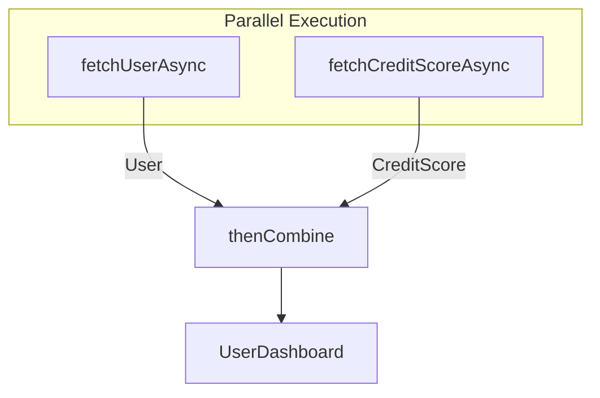

## Question

Explain `CompletableFuture`: how to combine dependent and independent async tasks (`thenCompose` vs `thenCombine`), exception handling (`exceptionally`, `handle`), timeout management, and why passing a custom `Executor` is critical in production.

## Answer

**What is `CompletableFuture`?**
Introduced in Java 8, `CompletableFuture<T>` implements `Future<T>` and `CompletionStage<T>`. It allows building non-blocking asynchronous processing pipelines using functional composition without blocking calling threads via `.get()`.

**1. Creating and Executing Tasks:**
By default, if no `Executor` is supplied, tasks run on the shared `ForkJoinPool.commonPool()`.

```java
// Custom Thread Pool for I/O bound tasks
ExecutorService ioExecutor = Executors.newFixedThreadPool(20);

CompletableFuture<String> future = CompletableFuture.supplyAsync(() -> {
    return fetchUserDataFromDB(userId);
}, ioExecutor);
```

**2. Combining Asynchronous Tasks:**

- **`thenCompose` (FlatMap equivalent - Dependent Tasks):**
Use when Task B depends on the result of Task A and returns another `CompletableFuture`.
```java
// Fetch User -> then Fetch User's Orders
CompletableFuture<List<Order>> ordersFuture = fetchUserAsync(userId)
    .thenCompose(user -> fetchOrdersForUserAsync(user.getId()));
```

- **`thenCombine` (Zip equivalent - Independent Parallel Tasks):**
Use when Task A and Task B can run in parallel, and you want to combine both results when finished.
```java
CompletableFuture<User> userFuture = fetchUserAsync(userId);
CompletableFuture<CreditScore> creditFuture = fetchCreditScoreAsync(userId);

// Run both in parallel and combine
CompletableFuture<UserDashboard> dashboardFuture = userFuture
    .thenCombine(creditFuture, (user, credit) -> new UserDashboard(user, credit));
```



- **`CompletableFuture.allOf` (Wait for Multiple Futures):**
```java
List<CompletableFuture<String>> futures = urls.stream()
    .map(url -> downloadUrlAsync(url))
    .toList();

CompletableFuture<Void> allDone = CompletableFuture.allOf(
    futures.toArray(new CompletableFuture[0])
);

// Get list of results when ALL complete
CompletableFuture<List<String>> resultsFuture = allDone.thenApply(v ->
    futures.stream().map(CompletableFuture::join).toList()
);
```

**3. Exception Handling:**

- **`exceptionally` (Fallback):**
```java
CompletableFuture<String> result = fetchRemoteData()
    .exceptionally(ex -> {
        log.error("Failed to fetch data", ex);
        return "DEFAULT_FALLBACK_VALUE"; // Return fallback on failure
    });
```

- **`handle` (Transform Result or Exception):**
```java
CompletableFuture<Response> result = fetchRemoteData()
    .handle((data, ex) -> {
        if (ex != null) {
            return new Response(500, "Error: " + ex.getMessage());
        }
        return new Response(200, data);
    });
```

**4. Timeouts (Java 9+):**
```java
CompletableFuture<String> result = fetchRemoteData()
    .orTimeout(3, TimeUnit.SECONDS) // Throws TimeoutException if > 3s
    .exceptionally(ex -> "TIMED_OUT");
```

**Production Trap — `ForkJoinPool.commonPool()` Starvation:**
If you execute blocking I/O calls inside `supplyAsync()` without providing a custom `Executor`, tasks consume threads in `ForkJoinPool.commonPool()`. Since this pool is shared across the entire JVM (including Parallel Streams), it leads to thread starvation.
- **Rule:** ALWAYS supply a custom `Executor` tuned for I/O bounds.

## Follow-ups

- What is the difference between `thenApply` vs `thenApplyAsync`?
- How does `CompletableFuture` compare to Reactive Streams (Mono/Flux in Project Reactor)?
- How do Virtual Threads affect the need for complex `CompletableFuture` pipelines?
