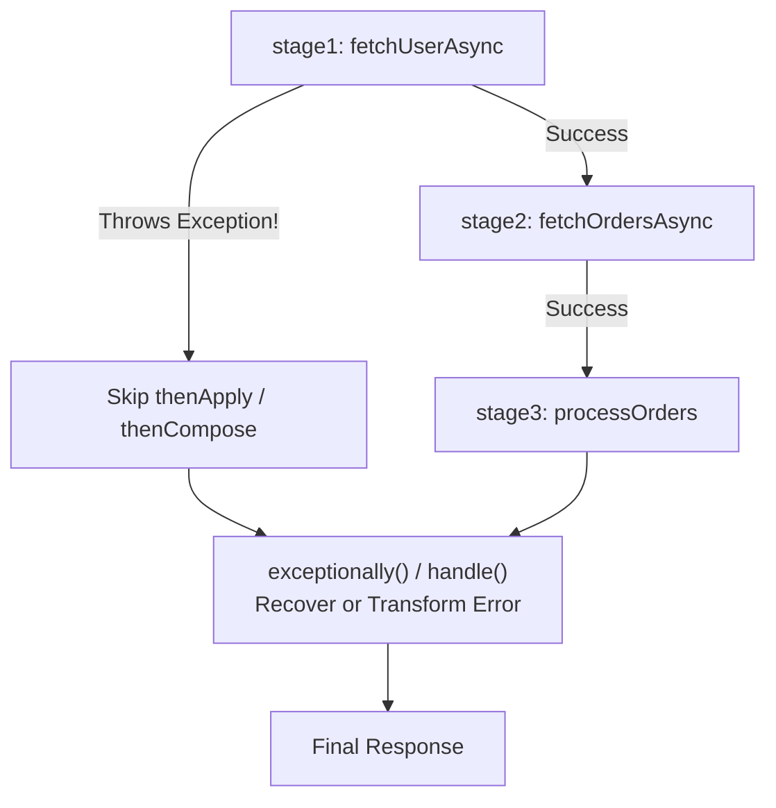

## Question

Explain advanced exception handling in `CompletableFuture` pipelines: `exceptionally` vs `exceptionallyAsync` vs `handle` vs `whenComplete`, handling nested `CompletionException`, recovering from specific exception types, and cleaning up resources.

## Answer

**Exception Chaining in Asynchronous Pipelines:**
When an exception occurs inside a stage of a `CompletableFuture` pipeline, execution skips downstream transformation stages (`thenApply`, `thenAccept`, `thenCompose`) and propagates the exception down the pipeline wrapped in a `CompletionException` until an exception-handling stage is encountered.



**1. Exception Handling Method Options:**

### `exceptionally(Function<Throwable, T>)`
Executes ONLY if an exception occurred in any upstream stage. Allows returning a fallback value of type `T`.

```java
CompletableFuture<UserDto> future = userService.fetchUserAsync(userId)
    .thenApply(this::enrichUser)
    .exceptionally(ex -> {
        // Unwrap CompletionException to get actual cause
        Throwable cause = (ex instanceof CompletionException) ? ex.getCause() : ex;
        log.warn("Failed to fetch user {}, returning guest user. Cause: {}", userId, cause.getMessage());
        
        return new UserDto(0L, "Guest User", "guest@example.com"); // Fallback
    });
```

### `exceptionallyAsync(Function<Throwable, T>, Executor)` (Java 12+)
Executes the exception handler callback asynchronously on a specified thread pool rather than on the thread that threw the exception.

```java
CompletableFuture<String> future = fetchDataAsync()
    .exceptionallyAsync(ex -> {
        return fetchFromBackupServer(); // Blocking network fallback on custom executor
    }, ioExecutor);
```

### `handle(BiFunction<T, Throwable, R>)`
Executes ALWAYS, whether upstream completed normally OR with an exception. Allows transforming either the successful result OR the exception into a new type `R`.

```java
CompletableFuture<ApiResponse<UserDto>> future = userService.fetchUserAsync(userId)
    .handle((user, ex) -> {
        if (ex != null) {
            log.error("Error fetching user {}", userId, ex);
            return ApiResponse.error(500, "User fetch failed: " + ex.getMessage());
        }
        return ApiResponse.success(user);
    });
```

### `whenComplete(BiConsumer<T, Throwable>)`
Executes ALWAYS (like a `finally` block or logging tap). It receives result and exception, but CANNOT modify the result or swallow the exception — the original result or exception passes through untouched!

```java
CompletableFuture<UserDto> future = userService.fetchUserAsync(userId)
    .whenComplete((user, ex) -> {
        if (ex != null) {
            metrics.incrementFailedRequests();
        } else {
            metrics.incrementSuccessfulRequests();
        }
    }); // Original CompletableFuture result/exception is preserved!
```

**2. Handling Specific Exception Types:**
You can chain multiple `exceptionally` blocks to recover selectively based on exception types:

```java
CompletableFuture<PaymentResponse> pipeline = paymentService.chargeAsync(request)
    .exceptionally(ex -> {
        Throwable cause = ex.getCause();
        if (cause instanceof InsufficientFundsException) {
            // Recover from insufficient funds by returning user-friendly status
            return new PaymentResponse("REJECTED", "Insufficient funds in account");
        }
        // Re-throw other exceptions to pass to next exception handler
        throw (RuntimeException) cause;
    })
    .exceptionally(ex -> {
        // Catches network/unexpected errors
        log.error("System error during payment", ex);
        return new PaymentResponse("SYSTEM_ERROR", "Payment processing failed");
    });
```

**3. Manually Completing Exceptionally (`completeExceptionally`):**
Used when bridging custom callbacks or reactive events into `CompletableFuture`:

```java
public CompletableFuture<String> createFutureFromCallback() {
    CompletableFuture<String> future = new CompletableFuture<>();

    externalClient.executeCallback(new Callback() {
        @Override
        public void onSuccess(String data) {
            future.complete(data);
        }

        @Override
        public void onFailure(Exception ex) {
            future.completeExceptionally(ex); // Triggers exceptionally() pipeline stages!
        }
    });

    return future;
}
```

## Follow-ups

- What is `CompletableFuture.delayedExecutor()` and how is it used for async retry delays?
- What is the difference between `ex.getCause()` and `ex` in `CompletionException` wrapping?
- How do you guarantee resources (like database connections or open files) are closed in a complex `CompletableFuture` pipeline?
