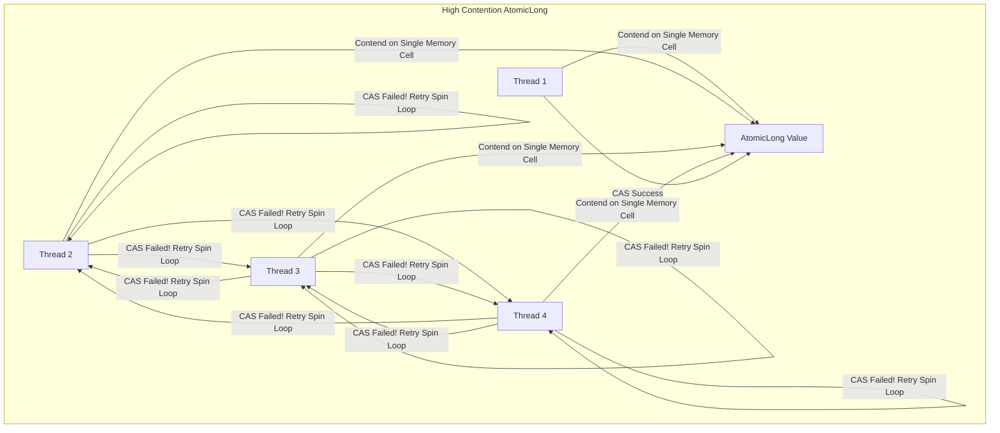

## Question

Compare Java atomic variables: `AtomicInteger` / `AtomicLong` (CAS spin loops) vs `LongAdder` / `LongAccumulator` (Cell array striping). Explain why `LongAdder` outperforms `AtomicLong` under high thread contention.

## Answer

**The High Contention CAS Problem (`AtomicLong`):**
`AtomicInteger` and `AtomicLong` use Hardware Compare-And-Swap (CAS) CPU instructions (`lock cmpxchg` on x86) to achieve lock-free thread safety.

```java
// AtomicLong increment CAS spin loop
public final long incrementAndGet() {
    for (;;) {
        long current = get();
        long next = current + 1;
        if (compareAndSet(current, next)) // CAS Instruction
            return next;
        // If CAS fails (another thread modified value), loop spins and retries!
    }
}
```

**The Problem under High Contention:**
When 100 threads concurrently attempt to update a single `AtomicLong`:
1. Only ONE thread succeeds per CAS operation.
2. The remaining 99 threads FAIL their CAS check, discard their work, and spin in the `for(;;)` loop.
3. CPU utilization spikes to 100% due to bus locking and cache-line invalidation (cache bouncing), resulting in degraded throughput.



**The `LongAdder` Solution (Striped Cell Array):**
Introduced in Java 8, `LongAdder` avoids CAS contention by maintaining a dynamically-sized array of internal counter cells (`Cell[]`), plus a `base` value.

```mermaid
flowchart TD
    subgraph LongAdder Under High Contention
        Thread1[Thread 1] -->|Hash Thread ID| Cell0[Cell 0: +1]
        Thread2[Thread 2] -->|Hash Thread ID| Cell1[Cell 1: +1]
        Thread3[Thread 3] -->|Hash Thread ID| Cell2[Cell 2: +1]
        Thread4[Thread 4] -->|Hash Thread ID| Base[Base Counter: +1]
        
        Cell0 & Cell1 & Cell2 & Base -->|Sum on sum() Call| Total[Total Sum = 4]
    end
```

**How `LongAdder` Operates:**
1. **Low Contention:** Threads update the single `base` counter directly via CAS.
2. **High Contention:** When CAS on `base` fails, `LongAdder` allocates a table of `Cell` objects (up to CPU core count).
3. Threads are assigned to different `Cell` slots based on their thread hash (`ThreadLocalRandom.getProbe()`). Threads update their assigned `Cell` independently without contending with each other!
4. **`sum()` Call:** To retrieve the total value, `LongAdder` iterates over all `Cell` values and sums them with `base`.

**Performance Comparison Matrix:**

| Feature | `AtomicLong` | `LongAdder` |
|---|---|---|
| **Mechanism** | Single CAS variable | Striped `Cell[]` array |
| **High-Contention Throughput** | Lower (CPU spin loops) | **10-100x Higher** (Zero contention) |
| **Memory Footprint** | Low (8 bytes) | Higher (allocates `Cell[]` array dynamically) |
| **Atomic Read-and-Set** | Supported (`getAndIncrement()`) | Not Supported (Only `add()` and `sum()`) |
| **Use Case** | Sequence generators, precise IDs | Counters, metrics (Prometheus/Micrometer counters) |

**Code Example:**
```java
public class CounterBenchmark {
    // For high-throughput metric counting
    private final LongAdder requestCounter = new LongAdder();

    public void onRequest() {
        requestCounter.increment(); // Ultra-fast under high concurrency!
    }

    public long getTotalRequests() {
        return requestCounter.sum(); // Sums cell values
    }
}
```

**False Sharing Prevention (`@Contended`):**
Inside `LongAdder`, each `Cell` object is annotated with `@jdk.internal.vm.annotation.Contended`. This instructs the JVM to pad the cell with 128 dummy bytes, ensuring no two `Cell` objects occupy the same CPU L1/L2 cache line (preventing False Sharing).

## Follow-ups

- What is `LongAccumulator` and how does it extend `LongAdder` for arbitrary binary operations (e.g., max, min, product)?
- What is False Sharing in multi-threaded CPU cache lines and how does `@Contended` prevent it?
- Why is `LongAdder.sum()` not an atomic snapshot if concurrent updates occur during the sum calculation?
