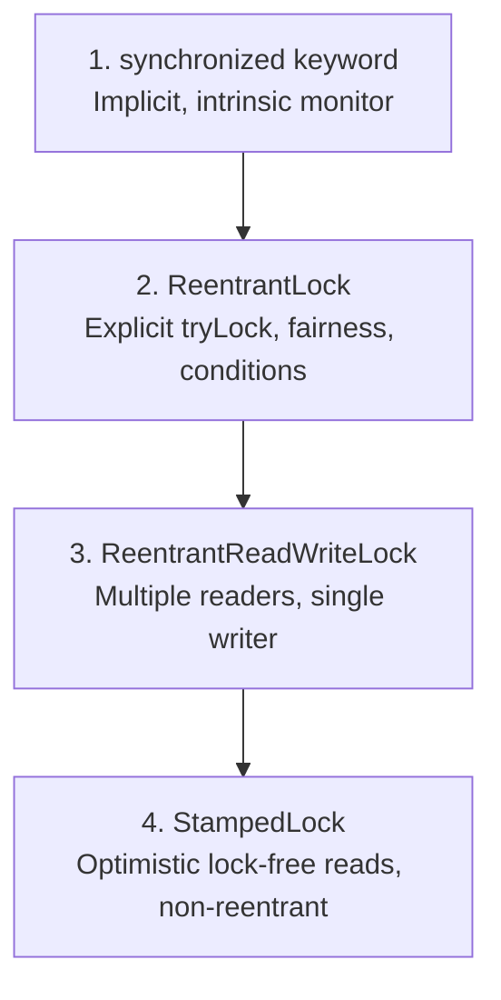

## Question

Compare Java explicit locks (`java.util.concurrent.locks`): `synchronized` vs `ReentrantLock`, `ReentrantReadWriteLock`, and `StampedLock`. Explain optimistic reading validation, writer starvation, and lock downgrading.

## Answer

**Java Locking Mechanisms Evolution:**



**1. `synchronized` vs `ReentrantLock`:**
- `synchronized`: Language-level, implicit acquisition/release (block-structured), auto-cleanup. JVM biased locking & lock inflation optimizations.
- `ReentrantLock`: API-level, explicit `lock()` and `unlock()` inside `try-finally`. Supports fairness policies, interruptible lock acquisition (`lockInterruptibly()`), non-blocking attempts (`tryLock(timeout)`), and multiple `Condition` variables.

```java
// ReentrantLock idiom
ReentrantLock lock = new ReentrantLock(true); // Fair lock
lock.lock();
try {
    // Critical Section
} finally {
    lock.unlock(); // Mandatory in finally block!
}
```

**2. `ReentrantReadWriteLock` (Read-Write Lock):**
Maintains a pair of associated locks: one for read-only operations (shared, multiple threads), one for write operations (exclusive).
- **Advantage:** Increases throughput for read-heavy workloads.
- **Flaw — Writer Starvation:** Under high read contention, incoming readers continuously acquire the read lock, starving waiting write threads indefinitely.

**3. `StampedLock` (Java 8+):**
`StampedLock` provides a stamp-based mechanism with three modes: Write, Read, and **Optimistic Read**.

**Optimistic Read Mode (Lock-Free Read):**
Does NOT acquire a lock! It acquires a version stamp, reads fields into local variables, and calls `validate(stamp)` to check if a writer modified state during the read. If validation fails, it falls back to a pessimistic read lock.

```java
public class Point {
    private double x, y;
    private final StampedLock sl = new StampedLock();

    // Move point (Write Lock)
    public void move(double deltaX, double deltaY) {
        long stamp = sl.writeLock(); // Exclusive write lock
        try {
            x += deltaX;
            y += deltaY;
        } finally {
            sl.unlockWrite(stamp);
        }
    }

    // Distance from origin (Optimistic Read)
    public double distanceFromOrigin() {
        long stamp = sl.tryOptimisticRead(); // 1. Acquire optimistic stamp (NO lock!)
        double currentX = x, currentY = y;   // 2. Copy fields to local variables
        
        if (!sl.validate(stamp)) {           // 3. Check if write occurred during step 2
            stamp = sl.readLock();           // 4. Fallback: Acquire pessimistic read lock
            try {
                currentX = x;
                currentY = y;
            } finally {
                sl.unlockRead(stamp);
            }
        }
        return Math.hypot(currentX, currentY);
    }
}
```

**Lock Features Matrix:**

| Lock Type | Reentrant? | Multiple Readers? | Writer Starvation Risk? | Optimistic Lock-Free Read? | Supports Condition? |
|---|---|---|---|---|---|
| `synchronized` | Yes | No | No | No | No (uses `wait`/`notify`) |
| `ReentrantLock` | Yes | No | No (with fair option) | No | Yes |
| `ReentrantReadWriteLock` | Yes | Yes | High | No | Yes (write lock only) |
| `StampedLock` | **NO!** | Yes | Low | **YES** | No |

**CRITICAL WARNING — `StampedLock` is NOT Reentrant!**
If a thread holding a `StampedLock` write lock calls another method that tries to acquire the same `StampedLock` write lock, it will **DEADLOCK itself**!

## Follow-ups

- How do you perform lock downgrading (Write Lock -> Read Lock) atomically in `StampedLock`?
- What is `Condition` in `ReentrantLock` and how does it replace `Object.wait()` and `Object.notify()`?
- How does AbstractQueuedSynchronizer (AQS) implement state management for `ReentrantLock`?
