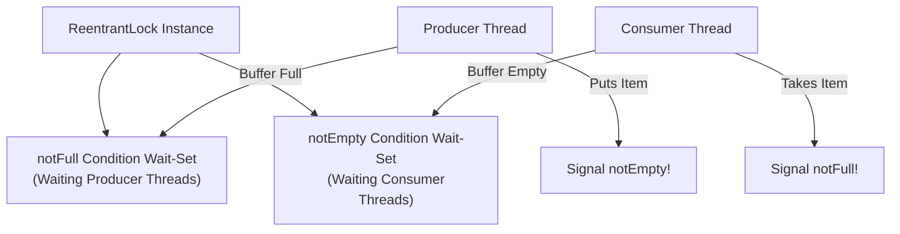

## Question

Explain `Condition` in `java.util.concurrent.locks`: how `lock.newCondition()` replaces intrinsic monitor methods (`wait`, `notify`, `notifyAll`), managing multiple wait-sets, and implementing a thread-safe Bounded Buffer (Producer-Consumer queue).

## Answer

**Why `Condition` Over Intrinsic Monitors (`Object.wait() / notify()`):**
Every Java object has one intrinsic monitor with ONE implicit wait-set (`wait()`, `notify()`). When multiple producer and consumer threads wait on the same monitor, calling `notify()` might wake up a producer thread when you intended to wake up a consumer thread (causing spurious notification and thread signaling inefficiency).

`ReentrantLock` allows creating **multiple distinct `Condition` objects** per lock instance, giving explicit control over WHICH subset of threads to signal!



**Implementation: Thread-Safe Bounded Buffer (Producer-Consumer Queue):**
```java
public class BoundedBuffer<T> {
    private final Object[] items;
    private int putIndex, takeIndex, count;

    private final ReentrantLock lock = new ReentrantLock();
    // Separate wait-sets for producers vs consumers!
    private final Condition notFull  = lock.newCondition();
    private final Condition notEmpty = lock.newCondition();

    public BoundedBuffer(int capacity) {
        this.items = new Object[capacity];
    }

    public void put(T x) throws InterruptedException {
        lock.lock();
        try {
            // ALWAYS check condition in a while loop to prevent spurious wakeups!
            while (count == items.length) {
                notFull.await(); // Producer releases lock & waits on notFull condition
            }
            
            items[putIndex] = x;
            if (++putIndex == items.length) putIndex = 0;
            count++;

            // Signal ONLY waiting consumers (not empty)!
            notEmpty.signal();
        } finally {
            lock.unlock();
        }
    }

    @SuppressWarnings("unchecked")
    public T take() throws InterruptedException {
        lock.lock();
        try {
            while (count == 0) {
                notEmpty.await(); // Consumer releases lock & waits on notEmpty condition
            }
            
            T x = (T) items[takeIndex];
            items[takeIndex] = null;
            if (++takeIndex == items.length) takeIndex = 0;
            count--;

            // Signal ONLY waiting producers (not full)!
            notFull.signal();
            return x;
        } finally {
            lock.unlock();
        }
    }
}
```

**Key Differences Summary:**

| Method | Intrinsic Monitor (`Object`) | `Condition` (`ReentrantLock`) |
|---|---|---|
| **Wait Method** | `object.wait()` | `condition.await()` |
| **Signal Method** | `object.notify()` / `notifyAll()` | `condition.signal()` / `signalAll()` |
| **Timeout Support** | `wait(long millis)` | `await(long time, TimeUnit unit)` / `awaitNanos()` |
| **Uninterruptible Wait** | Not supported | `condition.awaitUninterruptibly()` |
| **Multiple Wait-Sets** | No (Single wait-set per object) | **Yes** (Multiple `Condition` objects per lock) |

**Rule: Always Use `while` Loops for Waiting:**
```java
// BAD: If awakened spuriously or by another thread, buffer might still be full!
if (count == items.length) { notFull.await(); }

// GOOD: Re-check condition upon waking up!
while (count == items.length) { notFull.await(); }
```

## Follow-ups

- What is a "spurious wakeup" and why can threads wake up from `await()` without `signal()` being called?
- What is `awaitNanos(long nanosTimeout)` and how does it return remaining timeout time?
- How does `ArrayBlockingQueue` in `java.util.concurrent` use `ReentrantLock` and `Condition` internally?
