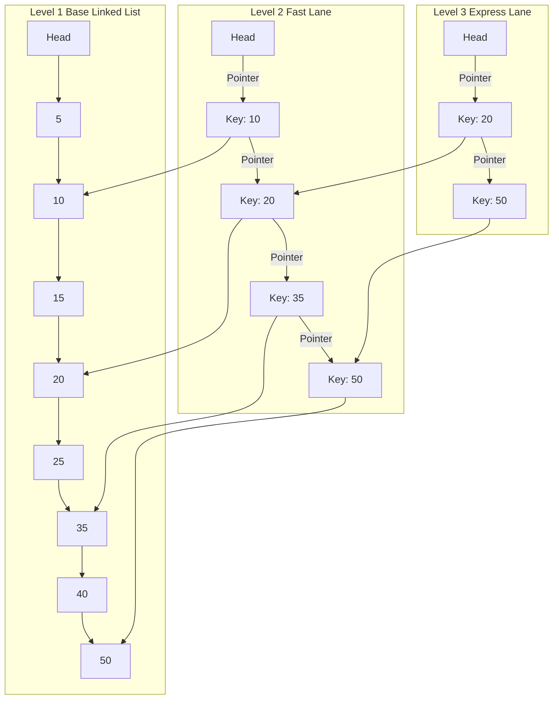

## Question

Explain `ConcurrentSkipListMap` in `java.util.concurrent`: how the probabilistic Skip List data structure works, lock-free CAS operations, O($\log n$) time complexity for search/insert, and why it is used over `ConcurrentHashMap` for ordered and range-based concurrent queries.

## Answer

**Why Not `ConcurrentHashMap` or `TreeMap` for Sorted Concurrent Access?**
- **`ConcurrentHashMap`:** Fast $O(1)$ point lookups, but keys are unordered. Range queries (`subMap`, `headMap`) or finding min/max keys require scanning all entries in $O(n)$ time.
- **`TreeMap`:** Maintained in sorted order via a Red-Black Tree ($O(\log n)$ access), but is NOT thread-safe. Wrapping it in `Collections.synchronizedSortedMap()` locks the ENTIRE tree per operation, creating a severe bottleneck.

**`ConcurrentSkipListMap` Solution:**
`ConcurrentSkipListMap` provides a thread-safe, concurrent, lock-free implementation of `ConcurrentNavigableMap` based on a **Skip List** data structure.



**How a Skip List Works:**
A Skip List is a probabilistic data structure consisting of multiple hierarchy levels of linked lists:
- **Base Level (Level 1):** Sorted linked list containing all elements.
- **Higher Levels (Express Lanes):** Sparse subsets of elements acting as fast-forward indexes.
- **Search Execution:** Start at highest level, jump forward while `key > nextKey`. Drop down a level when `key < nextKey`. This achieves **$O(\log n)$ average search, insertion, and deletion time** without rebalancing trees!

**Lock-Free CAS Concurrency:**
Unlike tree structures (Red-Black Trees require complex rotation operations affecting multiple pointers atomically), Skip List insertions and deletions require modifying only **local node forward pointers**.
- Nodes are inserted/linked using atomic **Compare-And-Swap (CAS)** operations (`AtomicReference`).
- Multiple threads can insert or delete elements simultaneously in different parts of the list without acquiring locks!

**Code Example:**
```java
public class LeaderboardService {
    // Concurrent, lock-free, sorted by score (keys)
    private final ConcurrentSkipListMap<Integer, String> leaderboard = new ConcurrentSkipListMap<>(Comparator.reverseOrder());

    public void updateScore(int score, String player) {
        leaderboard.put(score, player); // O(log n) lock-free insertion
    }

    public Map<Integer, String> getTopPlayers(int topN) {
        // Fast range view without copying or locking!
        return leaderboard.entrySet().stream()
                .limit(topN)
                .collect(Collectors.toMap(
                    Map.Entry::getKey, 
                    Map.Entry::getValue, 
                    (e1, e2) -> e1, 
                    LinkedHashMap::new
                ));
    }

    public Map<Integer, String> getScoresBetween(int minScore, int maxScore) {
        // Returns thread-safe subMap view in O(log n)
        return leaderboard.subMap(maxScore, true, minScore, true);
    }
}
```

**Performance & Complexity Comparison:**

| Map Implementation | Thread-Safe? | Lock-Free? | Point Lookup (`get`) | Range Query (`subMap`) | Sorted Keys? |
|---|---|---|---|---|---|
| `HashMap` | No | No | $O(1)$ | $O(n)$ | No |
| `ConcurrentHashMap` | **Yes** | **Yes** (CAS + bin locks) | **$O(1)$** | $O(n)$ | No |
| `TreeMap` | No | No | $O(\log n)$ | $O(\log n)$ | **Yes** |
| `ConcurrentSkipListMap` | **Yes** | **Yes** (CAS) | $O(\log n)$ | **$O(\log n)$** | **Yes** |

## Follow-ups

- What is the probability factor ($p=0.5$ or $p=0.25$) used to determine a node's level height via random coin flips during insertion?
- How does `ConcurrentSkipListSet` leverage `ConcurrentSkipListMap` under the hood?
- Why is `size()` an $O(n)$ traversal operation in `ConcurrentSkipListMap`?
