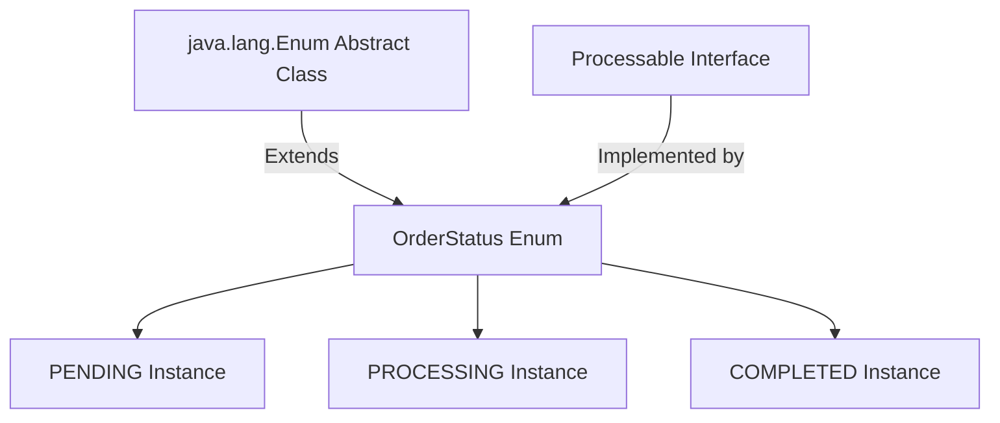

## Question

Explain Java Enums beyond constants: instance fields/methods, interface implementation, Strategy pattern with abstract methods, Singleton pattern safety, `EnumSet` bit-vector performance, and `EnumMap`.

## Answer

**What makes Java Enums Special?**
In Java, an `enum` is a specialized reference class extending `java.lang.Enum`. Unlike C/C++ integer enums, Java enums are full-fledged objects that can have fields, constructors, methods, implement interfaces, and declare constant-specific class bodies.



**1. Strategy Pattern via Enum Constant-Specific Methods:**
Enums can declare abstract methods that every enum constant MUST override, creating clean Strategy patterns without `if-else` or `switch` blocks.

```java
public enum Operation {
    PLUS("+") {
        @Override
        public double apply(double x, double y) { return x + y; }
    },
    MINUS("-") {
        @Override
        public double apply(double x, double y) { return x - y; }
    },
    MULTIPLY("*") {
        @Override
        public double apply(double x, double y) { return x * y; }
    },
    DIVIDE("/") {
        @Override
        public double apply(double x, double y) {
            if (y == 0) throw new ArithmeticException("Division by zero");
            return x / y;
        }
    };

    private final String symbol;

    Operation(String symbol) {
        this.symbol = symbol;
    }

    public String getSymbol() { return symbol; }

    // Abstract Strategy Method
    public abstract double apply(double x, double y);
}

// Usage:
double result = Operation.PLUS.apply(10, 20); // 30.0
```

**2. Thread-Safe Singleton Pattern (Effective Java Item 3):**
An Enum is the single BEST way to implement a Singleton in Java:
- **Thread Safety:** Guaranteed by the JVM during class loading.
- **Serialization Guarantee:** Native JVM protection prevents duplicate instantiation during deserialization.
- **Reflection Proof:** The JVM explicitly throws `IllegalArgumentException("Cannot reflectively create enum objects")` inside `Constructor.newInstance()`.

```java
public enum DatabaseConnectionPool {
    INSTANCE; // Guaranteed exactly-once instantiation

    private final ConnectionPool pool;

    DatabaseConnectionPool() {
        this.pool = new ConnectionPool(); // Initialized lazily on first access
    }

    public Connection getConnection() {
        return pool.acquire();
    }
}
```

**3. `EnumSet` (Bit-Vector Performance):**
`EnumSet` is a specialized `Set` implementation for enums.
- **Internal Representation:** Represented internally as a single `long` bit-mask (bit-vector) if enum size $\le 64$ (`RegularEnumSet`).
- **Performance:** All operations (`add`, `contains`, `remove`) are **O(1) CPU bitwise operations** (`&`, `|`, `~`). Extremely fast with minimal memory footprint compared to `HashSet`.

```java
public enum Permission { READ, WRITE, EXECUTE, DELETE }

// Ultra-fast bit-vector Set operations
EnumSet<Permission> userPermissions = EnumSet.of(Permission.READ, Permission.WRITE);

if (userPermissions.contains(Permission.WRITE)) {
    // Fast O(1) bitwise check!
}
```

**4. `EnumMap` (Array-Backed Map):**
`EnumMap` is a specialized `Map` implementation where keys are an enum type.
- **Internal Representation:** Represented internally as a flat Java array `Object[]` indexed directly by the enum's `ordinal()`.
- **Performance:** `get()` and `put()` bypass hash calculation and bucket collisions entirely, executing as direct array index lookups `array[key.ordinal()]`. Much faster and more compact than `HashMap`.

```java
Map<OrderStatus, List<Order>> ordersByStatus = new EnumMap<>(OrderStatus.class);
ordersByStatus.put(OrderStatus.PENDING, new ArrayList<>());
```

## Follow-ups

- Why is `ordinal()` fragile for database persistence and why should `@Enumerated(EnumType.STRING)` or custom converters be used in JPA?
- How do you implement dynamic lookup by String property using a static `Map` cache inside an Enum?
- How can Enums implement State Machines effectively?
