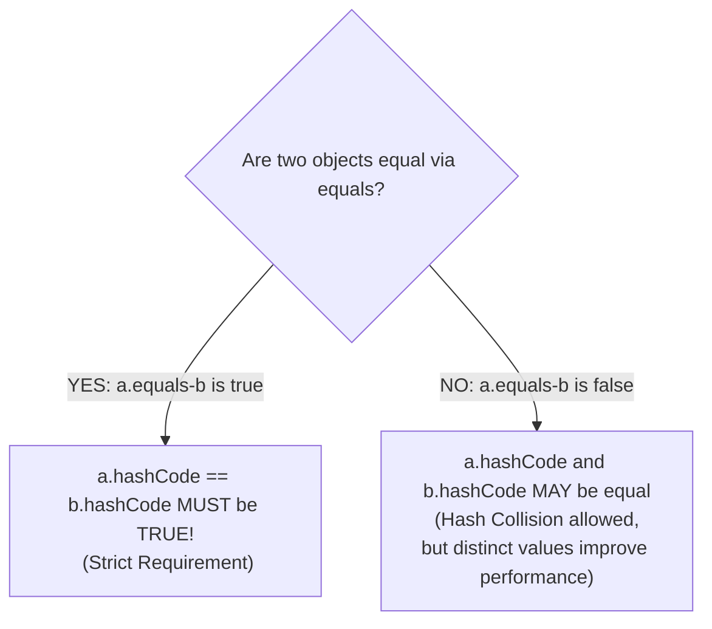

## Question

Explain the relationship and formal contract between `equals(Object)` and `hashCode()` in Java: what rules must be obeyed, what happens if you override one without the other, and how HashMap breaks if the contract is violated.

## Answer

**The Core Contract:**
In Java, `Object` defines both `boolean equals(Object obj)` and `int hashCode()`. Any custom class overriding `equals()` **MUST** also override `hashCode()`.



**The 3 Rules of the Contract:**

1. **Consistency of `hashCode()`:** Multiple invocations of `hashCode()` on the same object must return the exact same integer during execution, provided no information used in `equals()` comparisons is modified.
2. **If `a.equals(b)` is `true`, then `a.hashCode() == b.hashCode()` MUST be `true`.**
3. **If `a.equals(b)` is `false`, `a.hashCode() == b.hashCode()` is NOT required to be distinct.** However, generating distinct hashes for unequal objects improves `HashMap` bucket distribution.

**What Happens if You Override `equals()` Without `hashCode()`?**
If two objects are logically equal according to `equals()`, but `hashCode()` is not overridden, they will inherit `Object.hashCode()` (which generates a hash based on the memory address/identity of the object instance).

**Demonstration with `HashMap` / `HashSet` Failure:**

```java
public class Person {
    private final String ssn;
    private final String name;

    public Person(String ssn, String name) {
        this.ssn = ssn;
        this.name = name;
    }

    // Overriding equals ONLY
    @Override
    public boolean equals(Object o) {
        if (this == o) return true;
        if (o == null || getClass() != o.getClass()) return false;
        Person person = (Person) o;
        return Objects.equals(ssn, person.ssn);
    }

    // BAD: hashCode() NOT OVERRIDDEN!
}

// BUG IN ACTION:
Map<Person, String> map = new HashMap<>();
Person p1 = new Person("123-45", "Alice");
map.put(p1, "Software Engineer");

Person p2 = new Person("123-45", "Alice");

System.out.println(p1.equals(p2)); // true!
System.out.println(map.get(p2));   // PRINTS null! (MAP FAILS TO FIND VALUE!)
```

**Why `map.get(p2)` Returned `null`:**
1. `HashMap` uses `p2.hashCode()` to locate the bucket array index.
2. Because `hashCode()` was not overridden, `p1` and `p2` generated **different hash values** pointing to **different buckets** in the map!
3. `HashMap` never even called `p2.equals(p1)` because it looked in the wrong bucket!

**Correct Implementation using `java.util.Objects`:**
```java
@Override
public boolean equals(Object o) {
    if (this == o) return true;
    if (o == null || getClass() != o.getClass()) return false;
    Person person = (Person) o;
    return Objects.equals(ssn, person.ssn);
}

@Override
public int hashCode() {
    return Objects.hash(ssn); // Computes hash based on the same field used in equals()!
}
```

## Follow-ups

- What are the formal properties of `equals()` (reflexive, symmetric, transitive, consistent, non-null)?
- Why shouldn't mutable fields be included in `hashCode()` and `equals()` when objects are used as keys in a `Set` or `Map`?
- How does Lombok's `@EqualsAndHashCode` or Java `record` generate these methods automatically?
