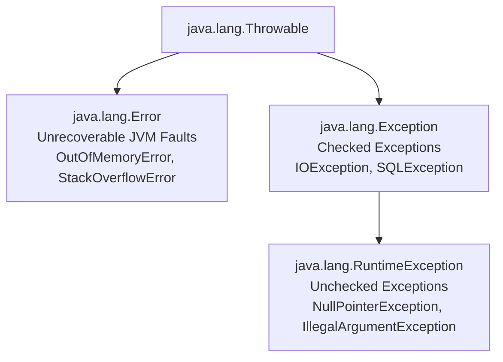

## Question

Explain Java Exception Architecture: Checked (`Exception`) vs Unchecked (`RuntimeException`) vs `Error`, try-with-resources (`AutoCloseable`), suppressed exceptions, exception translation, and antipatterns to avoid.

## Answer

**Java Exception Hierarchy:**



**1. Checked vs Unchecked Exceptions:**
- **Checked Exceptions (`subclasses of Exception`, excluding `RuntimeException`):** Enforced at compile-time. The compiler forces callers to handle (`try-catch`) or declare (`throws`). Used for recoverable scenarios (e.g., file not found).
- **Unchecked Exceptions (`subclasses of RuntimeException`):** Not checked by compiler. Represent programming bugs (null check missing, invalid arguments, index out of bounds). Modern Java frameworks (Spring, Hibernate) favor unchecked exceptions to keep code clean.
- **`Error`:** Unrecoverable JVM faults (OOM, StackOverflow). Do NOT catch `Throwable` or `Error`.

**2. Automatic Resource Management: Try-With-Resources:**
Classes implementing `AutoCloseable` or `Closeable` are automatically closed at the end of the `try` block in reverse order of declaration, even if an exception occurs.

```java
// Try-with-resources (Java 7+)
public String readFirstLine(Path path) throws IOException {
    try (BufferedReader reader = Files.newBufferedReader(path);
         Stream<String> lines = reader.lines()) {
        return lines.findFirst().orElse("");
    } // reader.close() guaranteed to run automatically!
}
```

**Suppressed Exceptions:**
If an exception occurs inside the `try` block AND `close()` also throws an exception:
- The main exception is thrown to the caller.
- The `close()` exception is attached to the main exception as a **Suppressed Exception** (`ex.getSuppressed()`).

**3. Exception Translation (Layer Decoupling):**
Catch low-level technical exceptions (e.g., `SQLException`) at architectural boundaries and wrap them in domain-specific exceptions (e.g., `DataAccessException` or `OrderNotFoundException`).

```java
public User findUser(Long id) {
    try {
        return userRepository.findById(id);
    } catch (SQLException ex) {
        // ALWAYS pass 'ex' as cause to preserve root stack trace!
        throw new DatabaseInfrastructureException("Failed to load user id: " + id, ex);
    }
}
```

**4. Anti-Patterns to Avoid:**

1. **Swallowing Exceptions:**
   ```java
   // BAD! Silent failure hides critical bugs
   try {
       processOrder();
   } catch (Exception e) {} 
   ```
2. **Catching Generic `Exception` or `Throwable`:**
   ```java
   // BAD! Catches RuntimeExceptions and Errors unintentionally
   catch (Throwable t) { ... }
   ```
3. **Log-and-Rethrow (Double Logging):**
   ```java
   // BAD! Causes duplicate log entries for the same exception
   catch (ServiceException e) {
       log.error("Error occurred", e);
       throw e;
   }
   ```
4. **Losing Root Cause:**
   ```java
   // BAD! Discards original stack trace!
   catch (SQLException e) {
       throw new BusinessException(e.getMessage()); // Lost root 'e'!
   }
   // GOOD:
   catch (SQLException e) {
       throw new BusinessException("Database error", e); // Preserves cause
   }
   ```

## Follow-ups

- What is the cost of instantiating an Exception in Java? (Filling the execution stack trace via `fillInStackTrace()`).
- How do custom light-weight exceptions override `fillInStackTrace()` for high-performance control flow?
- How does Spring's `@ResponseStatus` map custom domain exceptions directly to HTTP status codes?
