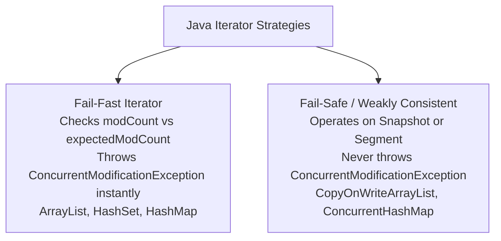

## Question

Compare Fail-Fast and Fail-Safe Iterators in Java: `modCount` mechanics, `ConcurrentModificationException`, `ArrayList` vs `CopyOnWriteArrayList` vs `ConcurrentHashMap` iterators, and safely removing elements during iteration.

## Answer

**Iteration and Collection Modification:**
When iterating over a Java collection, if another thread (or the same thread) structuraly modifies the collection (adds, removes, or clears elements) during iteration, the Iterator must handle the concurrent mutation.

Java provides two iterator strategies:
1. **Fail-Fast Iterators:** Fail immediately by throwing `ConcurrentModificationException`.
2. **Fail-Safe (Weakly Consistent) Iterators:** Operate on a copy or snapshot of the collection without throwing exceptions.



**1. Fail-Fast Iterators (How `modCount` Works):**
Standard collections (`ArrayList`, `HashSet`, `HashMap`) maintain an internal field called `modCount` tracking structural modifications.

When an Iterator is created, it records `expectedModCount = modCount`. On every `next()` or `remove()` call, the iterator checks:
```java
if (modCount != expectedModCount) {
    throw new ConcurrentModificationException();
}
```

**Bug Demonstration:**
```java
List<String> list = new ArrayList<>(List.of("A", "B", "C"));

// BUG: Modifying list directly inside for-each loop!
for (String item : list) {
    if (item.equals("B")) {
        list.remove(item); // Throws ConcurrentModificationException on next iteration!
    }
}
```

**Correct Way to Remove Elements in Fail-Fast Iterators:**
Use the **Iterator's own `remove()` method** or `Collection.removeIf()` (Java 8+):

```java
// Option 1: Iterator.remove() updates expectedModCount automatically!
Iterator<String> it = list.iterator();
while (it.hasNext()) {
    if (it.next().equals("B")) {
        it.remove(); // Safe! Keeps modCount in sync
    }
}

// Option 2: removeIf (Cleanest)
list.removeIf(item -> item.equals("B"));
```

**2. Fail-Safe / Weakly Consistent Iterators:**
Fail-Safe iterators operate on concurrent collections in `java.util.concurrent`:

- **`CopyOnWriteArrayList`:** Creates a **snapshot copy** of the underlying array when an iterator is created. Mutations (`add`/`remove`) create a new array copy without affecting existing active iterators. Iterators never throw `ConcurrentModificationException`, but might not reflect real-time additions made after iterator creation.
- **`ConcurrentHashMap` (Weakly Consistent):** Iterates over the live hash map buckets without copying. Reflects state at or since the creation of the iterator, guaranteed not to throw `ConcurrentModificationException`.

**Comparison Matrix:**

| Feature | Fail-Fast Iterator | Fail-Safe (Weakly Consistent) Iterator |
|---|---|---|
| **Collections** | `ArrayList`, `LinkedList`, `HashSet`, `HashMap` | `CopyOnWriteArrayList`, `ConcurrentHashMap`, `ConcurrentSkipListMap` |
| **Exception Thrown** | `ConcurrentModificationException` | **None** |
| **Memory Overhead** | Low (no copy created) | Higher (e.g. `CopyOnWriteArrayList` copies array) |
| **Modifies Live Data?** | Operates directly on live collection | Operates on Snapshot or Segments |

## Follow-ups

- Why is modifying an element's internal properties (without adding/removing from collection) not considered a structural modification?
- What is the performance penalty of using `CopyOnWriteArrayList` for write-heavy workloads?
- How does `ConcurrentHashMap.keySet().iterator()` guarantee weak consistency without copying the map?
