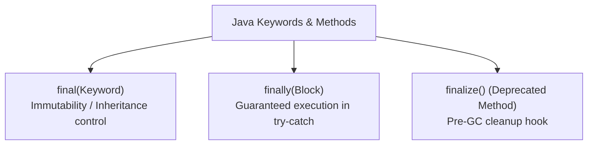

## Question

Compare `final`, `finally`, and `finalize()` in Java: `final` on variables/methods/classes, execution edge cases of `finally` blocks (e.g., `System.exit()`, infinite loops, return statements), and why `finalize()` was deprecated in Java 9.

## Answer

**Overview:**
Despite having similar names, `final`, `finally`, and `finalize()` are completely distinct concepts in Java:
- `final`: Keyword used to declare immutability, prevent method overriding, or block class inheritance.
- `finally`: Block used in exception handling (`try-catch-finally`) to guarantee code execution.
- `finalize()`: Deprecated method in `java.lang.Object` invoked by GC before object garbage collection.



**1. `final` Keyword (3 Uses):**

- **`final` Variable:** The variable's reference cannot be reassigned once initialized.
  - *Primitive:* Value cannot change (`final int x = 10;`).
  - *Object Reference:* Reference pointer cannot change (`final List<String> list = new ArrayList<>();`), but internal object contents CAN be mutated (`list.add("hello")`)!
- **`final` Method:** Prevents subclasses from overriding the method.
- **`final` Class:** Prevents the class from being extended (`String`, `Integer`, Java Records are all `final` classes).

**2. `finally` Block:**
A block following `try` or `try-catch` that is guaranteed to execute, regardless of whether an exception occurred or was caught.

```java
public int testFinally() {
    try {
        return 1;
    } finally {
        System.out.println("Finally executed!"); // Always runs!
    }
}
```

**CRITICAL TRAP: `return` inside `finally`:**
If a `finally` block contains an explicit `return` statement, it **overrides and suppresses** any return value or uncaught exception from the `try` or `catch` block!

```java
public int returnTrap() {
    try {
        throw new RuntimeException("Error!");
    } finally {
        return 42; // BAD! Suppresses RuntimeException and returns 42 silently!
    }
}
```

**When does `finally` NOT execute?**
1. Calling `System.exit(code)` or `Runtime.getRuntime().halt(code)`.
2. JVM crash (out of memory, segfault, `SIGKILL -9`).
3. Infinite loop or deadlock inside the `try` block.
4. OS power failure or hardware loss.

**3. `finalize()` Method (DEPRECATED):**
Protected method declared in `java.lang.Object`. Historically invoked by the GC on an object prior to memory reclamation.

```java
// DEPRECATED since Java 9! DO NOT USE!
@Override
protected void finalize() throws Throwable {
    try {
        closeNativeHandles();
    } finally {
        super.finalize();
    }
}
```

**Why `finalize()` WAS DEPRECATED & DANGEROUS:**
- **Unpredictable Execution:** No guarantee WHEN or IF `finalize()` will run.
- **Severe Performance Overhead:** Objects with `finalize()` require multiple GC cycles to reclaim, slowing down the garbage collector.
- **Resurrection Bug:** An object inside `finalize()` could assign `this` to a static field, accidentally resurrecting itself from death and breaking JVM invariants!
- **Exceptions Ignored:** Uncaught exceptions inside `finalize()` are silently swallowed by the GC thread.

**Modern Replacement for `finalize()`:**
- Use **Try-With-Resources** with `AutoCloseable`.
- Use **JDK 9 `Cleaner` API** or `PhantomReference` for native resource cleanup.

## Follow-ups

- Can a `final` variable be initialized inside a constructor if it's not initialized at declaration? (Blank final variable).
- What happens if both `try` block and `finally` block throw different exceptions? (Main exception is lost unless try-with-resources suppressed exception handling is used).
- How does `final` assist the JIT compiler with inlining and optimization?
