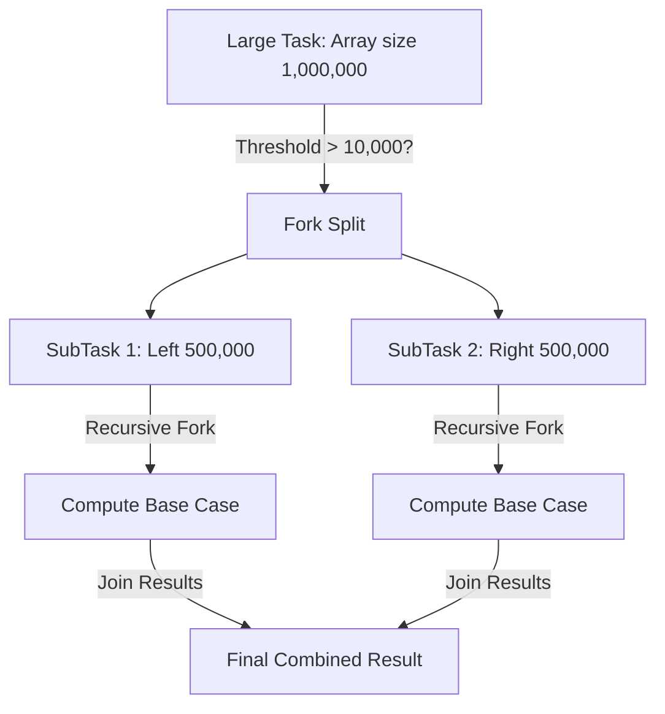

## Question

Explain the Fork/Join Framework (introduced in Java 7): `ForkJoinPool`, `RecursiveTask` vs `RecursiveAction`, the Work-Stealing algorithm, double-ended queues (Deques), and how Parallel Streams utilize the common pool under the hood.

## Answer

**What is the Fork/Join Framework?**
The Fork/Join Framework is designed for divide-and-conquer parallel processing, recursively splitting large computational tasks into smaller subtasks, executing them across CPU cores in parallel, and joining their results.

**Core Components:**
1. **`ForkJoinPool`:** Special `ExecutorService` managing worker threads.
2. **`ForkJoinTask<V>`:** Abstract task class.
   - `RecursiveTask<V>`: Task that returns a result.
   - `RecursiveAction`: Task that does NOT return a result (void).



**Code Example: Parallel Array Sum with `RecursiveTask`:**
```java
public class ParallelSumTask extends RecursiveTask<Long> {
    private static final int THRESHOLD = 10_000;
    private final long[] array;
    private final int start;
    private final int end;

    public ParallelSumTask(long[] array, int start, int end) {
        this.array = array;
        this.start = start;
        this.end = end;
    }

    @Override
    protected Long compute() {
        int length = end - start;
        if (length <= THRESHOLD) {
            // Base Case: Compute sequentially
            long sum = 0;
            for (int i = start; i < end; i++) {
                sum += array[i];
            }
            return sum;
        }

        // Divide Case: Split into subtasks
        int mid = start + length / 2;
        ParallelSumTask leftTask = new ParallelSumTask(array, start, mid);
        ParallelSumTask rightTask = new ParallelSumTask(array, mid, end);

        leftTask.fork(); // Push leftTask to current thread's deque asynchronously
        long rightResult = rightTask.compute(); // Compute rightTask synchronously in current thread!
        long leftResult = leftTask.join(); // Wait for leftTask result

        return leftResult + rightResult;
    }
}
```

**The Work-Stealing Algorithm:**
Each worker thread in `ForkJoinPool` maintains its own double-ended queue (Deque) of tasks:
- **LIFO (Push / Pop at Tail):** The owner thread pushes and pops its own subtasks from the **tail** of its Deque. This minimizes cache misses and lock contention.
- **FIFO (Steal at Head):** When a worker thread runs out of tasks in its own Deque, it looks at other worker threads' Deques and **steals** tasks from the **head** (top) of their Deques.

```mermaid
flowchart LR
    subgraph Worker Thread 1 (Active)
        T1Deque["Deque 1:\n[Task A] [Task B] [Task C] ↓ Push/Pop (Tail)"]
    end
    subgraph Worker Thread 2 (Idle)
        T2Deque["Deque 2: (Empty)"]
        T2Deque -->|Steals from Head!| T1Deque
    end
```

**Parallel Streams & `ForkJoinPool.commonPool()`:**
Java 8 Parallel Streams (`list.parallelStream()`) execute all parallel operations using the shared static `ForkJoinPool.commonPool()` (sized by `Runtime.getRuntime().availableProcessors() - 1`).

**Critical Parallel Streams Warning:**
Never execute blocking I/O calls inside a parallel stream (`list.parallelStream().map(url -> httpGet(url))`):
- Since `commonPool()` is shared JVM-wide, blocking operations in parallel streams starve all other parallel streams and `CompletableFuture` computations across the entire application.
- **Fix:** Custom pool execution:
```java
ForkJoinPool customPool = new ForkJoinPool(16);
customPool.submit(() -> list.parallelStream().forEach(...)).get();
```

## Follow-ups

- Why is it recommended to call `fork()` on the left task and `compute()` directly on the right task instead of `fork()`ing both?
- What is `ManagedBlocker` and how does it prevent thread starvation in `ForkJoinPool` when blocking operations are required?
- How does Java 21 Virtual Threads affect the relevance of `ForkJoinPool` for web applications?
