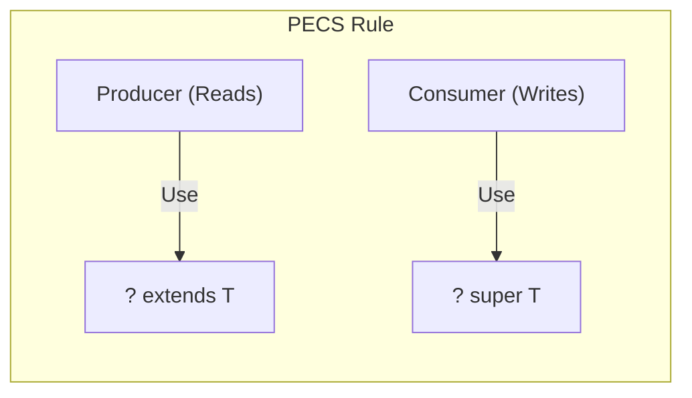

## Question

Explain Java Generics internals: Type Erasure, how the compiler enforces type safety without runtime performance penalties, covariance vs contravariance, wildcards (`? extends T` vs `? super T`), and the PECS principle.

## Answer

**Why Type Erasure Exists:**
Generics were introduced in Java 5. To maintain backward compatibility with legacy un-genericized Java 1.4 bytecode (`List` raw types), the Java compiler enforces generics strictly at **compile time** and erases type parameters in the generated **bytecode**.

**How Type Erasure Works:**
1. Replaces unbounded type parameters (`T`) with `Object`.
2. Replaces bounded type parameters (`T extends Number`) with the first bound (`Number`).
3. Inserts explicit type casts in caller bytecode where necessary.
4. Generates synthetic **bridge methods** to preserve polymorphism in extended generic classes.

```java
// Java Source Code
public class Node<T extends Number> {
    private T data;
    public Node(T data) { this.data = data; }
    public T getData() { return data; }
}

// Bytecode equivalent after Type Erasure
public class Node {
    private Number data; // Replaced T with Number
    public Node(Number data) { this.data = data; }
    public Number getData() { return data; }
}
```

**Consequences of Type Erasure:**
- Cannot instantiate generic types: `new T()` is illegal.
- Cannot create generic arrays: `new T[10]` is illegal.
- Primitive types cannot be used as type arguments (`List<int>` is illegal; must use wrapper `List<Integer>`).
- Cannot inspect generic type at runtime via `instanceof`: `list instanceof List<String>` is illegal (must check `list instanceof List<?>`).

**Variance: Covariance vs Contravariance:**
- **Arrays are Covariant:** `String[]` is a subtype of `Object[]`. This causes runtime errors (`ArrayStoreException`).
- **Generics are Invariant:** `List<String>` is NOT a subtype of `List<Object>`. This prevents runtime class cast errors at compile time.

**Wildcards and the PECS Rule:**
When working with wildcards (`?`), remember PECS:
> **P**roducer **E**xtends, **C**onsumer **S**uper

1. **`? extends T` (Upper Bounded Wildcard — Producer):**
Use when the collection **produces** items to be read. You can READ `T` from it, but you CANNOT WRITE to it (except `null`).
```java
// Producer: reading numbers from list
public double sumOfList(List<? extends Number> list) {
    double sum = 0.0;
    for (Number n : list) { // SAFE: Read as Number
        sum += n.doubleValue();
    }
    // list.add(10); // COMPILE ERROR! Compiler doesn't know if list is List<Double> or List<Integer>
    return sum;
}
```

2. **`? super T` (Lower Bounded Wildcard — Consumer):**
Use when the collection **consumes** items to be written. You can WRITE `T` into it, but items read back come out as `Object`.
```java
// Consumer: writing integers into list
public void addNumbers(List<? super Integer> list) {
    for (int i = 1; i <= 10; i++) {
        list.add(i); // SAFE: Can write Integer into List<Integer>, List<Number>, or List<Object>
    }
    // Object obj = list.get(0); // Only safe to read as Object
}
```



**Combining Producer and Consumer (`Collections.copy`):**
```java
// src produces elements -> ? extends T
// dest consumes elements -> ? super T
public static <T> void copy(List<? super T> dest, List<? extends T> src) {
    for (int i = 0; i < src.size(); i++) {
        dest.set(i, src.get(i));
    }
}
```

## Follow-ups

- What are Bridge Methods and why does the compiler generate them?
- What is Type Token (`Class<T>`) and super type tokens (`ParameterizedTypeReference`) and how do they bypass type erasure limitations?
- What is `@SafeVarargs` and why is it needed when combining generics with varargs?
