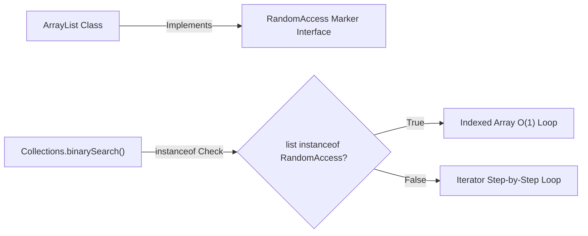

## Question

Explain Marker Interfaces in Java (`Serializable`, `Cloneable`, `RandomAccess`): what they are (interfaces with no methods), how the JVM uses them for runtime type checking via `instanceof`, and how Annotations have mostly superseded marker interfaces.

## Answer

**What is a Marker Interface?**
A **Marker Interface** (also known as a Tagging Interface) is an interface that contains **NO methods, NO fields, and NO constants**.

```java
// Standard JDK Marker Interface definition
public interface Serializable {
    // Completely empty body!
}
```

**Purpose of Marker Interfaces:**
It serves as a type metadata tag indicating to the JVM, compiler, or frameworks that an implementing class possesses a specific capability or contract.



**Classic Built-in JDK Marker Interfaces:**

1. **`java.io.Serializable`:**
   - Marks a class as safe for native Java Object Serialization (`ObjectOutputStream`).
   - If an object NOT implementing `Serializable` is passed to `ObjectOutputStream.writeObject()`, the JVM throws `NotSerializableException`.

2. **`java.lang.Cloneable`:**
   - Marks a class as permitting `Object.clone()` field-for-field shallow copying.
   - Calling `super.clone()` on an object NOT implementing `Cloneable` throws `CloneNotSupportedException`.

3. **`java.util.RandomAccess`:**
   - Used by `List` implementations (`ArrayList`, `Vector`) to signal that they support **fast constant-time $O(1)$ random access**.
   - `Collections.binarySearch()` checks `list instanceof RandomAccess`: if true, it uses index loops (`list.get(i)`); if false (like `LinkedList`), it uses iterator traversal!

4. **`java.rmi.Remote`:**
   - Identifies interfaces whose methods may be invoked from a non-local virtual machine (RMI).

**How Frameworks Use Marker Interfaces:**
```java
// Custom Marker Interface
public interface Auditable {}

// Runtime Type Check Example
public void processEntity(Object entity) {
    if (entity instanceof Auditable) {
        auditLogger.logAccess(entity); // Perform auditing for marked classes
    }
}
```

**Marker Interfaces vs Annotations:**

| Feature | Marker Interface | Annotation (`@Marker`) |
|---|---|---|
| **Type Safety** | **Compile-Time Type Safety:** Can be used as a method parameter type (`void process(Serializable obj)`) | Cannot be used as a parameter type |
| **Target Element** | Applies only to Classes/Interfaces | Applies to Classes, Methods, Fields, Parameters |
| **Inheritance** | **Inherited automatically** by all child classes | Requires `@Inherited` meta-annotation |
| **Attributes** | Cannot accept parameters or metadata values | **Can take parameters** (`@Column(name="email")`) |

**Why Annotations Have Mostly Superseded Marker Interfaces:**
Since Java 5, custom annotations (e.g. `@Entity`, `@Component`, `@Test`) have largely replaced custom marker interfaces because annotations can accept configuration attributes and can target methods/fields rather than entire classes.

However, built-in JDK marker interfaces (`Serializable`, `RandomAccess`) remain deeply integrated into Java's type system and collection optimizations.

## Follow-ups

- How does `Collections.binarySearch()` use `list instanceof RandomAccess` to select between index loops and iterator loops?
- Why can't custom annotations be used directly as polymorphic parameter types in Java methods?
- What is `SingleThreadModel` in Java Servlets and why was it deprecated?
