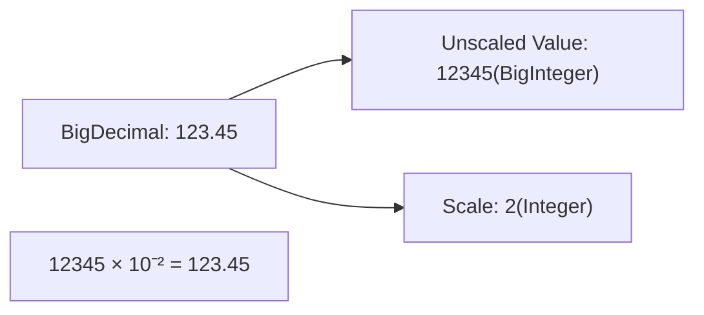

## Question

Explain IEEE 754 floating-point pitfalls (`float` and `double`), why binary floating-point representation causes inaccuracies (e.g., `0.1 + 0.2 != 0.3`), how `BigDecimal` provides arbitrary-precision decimal arithmetic, `MathContext`, scaling, rounding modes, and performance tradeoffs.

## Answer

**The IEEE 754 Floating-Point Problem:**
Computers represent numbers using base-2 (binary). Fractions like $0.1$ ($\frac{1}{10}$) cannot be represented exactly in binary floating-point, just like $\frac{1}{3}$ cannot be represented exactly in base-10 decimal ($0.33333...$).

```java
// FLOATING-POINT PITFALL!
double a = 0.1;
double b = 0.2;
System.out.println(a + b); // Prints: 0.30000000000000004 !

if (a + b == 0.3) {
    System.out.println("Equal"); // NEVER EXECUTES!
}
```
In financial applications (banking, e-commerce, tax calculations), floating-point errors accumulate into real monetary discrepancies.

**`BigDecimal` Arbitrary-Precision Decimal Arithmetic:**
`BigDecimal` represents a decimal number as an unscaled arbitrary-precision integer (`BigInteger`) plus a 32-bit integer `scale` ($value = unscaledVal \times 10^{-scale}$).



**1. Critical Rule: ALWAYS Use `String` or `BigDecimal.valueOf()` Constructor!**
```java
// BAD! Instantiating BigDecimal with double passes the inexact floating-point representation!
BigDecimal bad = new BigDecimal(0.1); 
System.out.println(bad); // Prints: 0.1000000000000000055511151231257827021181583404541015625

// GOOD: Use String constructor or BigDecimal.valueOf(double)
BigDecimal good1 = new BigDecimal("0.1");
BigDecimal good2 = BigDecimal.valueOf(0.1);
System.out.println(good1); // Prints: 0.1
```

**2. Arithmetic Operations & Explicit Rounding:**
Division in `BigDecimal` can produce non-terminating decimals ($\frac{1}{3} = 0.3333...$). Failing to specify a RoundingMode throws `ArithmeticException: Non-terminating decimal expansion`.

```java
BigDecimal amount = new BigDecimal("100.00");
BigDecimal divisor = new BigDecimal("3.00");

// BAD: Throws ArithmeticException!
// BigDecimal result = amount.divide(divisor);

// GOOD: Always specify Scale and RoundingMode
BigDecimal result = amount.divide(divisor, 2, RoundingMode.HALF_UP);
System.out.println(result); // Prints: 33.33
```

**Rounding Modes Summary:**
- `RoundingMode.HALF_UP`: Standard commercial rounding ($\ge 0.5$ rounds up).
- `RoundingMode.HALF_EVEN` (Banker's Rounding): Rounds to nearest neighbor unless equidistant, in which case it rounds to even choice. Minimizes statistical bias when summing rounded numbers in accounting.
- `RoundingMode.UNNECESSARY`: Asserts operation has exact result; throws exception if rounding needed.

**3. `equals()` vs `compareTo()` Pitfall:**
`BigDecimal.equals()` checks both numerical value AND `scale`!

```java
BigDecimal d1 = new BigDecimal("2.0");
BigDecimal d2 = new BigDecimal("2.00");

System.out.println(d1.equals(d2));    // FALSE! Scale differs (1 vs 2)
System.out.println(d1.compareTo(d2)); // 0 (TRUE! Numerical values are equal)
```
- **Rule:** Always use `compareTo() == 0` or `TreeSet` when comparing `BigDecimal` values for equality in business logic.

**4. Performance Tradeoff:**
`BigDecimal` objects are immutable, allocated on the heap, and process operations via loops/method calls rather than CPU registers. `BigDecimal` operations are **~10-50x slower** than native `double` primitive arithmetic. Use primitives for high-performance physics/graphics; use `BigDecimal` for money.

## Follow-ups

- What is `MathContext` and how does it define precision vs scale?
- How does JPA `@Column(precision = 19, scale = 4)` map `BigDecimal` to database `DECIMAL`/`NUMERIC` columns?
- Why should monetary amounts in microservices sometimes be stored as integer cents (`long`) rather than `BigDecimal`?
