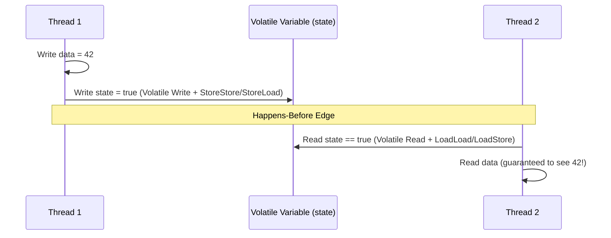

## Question

Explain the Java Memory Model (JMM): how CPU instruction reordering and multi-level CPU caches affect multi-threaded Java code, the formal *happens-before* relationship, and the role of memory barriers (`LoadLoad`, `StoreStore`, `LoadStore`, `StoreLoad`).

## Answer

**The Problem JMM Solves:**
Modern CPUs use out-of-order execution, speculative execution, and per-core L1/L2 caches with write buffers. Without a strict memory model, reads in one thread may see stale data or out-of-order writes from another thread.

The JMM defines abstract rules ensuring predictable visibility and ordering across threads regardless of underlying hardware architecture (x86, ARM).

**The Happens-Before Relationship:**
If operation A *happens-before* operation B, the memory writes of A are guaranteed to be visible to B, and A appears to execute before B.

Key *happens-before* rules in Java:
1. **Program Order Rule:** Each action in a thread happens-before every action in that thread that comes later in program order.
2. **Volatile Variable Rule:** A write to a `volatile` field happens-before every subsequent read of that same `volatile`.
3. **Monitor Lock Rule:** An `unlock` on a monitor happens-before every subsequent `lock` on that same monitor.
4. **Thread Start Rule:** A call to `Thread.start()` happens-before any action in the started thread.
5. **Thread Join Rule:** All actions in a thread happen-before any other thread successfully returns from a `join()` on that thread.
6. **Transitivity:** If A happens-before B, and B happens-before C, then A happens-before C.



**Memory Barriers (Fences):**
The JVM compiler (JIT) emits hardware memory barrier instructions based on JMM rules:
- **`StoreStore`:** Prevents store before fence from being reordered with store after fence.
- **`LoadLoad`:** Prevents load before fence from being reordered with load after fence.
- **`LoadStore`:** Prevents load before fence from being reordered with store after fence.
- **`StoreLoad`:** Heaviest fence (flushes CPU write buffer); prevents store before fence from being reordered with load after fence.

**Practical Implication:**
```java
public class VisibilityDemo {
    private int data = 0;
    private volatile boolean ready = false;

    public void writer() {
        data = 42;          // 1. Regular write
        ready = true;       // 2. Volatile write (flushes data = 42 to RAM/cache)
    }

    public void reader() {
        if (ready) {        // 3. Volatile read
            System.out.println(data); // 4. Guaranteed to print 42, never 0!
        }
    }
}
```

## Follow-ups

- What is piggybacking on synchronization in Java?
- How does final field semantics differ in JMM (safe publication guarantees)?
- What is double-checked locking and why was it broken prior to Java 5?
