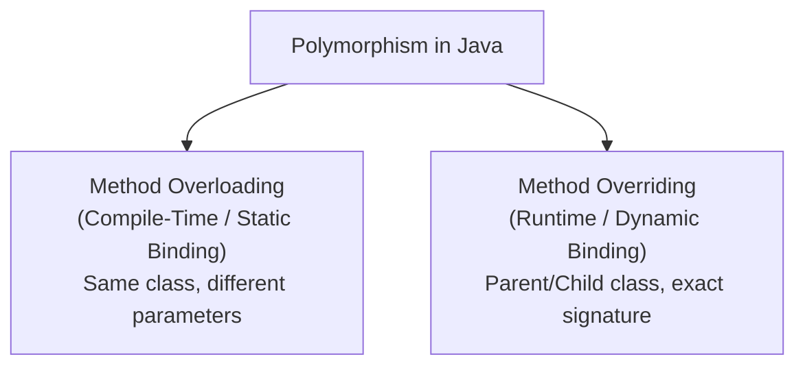

## Question

Compare Method Overloading and Method Overriding in Java: Compile-time (Static) vs Runtime (Dynamic) Polymorphism, method signature requirements, covariance return types, exception rules, and `@Override` annotation benefits.

## Answer

**Polymorphism in Java:**
Polymorphism allows objects to take multiple forms. Java supports polymorphism through:
1. **Method Overloading:** Compile-Time (Static) Polymorphism within the same class.
2. **Method Overriding:** Runtime (Dynamic) Polymorphism across parent and child classes.



**1. Method Overloading (Compile-Time):**
Occurs within the **same class** when multiple methods have the **same name** but **different parameter lists** (number, type, or order of parameters).

```java
public class Calculator {
    // Overloaded method 1
    public int add(int a, int b) { return a + b; }

    // Overloaded method 2 (different parameter count)
    public int add(int a, int b, int c) { return a + b + c; }

    // Overloaded method 3 (different parameter types)
    public double add(double a, double b) { return a + b; }
}
```
- **Return Type:** Changing ONLY the return type is NOT valid overloading and causes a compiler error!

**2. Method Overriding (Runtime):**
Occurs when a subclass provides a specific implementation of a method declared in its superclass using the **exact same name, parameters, and compatible return type**.

```java
public class Animal {
    public void makeSound() {
        System.out.println("Generic animal sound");
    }
}

public class Dog extends Animal {
    @Override // Annotation guarantees compiler checks matching method signature
    public void makeSound() {
        System.out.println("Woof! Woof!");
    }
}
```

**Rules for Method Overriding:**
1. **Signature Match:** Parameter types and order must be identical.
2. **Covariant Return Type:** Return type must be identical or a subtype of the parent method's return type.
3. **Access Modifier:** Cannot assign a MORE restrictive access modifier (e.g. parent is `protected`, child cannot be `private`).
4. **Exception Handling:** Overriding method cannot throw broader/new checked exceptions than declared by superclass.
5. **Forbidden Overriding:** `private`, `static`, and `final` methods CANNOT be overridden!

**Comparison Matrix:**

| Feature | Method Overloading | Method Overriding |
|---|---|---|
| **Polymorphism Type** | Compile-Time (Static Binding) | **Runtime (Dynamic Binding)** |
| **Location** | Same class | Subclass vs Superclass |
| **Parameter List** | **Must be different** | **Must be identical** |
| **Return Type** | Can be anything | Must be identical or Covariant subtype |
| **Private/Static/Final** | Can overload | **Cannot override** |

**Dynamic Method Dispatch Example:**
```java
Animal myPet = new Dog(); // Upcasting
myPet.makeSound(); // PRINTS "Woof! Woof!" (Resolved at Runtime via vtable!)
```

## Follow-ups

- What is virtual method invocation and virtual method table (vtable) in JVM?
- Why does static method hiding occur instead of overriding when declaring a static method with same signature in subclass?
- Why is the `@Override` annotation strongly recommended even though it's optional?
