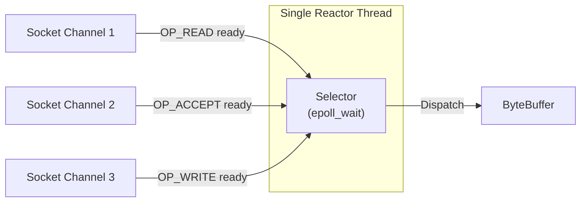

## Question

Explain Java NIO (`java.nio`): blocking I/O vs non-blocking I/O, Channels, Buffers (`capacity`, `position`, `limit`), Selectors, and how a single thread can multiplex thousands of socket connections (OS `epoll`/`kqueue`).

## Answer

**Java Classic IO vs New IO (NIO):**
- **Classic `java.io` (Stream-oriented, Blocking):** Reads byte-by-byte or line-by-line from `InputStream`/`OutputStream`. Each connection requires its own dedicated thread because `read()` blocks until data arrives.
- **Java NIO `java.nio` (Buffer-oriented, Non-Blocking):** Reads data into `Buffer` blocks via `Channel` objects. A single thread uses a `Selector` to monitor thousands of channels for ready events (`OP_READ`, `OP_WRITE`, `OP_ACCEPT`).



**1. Three Pillars of Java NIO:**

1. **`Buffer`:** Container for data. Has 3 essential pointers:
   - `capacity`: Total size of the buffer.
   - `position`: Current index for reading/writing.
   - `limit`: Index up to which data can be read/written.
   - `flip()`: Prepares buffer for reading after writing (sets `limit = position`, resets `position = 0`).

2. **`Channel`:** Open connection to a device, file, or socket capable of I/O operations. Channels are bidirectional (unlike 1-way streams).

3. **`Selector`:** Multiplexer that registers `SelectableChannel` instances and polls the OS kernel (`epoll` on Linux, `kqueue` on macOS) for ready I/O events.

**2. Non-Blocking Echo Server Code Example:**
```java
public class NioEchoServer {

    public void start(int port) throws IOException {
        // 1. Open Selector and ServerSocketChannel
        Selector selector = Selector.open();
        ServerSocketChannel serverChannel = ServerSocketChannel.open();
        
        serverChannel.bind(new InetSocketAddress(port));
        serverChannel.configureBlocking(false); // Non-blocking mode!
        
        // 2. Register channel with selector for OP_ACCEPT events
        serverChannel.register(selector, SelectionKey.OP_ACCEPT);
        
        ByteBuffer buffer = ByteBuffer.allocate(1024);

        while (true) {
            // 3. Poll OS epoll_wait for ready events (blocking until at least 1 channel is ready)
            selector.select();

            Set<SelectionKey> selectedKeys = selector.selectedKeys();
            Iterator<SelectionKey> iter = selectedKeys.iterator();

            while (iter.hasNext()) {
                SelectionKey key = iter.next();
                iter.remove(); // Remove key to prevent double processing!

                if (key.isAcceptable()) {
                    // New client connection ready
                    ServerSocketChannel server = (ServerSocketChannel) key.channel();
                    SocketChannel client = server.accept();
                    client.configureBlocking(false);
                    client.register(selector, SelectionKey.OP_READ);
                    System.out.println("Accepted connection from: " + client.getRemoteAddress());
                } 
                else if (key.isReadable()) {
                    // Data available to read
                    SocketChannel client = (SocketChannel) key.channel();
                    buffer.clear();
                    int bytesRead = client.read(buffer);

                    if (bytesRead == -1) {
                        client.close(); // Client disconnected
                    } else {
                        buffer.flip(); // Prepare buffer for writing back (echo)
                        client.write(buffer);
                    }
                }
            }
        }
    }
}
```

**Buffer State Transitions:**
```java
ByteBuffer buf = ByteBuffer.allocate(10); // capacity=10, position=0, limit=10
buf.put((byte) 'H');
buf.put((byte) 'i');                       // capacity=10, position=2, limit=10

buf.flip();                                // capacity=10, position=0, limit=2
byte b1 = buf.get();                       // reads 'H', position=1
byte b2 = buf.get();                       // reads 'i', position=2

buf.clear();                               // Resets position=0, limit=10 for new writes
```

**Netty Framework:**
Writing raw Java NIO code requires handling edge cases (partial reads/writes, buffer reallocation, epoll CPU spinning bug). Netty wraps Java NIO into an event-driven framework used by gRPC, Cassandra, Spring WebFlux, and ElasticSearch.

## Follow-ups

- What is the JDK NIO `epoll` CPU 100% spinning bug and how does Netty work around it?
- How does `FileChannel.transferTo()` achieve zero-copy file transfer over OS sockets using `sendfile`?
- What is `AsynchronousFileChannel` (NIO 2.0 / AIO) and how does it use completion handlers?
