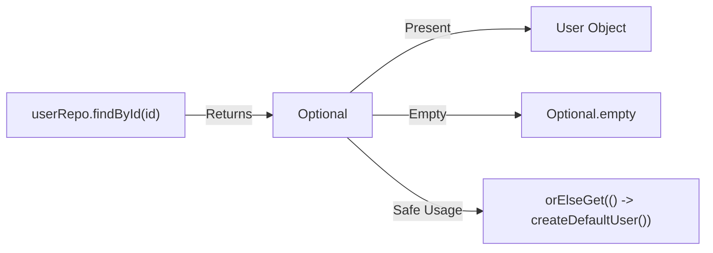

## Question

Explain `Optional<T>` in Java: design purpose, `orElse` vs `orElseGet`, `flatMap`, `ifPresentOrElse`, avoiding `Optional.get()`, and why `Optional` should NOT be used for method parameters, class fields, or serializable objects.

## Answer

**Design Purpose of `Optional<T>`:**
Introduced in Java 8, `Optional<T>` is a container object that may or may not contain a non-null value. It was designed specifically as a **method return type** to explicitly communicate to callers that a method might return no result, eliminating `NullPointerException` errors.



**1. `orElse` vs `orElseGet` (Critical Performance Difference):**

- **`orElse(fallback)`:** The fallback argument is **ALWAYS evaluated**, even if the `Optional` is NOT empty!
- **`orElseGet(Supplier)`:** The fallback `Supplier` is **LAZILY evaluated** ONLY if the `Optional` is empty!

```java
Optional<User> userOpt = userRepo.findById(123L);

// DANGER! createDefaultUser() database query is EXECUTED ALWAYS, even if userOpt has a value!
User user1 = userOpt.orElse(createDefaultUserInDb()); 

// GOOD: createDefaultUser() is ONLY executed if userOpt is empty!
User user2 = userOpt.orElseGet(() -> createDefaultUserInDb());
```

**2. Transforming Optionals (`map` vs `flatMap`):**

- **`map(Function)`:** Used when the mapping function returns a plain value `T`.
- **`flatMap(Function)`:** Used when the mapping function returns an `Optional<U>` to prevent nested `Optional<Optional<U>>`.

```java
public class User {
    private Address address;
    public Optional<Address> getAddress() { return Optional.ofNullable(address); }
}

// Chaining Optionals with flatMap to safely traverse nested objects!
Optional<String> city = userOpt
    .flatMap(User::getAddress)  // Returns Optional<Address>
    .map(Address::getCity);      // Returns String
```

**3. Common Antipatterns to AVOID:**

**Antipattern 1: Calling `optional.get()` without checking `isPresent()`**
```java
// BAD! Throws NoSuchElementException if empty! (Worse than NPE!)
User user = userOpt.get(); 

// GOOD: Use functional methods
User user = userOpt.orElseThrow(() -> new UserNotFoundException(userId));
```

**Antipattern 2: Using `if (optional.isPresent()) { get(); }`**
Writing imperative null checks using `Optional` is verbose and defeats the purpose of the API.
```java
// BAD (Imperative style):
if (userOpt.isPresent()) {
    processUser(userOpt.get());
}

// GOOD (Functional style):
userOpt.ifPresent(this::processUser);

// Java 9+ Handling Both Present and Empty:
userOpt.ifPresentOrElse(
    this::processUser,
    () -> log.warn("User not found")
);
```

**Antipattern 3: Using `Optional` for Class Fields or Method Parameters**
```java
// BAD! Optional is NOT Serializable and adds 16 bytes overhead per field!
public class User {
    private Optional<String> middleName; // DO NOT DO THIS!
}

// BAD! Forces callers to wrap arguments: service.find(Optional.of("query"))
public void searchUser(Optional<String> name) {} // DO NOT DO THIS!
```

**Rule of Thumb for `Optional`:**
- **DO:** Use `Optional<T>` as the **return type** for methods that might return no result.
- **DON'T:** Use `Optional` for class fields, method parameters, or collection elements (`List<Optional<User>>`). Use plain `null` or empty collections instead!

## Follow-ups

- Why is returning `Optional<List<T>>` an antipattern? (Return an empty list `List.of()` instead!)
- How does `Optional.stream()` (Java 9) allow filtering out empty optionals in a Stream pipeline?
- What is `OptionalInt`, `OptionalLong`, and `OptionalDouble` and why should they be used for primitives?
