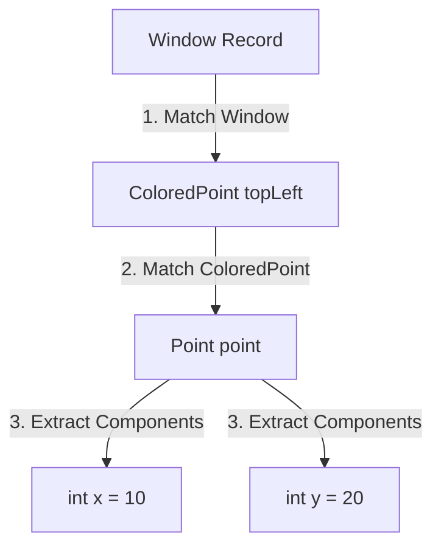

## Question

Explain Record Patterns (JEP 440) introduced in Java 21: destructuring record components directly in `instanceof` and `switch`, nested record deconstruction, guarded patterns (`when`), and unnamed variables (`_`).

## Answer

**What are Record Patterns?**
Record Patterns extend Pattern Matching (Java 16+) by allowing developers to unpack and destructure a record's state components directly inside expression patterns without calling accessor methods (`point.x()`, `point.y()`).

**1. Basic Record Pattern (`instanceof` Destructuring):**
Prior to Java 21, matching a record required testing the type first, then calling accessors:

```java
// Java 16 Pattern Matching
if (obj instanceof Point p) {
    int x = p.x();
    int y = p.y();
    System.out.println("Point: " + x + ", " + y);
}

// Java 21 Record Pattern (Direct Destructuring!)
if (obj instanceof Point(int x, int y)) {
    System.out.println("Point: " + x + ", " + y); // x and y bound directly!
}
```

**2. Nested Record Deconstruction:**
Record patterns can be nested arbitrarily deep, extracting nested component values in a single expression:

```java
public record Point(int x, int y) {}
public record ColoredPoint(Point point, String color) {}
public record Window(ColoredPoint topLeft, ColoredPoint bottomRight) {}

public class WindowInspector {
    public void printTopLeftX(Window window) {
        // Deep nested record deconstruction!
        if (window instanceof Window(ColoredPoint(Point(int x, int y), String color), _)) {
            System.out.println("Top-Left Point: (" + x + ", " + y + ") with color: " + color);
        }
    }
}
```



**3. Record Patterns in `switch` with Guard Clauses (`when`):**
Combine record pattern destructuring with conditional `when` guards:

```java
public sealed interface Shape permits Circle, Rectangle {}
public record Circle(Point center, double radius) implements Shape {}
public record Rectangle(Point topLeft, Point bottomRight) implements Shape {}

public class ShapeCalculator {
    public double calculateArea(Shape shape) {
        return switch (shape) {
            case Circle(Point center, double r) when r <= 0 -> 
                throw new IllegalArgumentException("Invalid radius: " + r);
            case Circle(_, double r) -> 
                Math.PI * r * r;
            case Rectangle(Point(int x1, int y1), Point(int x2, int y2)) -> 
                Math.abs((double)(x2 - x1) * (y2 - y1));
        };
    }
}
```

**4. Unnamed Variables (`_`) (Java 22 JEP 456):**
Use the underscore `_` for components that are destructured but not used in the body, signifying to the compiler and reader that the variable is intentionally ignored.

```java
// Ignore color component using '_'
if (obj instanceof ColoredPoint(Point(int x, int y), _)) {
    System.out.println("Coordinates: " + x + ", " + y);
}
```

## Follow-ups

- How do Record Patterns interact with Generic Records (e.g. `Box<T>(T content)`)?
- What happens if a record component destructured in a pattern contains a `null` value?
- How do Record Patterns enforce exhaustive `switch` statements without default cases?
