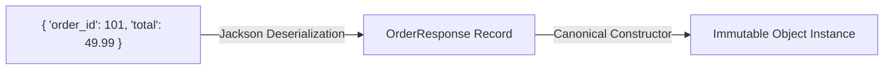

## Question

Compare Java Records (`record`) with Lombok (`@Value`, `@Data`): immutability guarantees, Jackson JSON serialization, compact constructors, inheritance restrictions, and DTO design best practices.

## Answer

**What is a Java Record?**
Introduced in Java 14 (finalized in Java 16), a `record` is a special restricted class intended to act as a transparent, immutable data carrier.

```java
public record UserDto(Long id, String email, String fullName) {}
```

**What the Compiler Generates Automatically:**
- `private final` fields for each component.
- Canonical constructor taking all components.
- Accessor methods (`id()`, `email()`, `fullName()`) — note: NO `get` prefix!
- `equals()`, `hashCode()`, and `toString()` implementations based on state components.

**Records vs Lombok Comparison:**

| Feature | Java Record | Lombok (`@Value` / `@Data`) |
|---|---|---|
| **Language Support** | First-class native Java keyword | Annotation processor (byte-code manipulation) |
| **Field Mutability** | Strictly immutable (`final`) | `@Value` = immutable; `@Data` = mutable |
| **Inheritance** | Cannot extend classes (implicitly extends `java.lang.Record`) | Can extend other classes (`@EqualsAndHashCode(callSuper=true)`) |
| **Getter Naming** | `user.email()` | `user.getEmail()` (JavaBean convention) |
| **Reflection / Serialization** | Native JVM special serialization (bypasses reflection constructor bypasses) | Standard class reflection serialization |
| **Wither Methods** | No built-in withers (coming in future JEPs) | `@With` annotation generates `withEmail(String e)` |

**1. Compact Constructors & Validation:**
Records support compact constructors where parameters are implicit, allowing validation before field assignment without boilerplate:

```java
public record CreateUserRequest(String email, int age) {
    // Compact Constructor
    public CreateUserRequest {
        Objects.requireNonNull(email, "Email must not be null");
        if (!email.contains("@")) {
            throw new IllegalArgumentException("Invalid email format");
        }
        if (age < 18) {
            throw new IllegalArgumentException("User must be at least 18 years old");
        }
        email = email.trim().toLowerCase(); // Normalize input!
    }
}
```

**2. Jackson JSON Serialization with Records (Spring Boot 3 / Jackson 2.12+):**
Jackson automatically supports Records out of the box using accessor methods (`id()`) instead of JavaBeans getters (`getId()`).

```java
public record OrderResponse(
    @JsonProperty("order_id") Long orderId,
    @JsonFormat(pattern = "yyyy-MM-dd HH:mm:ss") LocalDateTime createdAt,
    BigDecimal total
) {}
```



**3. JPA / Hibernate Trap with Records:**
**WARNING:** Records CANNOT be used as JPA `@Entity` classes!
- **Reason 1:** JPA entities require no-arg constructors (Records only have canonical all-arg constructors).
- **Reason 2:** JPA entities rely on proxying and mutability (lazy loading, setter updates). Records are strictly `final` and immutable.
- **Solution:** Use Records for **DTOs**, API Request/Response payloads, and projection queries (`SELECT new com.example.UserDto(...)`), while keeping standard classes for JPA Entities.

## Follow-ups

- How do Record Patterns in Java 21 simplify nested DTO extraction?
- Why is custom deserialization safer for Records than traditional Java classes?
- How do you implement builder patterns for Records with multiple optional fields?
