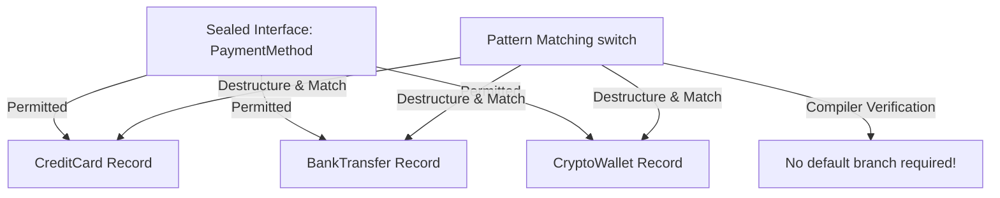

## Question

Explain modern Java features (Java 17 & 21): Sealed Classes (`sealed`/`permits`), Records, Pattern Matching for `switch`, and Record Patterns. How do they enable algebraic data types (ADTs) and exhaustiveness checking?

## Answer

**Modern Java Domain Modeling:**
Java 17+ introduced functional domain modeling features similar to Scala/Rust:
1. **Records:** Immutable data carriers eliminating boilerplate (getters, `equals`, `hashCode`, `toString`).
2. **Sealed Classes:** Restrict which classes can extend/implement an interface/class.
3. **Pattern Matching:** Deconstruct types and records directly in `if` and `switch` statements with compile-time exhaustiveness checks.

**1. Sealed Classes & Interfaces:**
Restricts subclassing to a closed set of permitted classes. Subclasses must be `final`, `sealed`, or `non-sealed`.

```java
// Algebraic Data Type (Sum Type)
public sealed interface PaymentMethod permits CreditCard, BankTransfer, CryptoWallet {}

public final record CreditCard(String cardNumber, String cvv) implements PaymentMethod {}
public final record BankTransfer(String iban, String swiftCode) implements PaymentMethod {}
public final record CryptoWallet(String walletAddress, String chain) implements PaymentMethod {}
```

**2. Pattern Matching for `switch` & Record Patterns (Java 21):**
Allows matching types and destructuring Record components inline.

```java
public class PaymentProcessor {

    public String process(PaymentMethod method) {
        // Compile-time exhaustiveness check! No 'default' branch needed.
        return switch (method) {
            case CreditCard(String number, String cvv) -> 
                "Processing credit card: " + maskCard(number);
            case BankTransfer(String iban, _) -> 
                "Initiating wire transfer to: " + iban;
            case CryptoWallet(String address, String chain) when chain.equalsIgnoreCase("ETH") -> 
                "Sending Ethereum transaction to: " + address;
            case CryptoWallet(String address, String chain) -> 
                "Sending " + chain + " transaction to: " + address;
        };
    }
}
```



**Key Advantages:**
- **Exhaustiveness Guarantee:** If you add a new permitted class `MobileWallet` to `PaymentMethod`, the compiler raises a compile error in every `switch` statement that handles `PaymentMethod` across the entire codebase.
- **Immutability by Default:** Records are implicitly `final`, fields are `private final`, and cannot extend other classes.
- **Boilerplate Reduction:** Replaces hundreds of lines of Lombok/hand-written code with concise type-safe constructs.

## Follow-ups

- Can a record implement a sealed interface? (Yes, records are implicitly `final` so they fulfill sealed requirements.)
- What is the difference between a `sealed` subclass and a `non-sealed` subclass?
- How do compact constructors in Records allow validation before field assignment?
