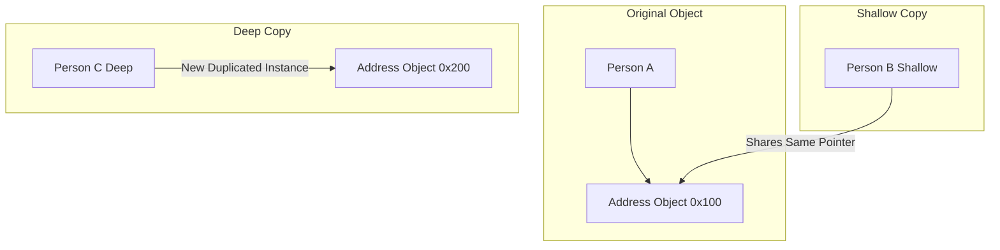

## Question

Compare Shallow Copy and Deep Copy in Java: `Object.clone()`, `Cloneable` interface pitfalls, Copy Constructors, and deep cloning techniques (Serialization, Jackson JSON, Apache Commons `SerializationUtils`).

## Answer

**Object Copying Concepts:**
When duplicating an object in Java, the depth of the copy determines whether nested reference objects are shared or recursively duplicated.



**1. Shallow Copy:**
Creates a new outer object instance, but copies references to all internal nested objects.
- Primitive fields are copied by value.
- Reference fields point to the **SAME memory addresses** on the heap as the original object.
- **Risk:** Modifying a nested object field inside the shallow copy mutates the original object's nested field!

**2. Deep Copy:**
Creates a new outer object instance AND recursively creates new instances of all internal nested objects.
- The new object graph is completely independent of the original.
- Modifying nested objects in the deep copy has zero effect on the original object.

**Shallow Copy via `Object.clone()` (Java Native Cloning):**
`Object.clone()` performs a **shallow copy** by default. A class MUST implement the `Cloneable` marker interface, otherwise calling `super.clone()` throws `CloneNotSupportedException`.

```java
public class Address implements Cloneable {
    public String city;

    public Address(String city) { this.city = city; }

    @Override
    public Object clone() throws CloneNotSupportedException {
        return super.clone(); // Shallow copy
    }
}

public class Person implements Cloneable {
    public String name;
    public Address address; // Reference field!

    public Person(String name, Address address) {
        this.name = name;
        this.address = address;
    }

    // Shallow Copy Implementation
    @Override
    public Object clone() throws CloneNotSupportedException {
        return super.clone(); // Address reference is shared!
    }
}

// Shallow Copy Bug Demo:
Address addr = new Address("New York");
Person p1 = new Person("Alice", addr);
Person p2 = (Person) p1.clone(); // Shallow copy!

p2.address.city = "London"; // MUTATES p1's address city as well!
System.out.println(p1.address.city); // PRINTS "London"!
```

**Flaws of `Cloneable` Interface:**
Josh Bloch (Effective Java) considers `Cloneable` broken:
- It lacks a `clone()` method in the interface declaration.
- Uses reflective bytecode allocation without invoking constructors.
- Throws checked `CloneNotSupportedException`.

**Best Practices for Implementing Deep Copies:**

**Option A: Copy Constructors (Recommended Native Pattern):**
```java
public class Address {
    public String city;
    public Address(String city) { this.city = city; }
    
    // Copy Constructor
    public Address(Address other) {
        this.city = other.city;
    }
}

public class Person {
    public String name;
    public Address address;

    // Deep Copy Constructor
    public Person(Person other) {
        this.name = other.name;
        this.address = new Address(other.address); // Deep copy nested object!
    }
}
```

**Option B: Deep Copy via Jackson JSON Serialization:**
```java
ObjectMapper mapper = new ObjectMapper();

// Deep copy by serializing to JSON and back
Person deepCopy = mapper.readValue(
    mapper.writeValueAsString(p1), 
    Person.class
);
```

**Option C: Deep Copy via SerializationUtils (Apache Commons):**
```java
// Requires classes to implement Serializable
Person deepCopy = SerializationUtils.clone(p1);
```

## Follow-ups

- Why are immutable classes (like `String` or Java `record`) immune to shallow copy bugs?
- How does `List.copyOf()` or `Collections.unmodifiableList()` affect shallow vs deep copying of collections?
- What performance penalty does JSON/Bytecode serialization cloning have compared to copy constructors?
