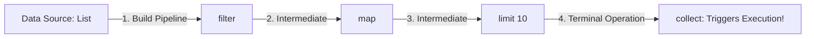

## Question

Explain Java Stream API internals: pipeline construction, Intermediate vs Terminal operations, Lazy Evaluation, short-circuiting, and how `Spliterator` splits data for parallel processing.

## Answer

**What is a Stream?**
A Stream (`java.util.stream.Stream`) is a sequence of elements supporting sequential and parallel aggregate operations. Streams do NOT store data; they process data from a source (Collection, Array, I/O channel) through a pipeline.

**Stream Pipeline Architecture:**
A stream pipeline consists of three parts:
1. **Source:** `list.stream()`, `Files.lines()`, `Stream.of()`.
2. **Intermediate Operations:** Zero or more operations (`map`, `filter`, `sorted`, `distinct`, `flatMap`). They are **lazy** and return a new Stream.
3. **Terminal Operation:** One operation (`collect`, `forEach`, `reduce`, `findFirst`, `count`). Triggers pipeline execution and returns a result or side effect.



**1. Lazy Evaluation:**
Intermediate operations do NOT process elements when declared. Execution happens only when the Terminal operation is invoked.
Elements pass through the pipeline **one element at a time** (vertical processing), rather than processing the entire collection per step (horizontal processing).

```java
List<String> names = List.of("Alice", "Bob", "Charlie", "David");

String result = names.stream()
    .filter(name -> {
        System.out.println("Filter: " + name);
        return name.length() > 3;
    })
    .map(name -> {
        System.out.println("Map: " + name);
        return name.toUpperCase();
    })
    .findFirst() // Terminal operation!
    .orElse("");

// Console Output:
// Filter: Alice
// Map: Alice
// (Notice 'Bob', 'Charlie', 'David' are NEVER evaluated because findFirst short-circuits after Alice!)
```

**2. Short-Circuiting Operations:**
Operations like `findFirst()`, `anyMatch()`, `limit(n)`, `takeWhile()` terminate execution early as soon as the condition is satisfied, avoiding unnecessary computations over infinite or large streams.

**3. `Spliterator` (Splitable Iterator):**
Introduced in Java 8 for parallel stream execution (`list.parallelStream()`).
- `tryAdvance(Consumer)`: Consumes next element sequentially.
- `trySplit()`: Splits the source into two smaller `Spliterator` instances for parallel worker threads to process independently in `ForkJoinPool`.

```java
Spliterator<Integer> firstHalf = list.spliterator();
Spliterator<Integer> secondHalf = firstHalf.trySplit(); // Divides elements roughly in half!
```

**Stateful vs Stateless Intermediate Operations:**
- **Stateless (`map`, `filter`):** Each element is processed independently without knowledge of previous elements.
- **Stateful (`sorted`, `distinct`):** Must buffer all elements in memory before producing a result. Breaks element-by-element streaming and cannot short-circuit effectively.

## Follow-ups

- What is the difference between `Stream.flatMap()` and `Stream.map()`?
- Why should you avoid side effects (modifying outer state) inside Stream lambda expressions?
- How does `Collectors.groupingBy()` work with downstream collectors?
