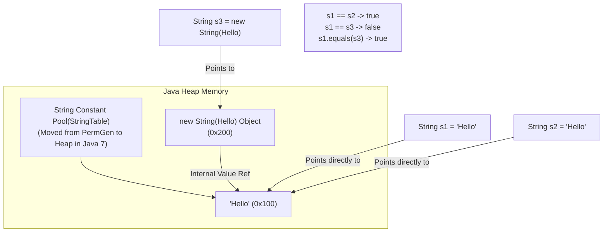

## Question

Explain Java String internals: String immutability rationale, String Constant Pool (String Table), `String.intern()`, heap location changes (PermGen to Metaspace/Heap), `StringBuilder` vs `StringBuffer`, and Java 9 Compact Strings (`byte[]` vs `char[]`).

## Answer

**Why Java Strings are Immutable:**
1. **Security:** Strings are widely used as parameters for network connections, database URLs, file paths, and reflection names. If strings were mutable, an attacker could modify a validated path string after security checks.
2. **Thread Safety:** Immutable strings are inherently thread-safe and can be shared freely across threads without synchronization.
3. **String Pool Caching:** Allows the JVM to store only one copy of each distinct string literal in memory, saving massive amounts of RAM.
4. **Cached HashCode:** A String's `hashCode()` is calculated once during first access and cached internally (`private int hash`). Essential for fast `HashMap` key lookups.

**String Pool (String Table) Architecture:**
The String Pool is a native hashtable (`StringTable`) maintained by the JVM.



**`String.intern()` Method:**
- When `s.intern()` is called, if the String Pool already contains a string equal to `s` (via `equals()`), the reference from the pool is returned.
- Otherwise, `s` is added to the String Pool and a reference to `s` is returned.

```java
String s1 = new String("World"); // Creates object on heap (0x200)
String s2 = s1.intern();         // Puts "World" into pool (0x100) and returns pool ref
String s3 = "World";            // Gets "World" directly from pool (0x100)

System.out.println(s1 == s2); // false
System.out.println(s2 == s3); // true!
```

**Memory Location Changes Across Java Versions:**
- **Java 6 and earlier:** String Pool was located in **PermGen** (Permanent Generation). PermGen had a fixed max size; calling `intern()` heavily caused `java.lang.OutOfMemoryError: PermGen space`.
- **Java 7+:** String Pool was moved into the **Main Java Heap**. Interned strings are now garbage collected when no longer referenced!

**Compact Strings (Java 9 JEP 254):**
- **Java 8 and earlier:** `String` stored characters in a UTF-16 `char[]` array (2 bytes per character), even for plain ASCII strings like `"hello"`.
- **Java 9+:** `String` uses a `byte[]` array plus an encoding flag byte (`coder`):
  - `LATIN1` (0): 1 byte per character for ASCII/ISO-8859-1.
  - `UTF16` (1): 2 bytes per character for non-Latin characters (Chinese, Emoji, Cyrillic).
- **Result:** Memory footprint for String-heavy applications dropped by **~50%** with zero code changes!

**`StringBuilder` vs `StringBuffer`:**

| Feature | `StringBuilder` | `StringBuffer` |
|---|---|---|
| **Thread Safety** | Not Thread-Safe (no synchronization) | Thread-Safe (all methods `synchronized`) |
| **Performance** | Fast (no lock overhead) | Slower due to lock overhead |
| **Use Case** | Single-thread String concatenation (default) | Multi-thread legacy code |

```java
// Compiler automatically translates string concatenation into StringBuilder in Java 8+
String msg = "Hello " + name + " count: " + count; 
```

## Follow-ups

- What is the JVM flag to tune the String Pool hash table size (`-XX:StringTableSize`)?
- What is String Deduplication in G1GC (`-XX:+UseStringDeduplication`) and how does it differ from String Pooling?
- How does `indify` string concatenation in Java 9+ (using `StringConcatFactory` via `invokedynamic`) improve over traditional `StringBuilder` bytecode?
