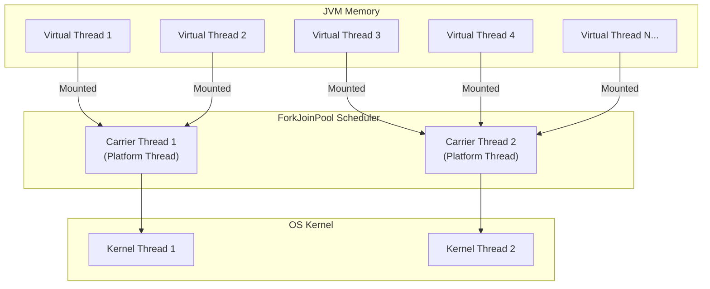

## Question

Explain Java Virtual Threads (introduced in Java 21 via Project Loom): the M:N scheduler model, carrier threads, Continuation objects, pinned virtual threads (`synchronized` blocks), and how they replace traditional thread-per-request architectures.

## Answer

**The Problem with Platform Threads:**
Traditional Java threads (`java.lang.Thread`) map 1:1 to OS kernel threads. OS threads are expensive:
- Stack allocation: ~1 MB per thread.
- Context switch: ~1-10 µs (kernel mode switch).
- Limit: ~10,000 threads per JVM instance before running out of memory/PID space.

In web servers, threads spend 95%+ of their lifecycle blocked on I/O (database, REST calls). Thread-per-request does not scale to hundreds of thousands of concurrent connections.

**Virtual Threads Model (M:N Scheduling):**
Virtual threads are lightweight user-mode threads managed by the JVM runtime rather than the OS. Millions of virtual threads can be multiplexed onto a small pool of platform "carrier" threads (typically matching CPU core count).



**How Unmounting Works (Continuation API):**
1. Virtual thread runs on a carrier thread.
2. Code performs blocking I/O operation (e.g., `SocketInputStream.read()` or `Thread.sleep()`).
3. The underlying JVM I/O mechanism yields: the virtual thread's stack frame is copied off the carrier thread's stack onto the heap (unmounted).
4. Carrier thread is now free to execute another virtual thread.
5. When I/O completes (via OS `epoll`/`kqueue`), the virtual thread is scheduled again and mounted onto an available carrier thread.

**Code Example:**
```java
// Create executor producing virtual thread per task
try (var executor = Executors.newVirtualThreadPerTaskExecutor()) {
    IntStream.range(0, 10_000).forEach(i -> {
        executor.submit(() -> {
            Thread.sleep(Duration.ofSeconds(1)); // Unmounts carrier thread!
            return i;
        });
    });
} // Auto-closes and waits for all 10,000 virtual threads to finish!
```

**Carrier Thread Pinning (Pitfall):**
A virtual thread is **pinned** to its carrier thread and CANNOT unmount during blocking I/O if:
1. It executes inside a `synchronized` block/method.
2. It executes a native method or foreign function.

```java
// BAD — Pins carrier thread!
public synchronized String fetchData() {
    return restTemplate.getForObject(url, String.class); // Blocking I/O inside synchronized!
}

// GOOD — Use ReentrantLock instead!
private final ReentrantLock lock = new ReentrantLock();
public String fetchData() {
    lock.lock();
    try {
        return restTemplate.getForObject(url, String.class); // Virtual thread unmounts cleanly!
    } finally {
        lock.unlock();
    }
}
```

**Diagnostic Flag:**
To detect thread pinning in production:
```bash
-Djdk.traceVirtualThreadPinned=full
```

## Follow-ups

- Why should you NEVER pool Virtual Threads (e.g., using `ThreadPoolExecutor`)?
- How does ThreadLocal behavior change with Virtual Threads, and why is `ScopedValues` preferred?
- How does Spring Boot 3.2+ enable Virtual Threads support (`spring.threads.virtual.enabled=true`)?
