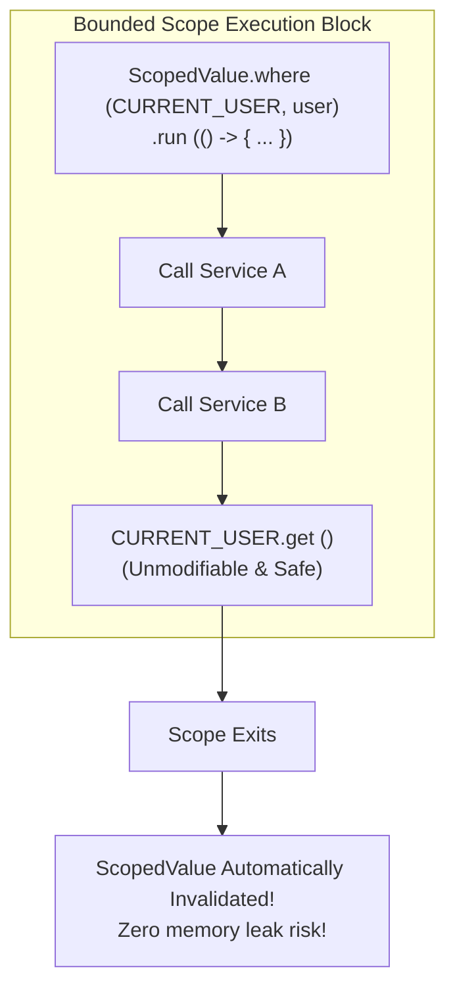

## Question

Explain Scoped Values (JEP 446 / Java 21 preview): problems with `ThreadLocal` in high-throughput Virtual Thread applications (mutability, unconfined lifetime, memory leaks), how `ScopedValue` works, rebinding, and structural inheritance across child threads.

## Answer

**The Problem with `ThreadLocal`:**
`ThreadLocal` has been the standard way to pass implicit context (User ID, Security Tokens, Transaction IDs) down a call stack without passing arguments through every method. However, `ThreadLocal` suffers from severe design flaws:

1. **Unbounded Lifetime & Memory Leaks:** A `ThreadLocal` value remains attached to the thread until explicitly cleared via `threadLocal.remove()`. In thread pools, if a thread isn't cleaned up, the `ThreadLocal` data leaks into subsequent user requests!
2. **Unrestricted Mutability:** Any code down the call stack can call `threadLocal.set(newValue)`, mutating the context for subsequent callers without their knowledge.
3. **High Footprint with Virtual Threads:** In traditional Java, you might have 500 platform threads. In Virtual Threads, you can have 1,000,000 virtual threads! Having 1,000,000 `ThreadLocalMap` instances on the heap consumes massive RAM.

**Enter Scoped Values (`java.lang.ScopedValue`):**
Scoped Values allow sharing an unmodifiable data value safely within a bounded execution block and across child threads in Structured Concurrency.



**Key Characteristics of `ScopedValue`:**
- **Immutable:** Once bound with `.where()`, the value cannot be mutated during the scope execution.
- **Bounded Lifetime:** Valid ONLY within the execution duration of the lambda passed to `where(...).run(...)` or `.call(...)`. Automatically popped off the stack when the method completes!
- **High Efficiency:** Shared efficiently across child threads in Structured Concurrency (`StructuredTaskScope`) without duplicating maps.

**Code Example:**
```java
public class UserContext {
    // 1. Declare ScopedValue static field
    public static final ScopedValue<User> CURRENT_USER = ScopedValue.newInstance();
}

@RestController
public class UserController {
    private final UserService userService;

    @GetMapping("/api/profile")
    public ProfileDto getProfile(@AuthenticationPrincipal User user) throws Exception {
        // 2. Bind value for the duration of the call block
        return ScopedValue.where(UserContext.CURRENT_USER, user)
                .call(() -> userService.getUserProfile()); // Execution scope!
    }
}

@Service
public class UserService {
    public ProfileDto getUserProfile() {
        // 3. Read bound value safely anywhere down the call stack!
        User currentUser = UserContext.CURRENT_USER.get();
        System.out.println("Processing profile for user: " + currentUser.email());
        
        return new ProfileDto(currentUser.id(), currentUser.email());
    }
}
```

**Rebinding Scoped Values (Nested Scopes):**
You cannot mutate a bound `ScopedValue`, but you can **rebind** it in a nested sub-scope. The new binding applies ONLY inside the nested block and automatically reverts when the sub-scope finishes:

```java
ScopedValue.where(CURRENT_USER, userAlice).run(() -> {
    System.out.println(CURRENT_USER.get().name()); // Prints "Alice"
    
    // Nested Rebinding
    ScopedValue.where(CURRENT_USER, userBob).run(() -> {
        System.out.println(CURRENT_USER.get().name()); // Prints "Bob"
    });
    
    System.out.println(CURRENT_USER.get().name()); // Reverts back to "Alice"!
});
```

**Comparison Matrix:**

| Feature | `ThreadLocal<T>` | `ScopedValue<T>` |
|---|---|---|
| **Mutability** | Mutable (`set()`, `remove()`) | **Strictly Immutable** |
| **Lifetime** | Unbounded (until thread dies or manual `remove()`) | **Bounded** to enclosing execution block |
| **Memory Leak Risk** | High (especially in thread pools) | **Zero** (auto-cleanup on scope exit) |
| **Virtual Thread Suitability** | Poor (Memory overhead) | **Designed for Virtual Threads** |
| **Child Thread Inheritance** | `InheritableThreadLocal` (copies whole map) | Inherited efficiently via Structured Concurrency |

## Follow-ups

- How do Scoped Values work with `StructuredTaskScope` in Structured Concurrency?
- What happens if code calls `CURRENT_USER.get()` outside of a bound `where()` block? (`NoSuchElementException`)
- How does `CURRENT_USER.isBound()` prevent exceptions during optional context checks?
