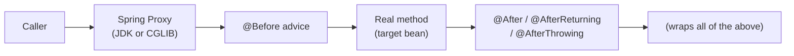

## Question

Explain Spring AOP: the AOP terminology (aspect, join point, pointcut, advice, weaving), proxy types (JDK dynamic vs CGLIB), the `@Around` advice, and practical use cases like logging, timing, retry, and circuit breaking.

## Answer

**Core AOP terminology:**

| Term | Meaning | Example |
|---|---|---|
| **Aspect** | A module encapsulating cross-cutting concern | `LoggingAspect` class |
| **Join point** | A point in execution where advice can apply | Any method execution |
| **Pointcut** | An expression selecting join points | `execution(* com.example.service.*.*(..))` |
| **Advice** | Code that runs at a join point | `@Before`, `@After`, `@Around` |
| **Weaving** | Applying aspects to target code | Spring does this at container startup |

**Proxy mechanism:**



- **JDK Dynamic Proxy:** Works if bean implements an interface. Creates proxy implementing same interface.
- **CGLIB Proxy:** Subclasses the bean class. Required when no interface. Default in Spring Boot.

**Advice types:**
```java
@Aspect
@Component
public class TimingAspect {
    
    @Before("execution(* com.example.service.*.*(..))")
    public void logBefore(JoinPoint jp) {
        log.info("Calling: {}", jp.getSignature().getName());
    }
    
    @Around("@annotation(Timed)")  // pointcut: methods with @Timed annotation
    public Object timeMethod(ProceedingJoinPoint pjp) throws Throwable {
        long start = System.nanoTime();
        try {
            return pjp.proceed();   // call real method
        } finally {
            long elapsed = System.nanoTime() - start;
            log.info("{} took {}ms", pjp.getSignature(), elapsed / 1_000_000);
        }
    }
    
    @AfterThrowing(pointcut = "execution(* com.example..*(..))", throwing = "ex")
    public void logException(JoinPoint jp, Exception ex) {
        log.error("Exception in {}: {}", jp.getSignature(), ex.getMessage());
    }
}
```

**Common AOP use cases:**
- **Logging/tracing:** Log method entry, exit, arguments, return values.
- **Timing / metrics:** Instrument with Micrometer.
- **Transaction management:** `@Transactional` is implemented via AOP.
- **Security:** `@PreAuthorize` checks via AOP.
- **Caching:** `@Cacheable` is AOP.
- **Retry logic:** `@Retryable` (Spring Retry) uses AOP.
- **Audit logging:** Capture WHO changed WHAT.

**Pointcut expressions:**
```java
execution(* com.example.service.*.*(..))       // all methods in service package
@annotation(org.springframework.cache.annotation.Cacheable)  // annotated methods
within(com.example..*) && bean(userService)    // combine conditions
```

**Limitations:**
- Self-invocation (calling method on `this`) bypasses proxy → aspect not applied.
- Final classes can't be CGLIB-proxied.
- Private methods can't be proxied.

## Follow-ups

- What is the difference between Spring AOP (proxy-based) and AspectJ (compile-time weaving)?
- How do you control the order of multiple aspects applied to the same method? (`@Order`)
- How does `@EnableAspectJAutoProxy(proxyTargetClass=true)` affect proxy type selection?
