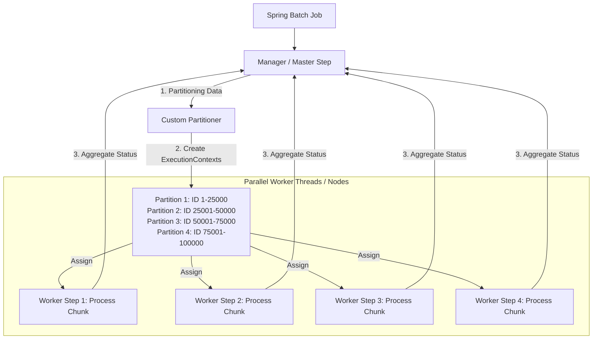

## Question

Explain Spring Batch Partitioning: Master-Worker step pattern, custom `Partitioner`, `ExecutionContext` splitting, scaling strategies across local thread pools vs remote workers (Spring Cloud Task), and handling step failures.

## Answer

**Why Batch Partitioning is Necessary:**
A single-threaded chunk step processing 100,000,000 database records sequentially might take 10 hours. Parallelizing the step into multiple independent partitions executing concurrently across a thread pool or cluster nodes reduces processing time linearly (e.g., down to 30 minutes).

**Partitioning Architecture:**



**1. Implementing a Custom `Partitioner`:**
The `Partitioner` splits the input data range into a Map of `ExecutionContext` objects:

```java
public class IdRangePartitioner implements Partitioner {
    private final String table;
    private final String column;
    private final JdbcTemplate jdbcTemplate;

    public IdRangePartitioner(String table, String column, DataSource dataSource) {
        this.table = table;
        this.column = column;
        this.jdbcTemplate = new JdbcTemplate(dataSource);
    }

    @Override
    public Map<String, ExecutionContext> partition(int gridSize) {
        // Query Min and Max IDs from table
        Long min = jdbcTemplate.queryForObject("SELECT MIN(" + column + ") FROM " + table, Long.class);
        Long max = jdbcTemplate.queryForObject("SELECT MAX(" + column + ") FROM " + table, Long.class);

        long targetSize = (max - min) / gridSize + 1;
        Map<String, ExecutionContext> result = new HashMap<>();

        long start = min;
        long end = start + targetSize - 1;

        for (int i = 0; i < gridSize; i++) {
            ExecutionContext context = new ExecutionContext();
            context.putLong("minValue", start);
            context.putLong("maxValue", Math.min(end, max));

            result.put("partition" + i, context);

            start += targetSize;
            end += targetSize;
        }

        return result;
    }
}
```

**2. Configuring Partitioned Step in Spring Batch:**
```java
@Configuration
public class PartitionedBatchConfig {

    @Bean
    public Job partitionedJob(JobRepository jobRepository, Step managerStep) {
        return new JobBuilder("partitionedJob", jobRepository)
                .start(managerStep)
                .build();
    }

    // Manager Step: Coordinates Partitioner and TaskExecutor
    @Bean
    public Step managerStep(JobRepository jobRepository,
                            Step workerStep,
                            Partitioner partitioner,
                            TaskExecutor batchTaskExecutor) {
        return new StepBuilder("managerStep", jobRepository)
                .partitioner("workerStep", partitioner)
                .step(workerStep)
                .gridSize(4) // 4 parallel partitions
                .taskExecutor(batchTaskExecutor) // Thread pool
                .build();
    }

    // Worker Step: Standard Chunk Step receiving Range from ExecutionContext
    @Bean
    public Step workerStep(JobRepository jobRepository,
                           PlatformTransactionManager txManager,
                           ItemReader<OrderEntity> reader,
                           ItemProcessor<OrderEntity, OrderEntity> processor,
                           ItemWriter<OrderEntity> writer) {
        return new StepBuilder("workerStep", jobRepository)
                .<OrderEntity, OrderEntity>chunk(500, txManager)
                .reader(reader)
                .processor(processor)
                .writer(writer)
                .build();
    }

    // Reader Step-Scoped to bind to Partition ExecutionContext
    @Bean
    @StepScope
    public JdbcPagingItemReader<OrderEntity> partitionedReader(
            @Value("#{stepExecutionContext['minValue']}") Long minValue,
            @Value("#{stepExecutionContext['maxValue']}") Long maxValue,
            DataSource dataSource) {

        // Reads ONLY the assigned ID range (e.g. WHERE id BETWEEN 1 AND 25000)
        JdbcPagingItemReader<OrderEntity> reader = new JdbcPagingItemReader<>();
        reader.setDataSource(dataSource);
        reader.setFetchSize(500);

        MySqlPagingQueryProvider queryProvider = new MySqlPagingQueryProvider();
        queryProvider.setSelectClause("SELECT id, status, total");
        queryProvider.setFromClause("FROM orders");
        queryProvider.setWhereClause("WHERE id BETWEEN " + minValue + " AND " + maxValue);
        queryProvider.setSortKeys(Map.of("id", Order.ASCENDING));

        reader.setQueryProvider(queryProvider);
        reader.setRowMapper(new BeanPropertyRowMapper<>(OrderEntity.class));
        return reader;
    }

    @Bean
    public TaskExecutor batchTaskExecutor() {
        ThreadPoolTaskExecutor executor = new ThreadPoolTaskExecutor();
        executor.setCorePoolSize(4);
        executor.setMaxPoolSize(8);
        executor.setThreadNamePrefix("batch-worker-");
        executor.initialize();
        return executor;
    }
}
```

**Local Partitioning vs Remote Partitioning:**
- **Local Thread Pool Partitioning:** Runs worker steps across multiple threads on a single JVM instance (e.g. 8 CPU cores).
- **Remote Partitioning (Spring Cloud Task / Integration):** Manager step publishes `ExecutionContext` messages to a message broker (RabbitMQ/Kafka). Independent worker microservice instances consume partitions, execute the steps, and return completion status back to the Manager!

## Follow-ups

- What happens if 1 out of 4 worker partitions fails? How does Spring Batch restart only the failed partition?
- How does `StepScope` binding work under the hood using proxying?
- How do you ensure database connections in the pool (`HikariCP`) are sized correctly for partitioned steps?
