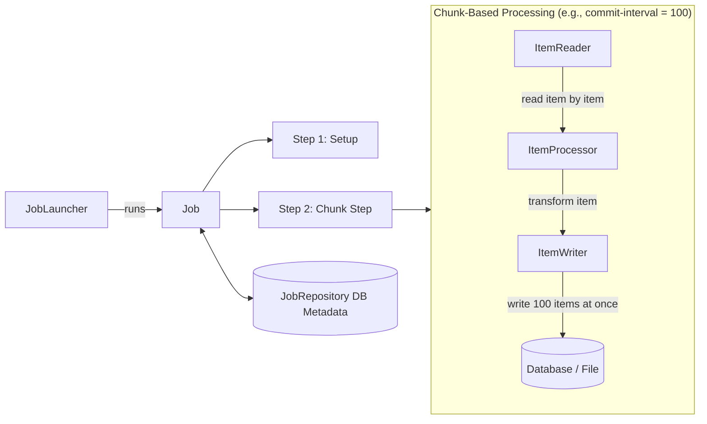

## Question

Explain Spring Batch architecture: Job, Step, `JobRepository`, chunk-based processing (`ItemReader`, `ItemProcessor`, `ItemWriter`), skip/retry logic, and scaling strategies (partitioning, parallel steps).

## Answer

**Spring Batch Core Concepts:**
Spring Batch is a framework designed for robust processing of large volumes of records (e.g., CSV imports, ETL jobs, end-of-day financial reconciliation).



**Architecture Components:**
1. **`Job`:** Complete batch process containing one or more steps.
2. **`Step`:** Independent, sequential phase of a Job. Can be tasklet-based (single operation) or chunk-based.
3. **`JobRepository`:** Database tables storing execution metadata (`BATCH_JOB_EXECUTION`, `BATCH_STEP_EXECUTION`). Tracks status, restart points, and parameters.
4. **`JobLauncher`:** Starts job executions with given `JobParameters`.

**Chunk-Based Processing:**
Processes items in transactions of size `N` (commit interval):
- Reads $N$ items one by one via `ItemReader`.
- Passes each item to `ItemProcessor` for transformation/validation.
- Passes all $N$ processed items as a list to `ItemWriter` in a single database transaction.

**Code Example:**
```java
@Configuration
public class UserImportBatchConfig {

    @Bean
    public Job importUserJob(JobRepository jobRepository, Step step1) {
        return new JobBuilder("importUserJob", jobRepository)
                .incrementer(new RunIdIncrementer())
                .flow(step1)
                .end()
                .build();
    }

    @Bean
    public Step step1(JobRepository jobRepository, 
                      PlatformTransactionManager transactionManager,
                      ItemReader<UserCsv> reader,
                      ItemProcessor<UserCsv, UserEntity> processor,
                      ItemWriter<UserEntity> writer) {
        return new StepBuilder("csvImportStep", jobRepository)
                .<UserCsv, UserEntity>chunk(100, transactionManager) // Commit every 100 items
                .reader(reader)
                .processor(processor)
                .writer(writer)
                .faultTolerant()
                .skip(FlatFileParseException.class)
                .skipLimit(10) // Skip up to 10 corrupt CSV rows
                .retry(DeadlockLoserDataAccessException.class)
                .retryLimit(3) // Retry DB deadlock up to 3 times
                .build();
    }

    @Bean
    public FlatFileItemReader<UserCsv> reader() {
        return new FlatFileItemReaderBuilder<UserCsv>()
                .name("userItemReader")
                .resource(new ClassPathResource("users.csv"))
                .delimited()
                .names("id", "firstName", "lastName", "email")
                .targetType(UserCsv.class)
                .build();
    }

    @Bean
    public ItemProcessor<UserCsv, UserEntity> processor() {
        return csv -> new UserEntity(csv.getFirstName().toUpperCase(), csv.getEmail());
    }

    @Bean
    public JdbcBatchItemWriter<UserEntity> writer(DataSource dataSource) {
        return new JdbcBatchItemWriterBuilder<UserEntity>()
                .sql("INSERT INTO users (name, email) VALUES (:name, :email)")
                .dataSource(dataSource)
                .beanMapped()
                .build();
    }
}
```

**Fault Tolerance (Skip & Retry):**
- **Skip:** Ignores specific exceptions during read/process/write up to `skipLimit`.
- **Retry:** Retries transient errors (e.g., DB lock timeout) up to `retryLimit`.

**Scaling Batch Jobs:**
1. **Multithreaded Step:** Step reads/processes chunks across worker threads (Note: `ItemReader` must be thread-safe).
2. **Parallel Steps:** Run independent Steps simultaneously.
3. **Partitioning:** Split data (e.g., by ID range 1-1000, 1001-2000) and execute worker steps across separate threads or remote nodes.

## Follow-ups

- What is the difference between a Tasklet and a Chunk-oriented Step?
- How does Spring Batch guarantee idempotency and restartability on failure?
- How do you manage `JobParameters` to allow re-running the same job multiple times?
