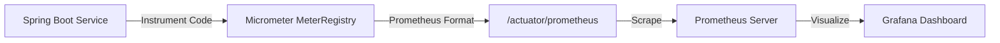

## Question

Explain Micrometer metrics instrumentation in Spring Boot: `MeterRegistry`, core meter types (`Counter`, `Gauge`, `Timer`, `DistributionSummary`), adding dimensional tags, and exposing custom metrics to Prometheus.

## Answer

**What is Micrometer?**
Micrometer is the dimensional metrics instrumentation facade for Java (think SLF4J for metrics). It allows developers to instrument application code with meters, and exports metrics to monitoring systems like Prometheus, Datadog, New Relic, or InfluxDB without vendor lock-in.



**Core Micrometer Meter Types:**

1. **`Counter`:** Monotonically increasing value (only goes UP). Used to count events (requests served, orders placed, errors occurred).
2. **`Gauge`:** Instantaneous single-value measurement (goes UP and DOWN). Used to measure current state (active thread count, memory usage, queue depth).
3. **`Timer`:** Measures short durations and latency distribution alongside execution counts.
4. **`DistributionSummary`:** Measures payload sizes or non-time distributions (request size in bytes, batch sizes).

**Custom Metrics Service Example:**
```java
@Service
public class OrderMetricsService {

    private final Counter orderSuccessCounter;
    private final Counter orderFailureCounter;
    private final Timer orderProcessingTimer;
    private final DistributionSummary orderAmountSummary;
    private final AtomicInteger pendingOrdersGauge;

    public OrderMetricsService(MeterRegistry registry) {
        // 1. Counter with Dimensional Tags
        this.orderSuccessCounter = Counter.builder("orders.created")
                .tag("status", "success")
                .tag("environment", "prod")
                .description("Total successfully created orders")
                .register(registry);

        this.orderFailureCounter = Counter.builder("orders.created")
                .tag("status", "failure")
                .tag("environment", "prod")
                .register(registry);

        // 2. Timer with Percentiles for SLA monitoring (P50, P95, P99)
        this.orderProcessingTimer = Timer.builder("orders.processing.time")
                .description("Time taken to process an order")
                .publishPercentiles(0.5, 0.95, 0.99) // Generates quantile metrics for Prometheus
                .publishPercentileHistogram() // Generates histogram buckets for le tag
                .register(registry);

        // 3. Distribution Summary (Order size in dollars)
        this.orderAmountSummary = DistributionSummary.builder("orders.amount.dollars")
                .baseUnit("dollars")
                .register(registry);

        // 4. Gauge (Tracking active pending queue size)
        this.pendingOrdersGauge = registry.gauge("orders.pending.count", new AtomicInteger(0));
    }

    public void recordOrder(double amount, Runnable processAction) {
        pendingOrdersGauge.incrementAndGet();
        try {
            orderProcessingTimer.record(() -> {
                processAction.run();
                orderSuccessCounter.increment();
                orderAmountSummary.record(amount);
            });
        } catch (Exception ex) {
            orderFailureCounter.increment();
            throw ex;
        } finally {
            pendingOrdersGauge.decrementAndGet();
        }
    }
}
```

**Instrumenting Methods with `@Timed`:**
Spring Boot automatically intercepts methods annotated with `@Timed` if `TimedAspect` bean is configured:

```java
@Configuration
public class MetricsConfig {
    @Bean
    public TimedAspect timedAspect(MeterRegistry registry) {
        return new TimedAspect(registry);
    }
}

@Service
public class PaymentService {

    @Timed(value = "payment.processing", percentiles = {0.95, 0.99})
    public void processPayment() {
        // Business logic automatically timed and recorded!
    }
}
```

**Prometheus Scrape Output (`/actuator/prometheus`):**
```
# HELP orders_created_total Total successfully created orders
# TYPE orders_created_total counter
orders_created_total{environment="prod",status="success",} 142.0
orders_created_total{environment="prod",status="failure",} 3.0

# HELP orders_processing_time_seconds Time taken to process an order
# TYPE orders_processing_time_seconds summary
orders_processing_time_seconds{quantile="0.5",} 0.042
orders_processing_time_seconds{quantile="0.95",} 0.125
orders_processing_time_seconds{quantile="0.99",} 0.350
```

## Follow-ups

- What is the difference between client-side calculated percentiles vs Prometheus `histogram_quantile()` using `publishPercentileHistogram()`?
- Why should you NEVER use high-cardinality values (e.g., User IDs, Order UUIDs) as Micrometer tag values?
- How do Common Tags (`registry.config().commonTags(...)`) help differentiate metrics across Kubernetes pods?
