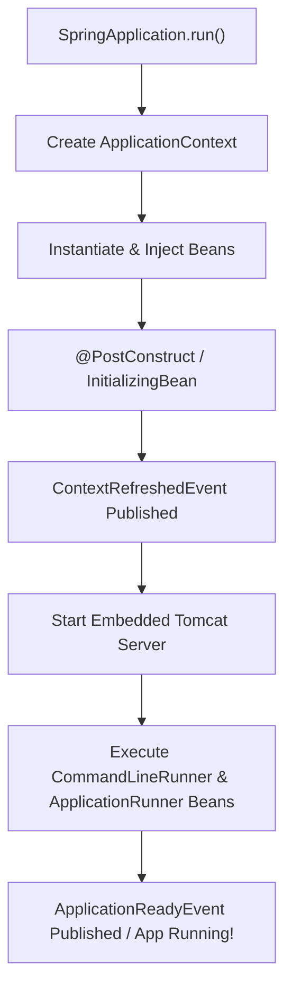

## Question

Explain Spring Boot startup callbacks: `CommandLineRunner` vs `ApplicationRunner`, `ApplicationListener<ContextRefreshedEvent>`, `@PostConstruct`, ordering with `@Order`, and handling initialization exceptions.

## Answer

**Spring Boot Startup Lifecycle:**
When a Spring Boot application starts up, developers often need to execute initialization logic (e.g., seeding default database data, warming up caches, starting background polling tasks) after the Spring `ApplicationContext` is fully refreshed.



**1. `@PostConstruct` vs `CommandLineRunner` / `ApplicationRunner`:**

- **`@PostConstruct`:** Executed during bean instantiation before the embedded web server (Tomcat) is started or other beans are fully wired. Should ONLY be used for local bean initialization.
- **`CommandLineRunner` / `ApplicationRunner`:** Executed AFTER the Spring `ApplicationContext` is completely loaded AND after the embedded web server is running. Perfect for data seeding and external warm-up tasks.

**2. `CommandLineRunner` vs `ApplicationRunner`:**
Both are functional interfaces with a `run()` method called just before `SpringApplication.run()` finishes.

- **`CommandLineRunner`:** Receives raw String array `String... args`.
```java
@Component
@Order(2)
public class DatabaseSeeder implements CommandLineRunner {

    @Override
    public void run(String... args) throws Exception {
        System.out.println("CommandLineRunner args: " + Arrays.toString(args));
        // Seed database...
    }
}
```

- **`ApplicationRunner`:** Receives parsed `ApplicationArguments` object, providing easy access to option arguments (`--debug`, `--port=8080`) vs non-option positional arguments.
```java
@Component
@Order(1) // Runs BEFORE DatabaseSeeder!
public class CacheWarmupRunner implements ApplicationRunner {

    @Override
    public void run(ApplicationArguments args) throws Exception {
        List<String> debugValues = args.getOptionValues("debug");
        boolean isDebug = args.containsOption("debug");
        
        System.out.println("Is debug flag present? " + isDebug);
        // Perform cache warm-up...
    }
}
```

**3. Ordering Startup Tasks (`@Order` / `Ordered`):**
When multiple `CommandLineRunner` or `ApplicationRunner` beans exist, order their execution using the `@Order(N)` annotation or implementing `Ordered` interface. Lower numbers execute first!

```java
@Component
@Order(Ordered.HIGHEST_PRECEDENCE) // Runs FIRST!
public class FirstRunner implements CommandLineRunner { ... }

@Component
@Order(Ordered.LOWEST_PRECEDENCE)  // Runs LAST!
public class LastRunner implements CommandLineRunner { ... }
```

**4. Listening to Application Events:**

- **`ApplicationListener<ContextRefreshedEvent>`:** Fires when `ApplicationContext` is refreshed (may fire multiple times in hierarchical contexts).
- **`ApplicationListener<ApplicationReadyEvent>`:** Fires ONCE when application is completely ready to service requests.

```java
@Component
public class StartupListener {

    @EventListener
    public void onApplicationReady(ApplicationReadyEvent event) {
        System.out.println("Spring Boot Application is fully ready and accepting traffic!");
    }
}
```

**Handling Exceptions in Startup Runners:**
If a `CommandLineRunner` throws an unhandled Exception, Spring Boot catches it, logs the stack trace, and **immediately terminates the JVM** (exit code 1). This is desirable for initialization failures (e.g. failing to connect to a required database on startup).

## Follow-ups

- What is the difference between `InitializingBean.afterPropertiesSet()` and `@PostConstruct`?
- How do you mock or disable startup runners during JUnit integration tests (`@MockBean` / `@Profile("!test")`)?
- How does `SpringApplicationRunListener` allow hooking into the Spring Boot startup process before the ApplicationContext is even created?
