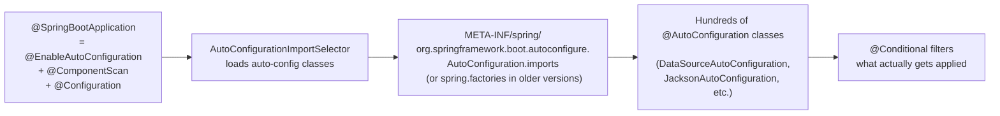

## Question

Explain Spring Boot auto-configuration: how `@EnableAutoConfiguration` discovers configuration classes, the role of `spring.factories` / `AutoConfiguration.imports`, and how `@Conditional` annotations control which beans are created.

## Answer

**Problem it solves:** Spring applications required manual XML or Java config for every library (DataSource, JPA, Jackson). Spring Boot detects classpath and auto-configures sensible defaults — zero or minimal config for common use cases.

**Discovery mechanism:**



**Key `@Conditional` annotations:**

| Annotation | Condition |
|---|---|
| `@ConditionalOnClass(DataSource.class)` | Class on classpath |
| `@ConditionalOnMissingBean(DataSource.class)` | No user-defined bean of type |
| `@ConditionalOnProperty("spring.datasource.url")` | Property set |
| `@ConditionalOnWebApplication` | Is a web app |
| `@ConditionalOnExpression("${feature.enabled:false}")` | SpEL expression |

**Example — DataSource auto-config logic:**
```java
@AutoConfiguration
@ConditionalOnClass({ DataSource.class, EmbeddedDatabaseType.class })
@ConditionalOnMissingBean(type = "io.r2dbc.spi.ConnectionFactory")
@EnableConfigurationProperties(DataSourceProperties.class)
public class DataSourceAutoConfiguration {
    
    @Bean
    @ConditionalOnMissingBean(DataSource.class)  // ← if user defined their own, skip
    public DataSource dataSource(DataSourceProperties properties) {
        return properties.initializeDataSourceBuilder().build();
    }
}
```

**Starters:** A starter is just a POM (no code) that pulls in a set of dependencies AND auto-configuration. `spring-boot-starter-web` → Tomcat + Spring MVC + Jackson → triggers WebMvcAutoConfiguration.

**Writing a custom auto-configuration:**
```java
@AutoConfiguration
@ConditionalOnClass(MyLibrary.class)
@ConditionalOnMissingBean(MyLibraryClient.class)
public class MyLibraryAutoConfig {
    @Bean
    public MyLibraryClient client(@Autowired MyLibraryProperties props) {
        return new MyLibraryClient(props.getUrl());
    }
}
// Register in META-INF/spring/...AutoConfiguration.imports
```

**Debugging auto-configuration:**
```bash
--debug flag → outputs "Conditions Evaluation Report"
# Shows which auto-configs were applied/skipped and why
```
Or `spring-boot-actuator` `/actuator/conditions` endpoint.

## Follow-ups

- How do you override an auto-configured bean with your own? (`@Bean` in `@Configuration` → `@ConditionalOnMissingBean` skips auto-config.)
- What is the difference between `@Import` and the auto-configuration mechanism?
- How does `spring.factories` relate to `AutoConfiguration.imports` introduced in Spring Boot 2.7?
