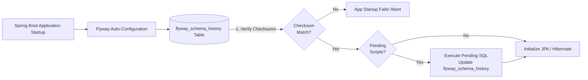

## Question

Compare Flyway and Liquibase for database schema migration in Spring Boot: versioning conventions, execution lifecycle during application startup, checksum verification, handling failing migrations, and blue-green deployment strategies.

## Answer

**Why Database Migration Tools are Essential:**
Without migration tools, schema changes are applied manually or via `spring.jpa.hibernate.ddl-auto=update` (which is unsafe in production). Flyway and Liquibase track schema changes in code alongside application source files, executing migrations automatically during Spring Boot startup before Hibernate initializes.

**1. Flyway Architecture & Conventions:**
Flyway uses plain SQL scripts placed in `src/main/resources/db/migration/`.

```
V1__init_schema.sql
V2__add_users_table.sql
V2_1__add_index_users_email.sql
R__refresh_user_view.sql
```



**Flyway Naming Rules:**
- **Versioned (`V`):** Executes exactly once. Version numbers must be unique. (`V1__description.sql` — double underscore required!).
- **Undo (`U`):** Reverts a specific versioned migration (Flyway Teams feature).
- **Repeatable (`R`):** Executes whenever its file hash/checksum changes (used for views, stored procedures, triggers).

**Spring Boot Setup (`application.yml`):**
```yaml
spring:
  datasource:
    url: jdbc:postgresql://localhost:5432/mydb
    username: myuser
    password: mypassword
  flyway:
    enabled: true
    baseline-on-migrate: true # For existing non-empty databases
    locations: classpath:db/migration
  jpa:
    hibernate:
      ddl-auto: validate # Verify JPA entities match DB schema after Flyway runs
```

**2. Flyway vs Liquibase Comparison:**

| Feature | Flyway | Liquibase |
|---|---|---|
| **Format** | Plain SQL (or Java code) | XML, YAML, JSON, or Formatted SQL |
| **Learning Curve** | Extremely low (writes pure SQL) | Moderate (learn Liquibase tags) |
| **Rollback / Undo** | Requires paid edition or custom scripts | Native rollback tags built-in |
| **Db Abstraction** | Database-specific SQL | DB-independent abstraction (XML/YAML) |
| **History Tracking** | `flyway_schema_history` table | `DATABASECHANGELOG` & `LOCK` tables |

**3. Zero-Downtime / Blue-Green Deployment Pattern:**
When deploying new application versions while old instances are running:
- **Rule:** Migrations MUST be backward-compatible with the old application version currently in production.
- **Example: Renaming a Column (`email` to `user_email`):**
  1. **Phase 1 Migration:** Add `user_email` column + DB trigger to mirror writes from `email` to `user_email`. Deploy App V1 (uses `email`).
  2. **Phase 2 App Release:** Deploy App V2 (reads/writes `user_email`).
  3. **Phase 3 Migration:** Drop trigger and original `email` column once App V1 is fully decommissioned.

**Handling Corrupt / Failing Migrations:**
If a SQL script fails midway:
1. Fix the error in the SQL script file.
2. Run `flyway repair` (via Flyway CLI or Maven plugin) to clean up corrupt entries in `flyway_schema_history`.
3. Restart Spring Boot application.

## Follow-ups

- How do you write Java-based Flyway migrations (`BaseJavaMigration`) for complex data transformations?
- How does `spring.flyway.out-of-order=true` work for concurrent multi-developer team feature branches?
- How do you run Flyway in multi-tenant architecture with separate schemas per tenant?
