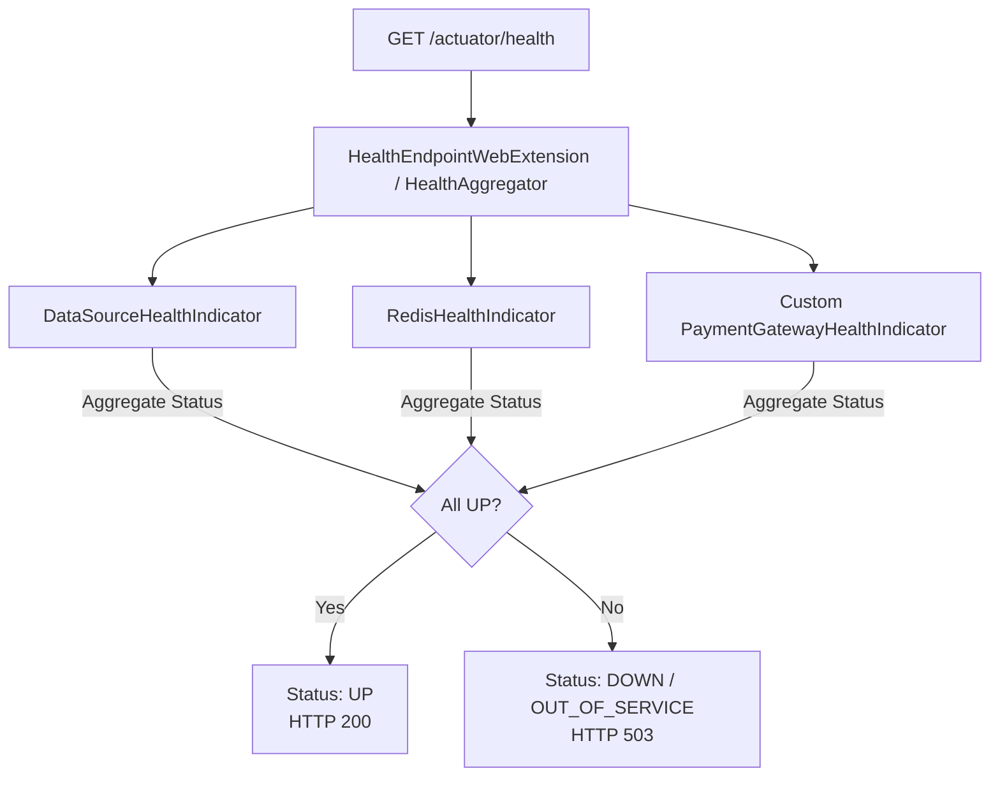

## Question

Explain Custom Health Indicators in Spring Boot Actuator: `HealthIndicator` vs `ReactiveHealthIndicator`, composite health contributors, custom health status codes (e.g., `FATAL`, `DEGRADED`), and exposing health details securely to monitoring tools.

## Answer

**Actuator Health Indicator Architecture:**
Spring Boot Actuator aggregates individual health checks from built-in contributors (`DiskSpaceHealthIndicator`, `DataSourceHealthIndicator`, `RedisHealthIndicator`) into a unified `/actuator/health` endpoint used by load balancers and Kubernetes readiness/liveness probes.



**1. Building a Custom Synchronous `HealthIndicator`:**
Implement `HealthIndicator` to verify availability of an external service or internal queue:

```java
@Component
public class PaymentGatewayHealthIndicator implements HealthIndicator {

    private final PaymentGatewayClient paymentClient;

    public PaymentGatewayHealthIndicator(PaymentGatewayClient paymentClient) {
        this.paymentClient = paymentClient;
    }

    @Override
    public Health health() {
        try {
            PingResponse response = paymentClient.ping();
            
            if (response.isSuccess()) {
                return Health.up()
                        .withDetail("gateway", "Stripe")
                        .withDetail("latencyMs", response.getLatencyMs())
                        .build();
            } else {
                return Health.down()
                        .withDetail("gateway", "Stripe")
                        .withDetail("reason", "Ping returned unhealthy status code: " + response.getCode())
                        .build();
            }
        } catch (Exception ex) {
            // Exception returns DOWN status with stack trace details
            return Health.down(ex)
                    .withDetail("gateway", "Stripe")
                    .withDetail("error", "Connection timed out")
                    .build();
        }
    }
}
```

**2. Custom Reactive Health Check (`ReactiveHealthIndicator`):**
In Spring WebFlux applications, blocking health indicators would block the event loop. Use `ReactiveHealthIndicator` returning `Mono<Health>`:

```java
@Component
public class CustomReactiveRedisHealthIndicator implements ReactiveHealthIndicator {

    private final ReactiveRedisConnectionFactory connectionFactory;

    public CustomReactiveRedisHealthIndicator(ReactiveRedisConnectionFactory connectionFactory) {
        this.connectionFactory = connectionFactory;
    }

    @Override
    public Mono<Health> health() {
        return connectionFactory.getReactiveConnection()
                .ping()
                .map(pong -> Health.up().withDetail("ping", pong).build())
                .onErrorResume(ex -> Mono.just(Health.down(ex).build()));
    }
}
```

**3. Custom Health Statuses & HTTP Mapping:**
By default, Spring Boot recognizes statuses: `UP` (200), `DOWN` (503), `OUT_OF_SERVICE` (503), and `UNKNOWN` (200). You can define custom statuses like `DEGRADED` or `WARNING` and map them to HTTP status codes:

```java
public class CustomHealthStatus {
    public static final Status DEGRADED = new Status("DEGRADED");
}

@Component
public class LicenseHealthIndicator implements HealthIndicator {
    @Override
    public Health health() {
        boolean expiringSoon = checkLicense();
        if (expiringSoon) {
            return Health.status(CustomHealthStatus.DEGRADED)
                    .withDetail("warning", "License expires in 3 days")
                    .build();
        }
        return Health.up().build();
    }
}
```

**Mapping Custom Status to HTTP Status in `application.yml`:**
```yaml
management:
  endpoint:
    health:
      show-details: when-authorized # Security: hide internal details from public
      status:
        http-mapping:
          DEGRADED: 200 # App is still functional, return 200 OK
          DOWN: 503
          OUT_OF_SERVICE: 503
        order: FATAL, DOWN, OUT_OF_SERVICE, DEGRADED, UNKNOWN, UP # Severity order
```

**4. Composite Health Contributors:**
Group multiple related health indicators together under a single parent key:

```java
@Component("thirdPartyServices")
public class ThirdPartyServicesHealthContributor implements CompositeHealthContributor {

    private final Map<String, HealthContributor> contributors = new HashMap<>();

    public ThirdPartyServicesHealthContributor(PaymentGatewayHealthIndicator payment,
                                                EmailServiceHealthIndicator email) {
        contributors.put("payment", payment);
        contributors.put("email", email);
    }

    @Override
    public Iterator<NamedContributor<HealthContributor>> iterator() {
        return contributors.entrySet().stream()
                .map(e -> NamedContributor.of(e.getKey(), e.getValue()))
                .iterator();
    }

    @Override
    public HealthContributor getContributor(String name) {
        return contributors.get(name);
    }
}
```
*Exposed at:* `/actuator/health/thirdPartyServices/payment`

## Follow-ups

- How do Kubernetes Liveness and Readiness probes map to `LivenessState` and `ReadinessState` in Spring Boot 2.3+?
- How do you disable a specific built-in health indicator (e.g. `management.health.db.enabled=false`)?
- What is `HealthStatusHttpMapper` and how do you customize HTTP status code mappings programmatically?
