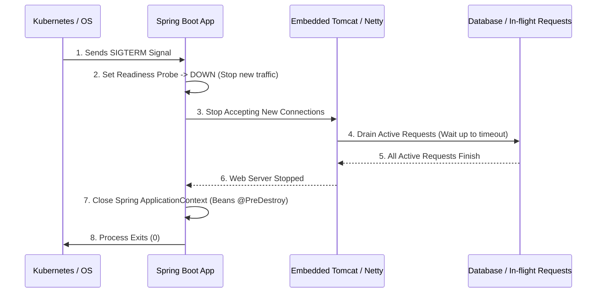

## Question

Explain Spring Boot Graceful Shutdown: how Embedded Web Servers (Tomcat, Netty, Jetty) handle `SIGTERM`, connection draining, Kubernetes pod termination lifecycle, and configuring `server.shutdown=graceful`.

## Answer

**Why Graceful Shutdown Matters:**
When Kubernetes terminates a pod (during deployment rolling updates, autoscaling down, or pod deletion), it sends a `SIGTERM` signal. If an application stops immediately:
1. In-flight HTTP requests fail with `502 Bad Gateway` or `Connection Reset`.
2. Database transactions are killed mid-execution, leaving partial state.
3. Background async tasks are abruptly terminated.

**Spring Boot Graceful Shutdown Lifecycle:**



**1. Enabling Graceful Shutdown (`application.yml`):**
```yaml
server:
  shutdown: graceful # Options: immediate (default), graceful

spring:
  lifecycle:
    timeout-per-shutdown-phase: 30s # Wait up to 30s for active requests to complete
```

**How Embedded Web Servers Behave:**
- **Tomcat / Jetty / Undertow:** Stop accepting new connections immediately upon receiving `SIGTERM`. Active connections are allowed to complete until `timeout-per-shutdown-phase` expires.
- **Netty (WebFlux):** Stops accepting new connections and waits for active reactive streams to finish.

**2. Kubernetes Pod Lifecycle Alignment:**
In Kubernetes, when a Pod is deleted:
1. Pod status changed to `Terminating`.
2. Endpoint controller removes Pod IP from Service Endpoints (stopping Kube-Proxy routing).
3. `preStop` hook executes (if configured).
4. `SIGTERM` signal sent to container PID 1.
5. K8s waits `terminationGracePeriodSeconds` (default 30s).
6. `SIGKILL` sent if process hasn't exited.

**Crucial K8s Synchronization Trap:**
Kube-Proxy network endpoint propagation is asynchronous and takes a few seconds. If Spring Boot receives `SIGTERM` and immediately stops accepting connections, Kube-Proxy might still route HTTP requests to the Pod for 2-5 seconds, resulting in `502 Bad Gateway`!

**Fix — Add `preStop` sleep in Kubernetes Deployment:**
```yaml
spec:
  containers:
  - name: my-spring-app
    image: my-spring-app:v1
    lifecycle:
      preStop:
        exec:
          command: ["sh", "-c", "sleep 10"] # Gives K8s ingress 10s to remove Pod IP before SIGTERM!
  terminationGracePeriodSeconds: 45 # Must be > preStop sleep + timeout-per-shutdown-phase
```

**3. Cleaning up Resources with `@PreDestroy` / `DisposableBean`:**
```java
@Component
public class WorkerTaskQueue implements DisposableBean {
    private final ExecutorService executor = Executors.newFixedThreadPool(10);

    @Override
    public void destroy() throws Exception {
        log.info("Initiating shutdown of background worker thread pool...");
        executor.shutdown();
        if (!executor.awaitTermination(20, TimeUnit.SECONDS)) {
            log.warn("Thread pool did not terminate gracefully. Forcing shutdown.");
            executor.shutdownNow();
        }
    }
}
```

## Follow-ups

- How does `PID 1` in Docker containers affect signal propagation (`SIGTERM`) to Java processes?
- How do `@PreDestroy` method order and bean dependencies work during container shutdown?
- How does Spring Boot Actuator `/actuator/shutdown` endpoint work when enabled?
