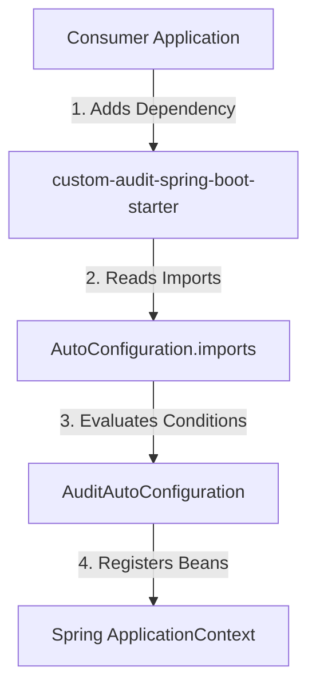

## Question

Walk through the step-by-step process of designing and building a custom Spring Boot Starter module: project structure, property binding, auto-configuration class, conditional beans, and registration in `AutoConfiguration.imports`.

## Answer

**What is a Custom Spring Boot Starter?**
A starter packages auto-configuration logic, default bean definitions, configuration properties, and required dependencies into a reusable library. It allows team members to add a feature to any service by simply including one dependency.

**Naming Convention:**
- Official starters: `spring-boot-starter-{name}`
- Custom / third-party starters: `{name}-spring-boot-starter` (e.g., `audit-spring-boot-starter`)

**Project Structure:**
```
audit-spring-boot-starter/
├── pom.xml
└── src/main/
    ├── java/com/example/audit/starter/
    │   ├── AuditProperties.java
    │   ├── AuditService.java
    │   ├── AuditAspect.java
    │   └── AuditAutoConfiguration.java
    └── resources/
        └── META-INF/spring/
            └── org.springframework.boot.autoconfigure.AutoConfiguration.imports
```

**Step 1: Configuration Properties Class**
```java
@ConfigurationProperties(prefix = "app.audit")
public class AuditProperties {
    private boolean enabled = true;
    private String destination = "LOG"; // LOG, KAFKA, DATABASE

    // Getters and setters
    public boolean isEnabled() { return enabled; }
    public void setEnabled(boolean enabled) { this.enabled = enabled; }
    public String getDestination() { return destination; }
    public void setDestination(String destination) { this.destination = destination; }
}
```

**Step 2: Auto-Configuration Class**
```java
@AutoConfiguration
@EnableConfigurationProperties(AuditProperties.class)
@ConditionalOnProperty(prefix = "app.audit", name = "enabled", havingValue = "true", matchIfMissing = true)
public class AuditAutoConfiguration {

    @Bean
    @ConditionalOnMissingBean
    public AuditService auditService(AuditProperties properties) {
        return new AuditService(properties.getDestination());
    }

    @Bean
    @ConditionalOnMissingBean
    @ConditionalOnClass(name = "org.aspectj.lang.annotation.Aspect")
    public AuditAspect auditAspect(AuditService auditService) {
        return new AuditAspect(auditService);
    }
}
```

**Step 3: Registration in `AutoConfiguration.imports`**
In `src/main/resources/META-INF/spring/org.springframework.boot.autoconfigure.AutoConfiguration.imports`:
```
com.example.audit.starter.AuditAutoConfiguration
```



**Testing the Custom Starter:**
Use `@SpringApplicationTest` or `ApplicationContextRunner` (Spring's utility for testing auto-configurations without launching a full server):
```java
class AuditAutoConfigurationTest {
    private final ApplicationContextRunner contextRunner = new ApplicationContextRunner()
            .withConfiguration(AutoConfigurations.of(AuditAutoConfiguration.class));

    @Test
    void registersAuditServiceByDefault() {
        this.contextRunner.run(context -> {
            assertThat(context).hasSingleBean(AuditService.class);
        });
    }

    @Test
    void disablesAuditServiceWhenPropertyFalse() {
        this.contextRunner.withPropertyValues("app.audit.enabled=false")
                .run(context -> {
                    assertThat(context).doesNotHaveBean(AuditService.class);
                });
    }
}
```

## Follow-ups

- What is the difference between `@AutoConfigureBefore` and `@AutoConfigureAfter`?
- How do you handle optional dependencies in a custom starter (`<optional>true</optional>`)?
- How does `spring-configuration-metadata.json` improve IDE autocompletion for custom properties?
