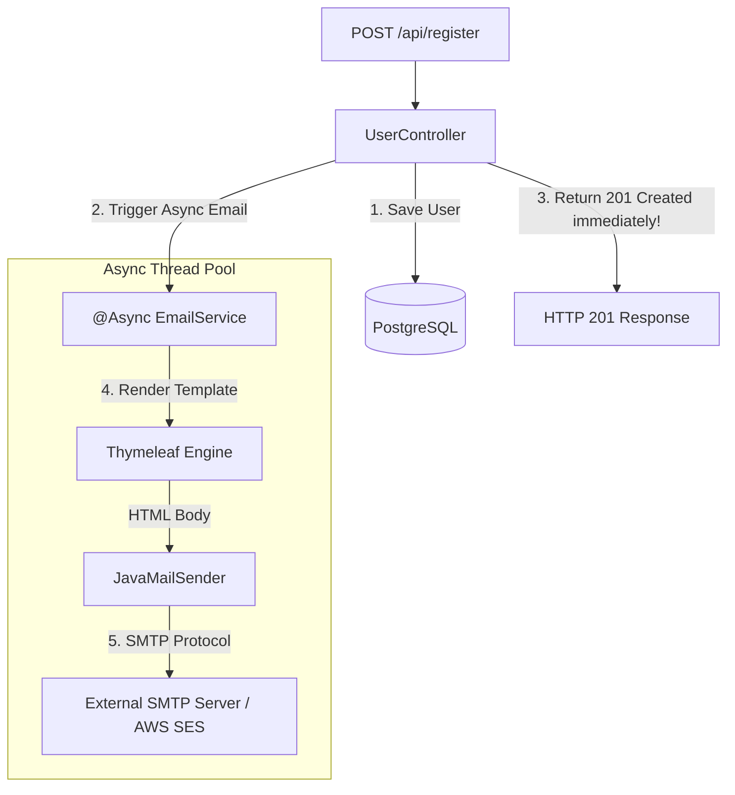

## Question

Explain sending emails in Spring Boot: `JavaMailSender`, building HTML email templates with Thymeleaf (`SpringTemplateEngine`), attachments, inline images (`cid:`), handling SMTP timeouts, and offloading email delivery to `@Async` background thread pools.

## Answer

**Email Architecture in Spring Boot:**
Email operations involve network round-trips to external SMTP servers (SendGrid, AWS SES, Mailgun, SMTP relay) which can take 1-3 seconds per email. Sending emails synchronously inside an HTTP request handler blocks web threads, severely degrading API response times.



**1. Dependencies (`pom.xml`):**
```xml
<dependency>
    <groupId>org.springframework.boot</groupId>
    <artifactId>spring-boot-starter-mail</artifactId>
</dependency>
<dependency>
    <groupId>org.springframework.boot</groupId>
    <artifactId>spring-boot-starter-thymeleaf</artifactId>
</dependency>
```

**2. Configuration (`application.yml`):**
```yaml
spring:
  mail:
    host: smtp.sendgrid.net
    port: 587
    username: apikey
    password: ${SMTP_API_KEY}
    properties:
      mail:
        smtp:
          auth: true
          starttls:
            enable: true
          # Essential Timeouts (Default is infinite wait!)
          connectiontimeout: 5000 # 5s
          timeout: 5000            # 5s
          writetimeout: 5000       # 5s
```

**3. HTML Thymeleaf Email Template (`src/main/resources/templates/mail/welcome.html`):**
```html
<!DOCTYPE html>
<html xmlns:th="http://www.thymeleaf.org">
<body>
    <h2>Welcome to Our Platform, <span th:text="${userName}">User</span>!</h2>
    <p>Your registration was successful. Click below to activate your account:</p>
    <a th:href="${activationUrl}" style="background: #007bff; color: white; padding: 10px 20px;">Activate Account</a>
    <br/><br/>
    
</body>
</html>
```

**4. Async Email Service Implementation:**
```java
@Service
public class EmailService {
    private static final Logger log = LoggerFactory.getLogger(EmailService.class);

    private final JavaMailSender mailSender;
    private final TemplateEngine templateEngine;

    public EmailService(JavaMailSender mailSender, TemplateEngine templateEngine) {
        this.mailSender = mailSender;
        this.templateEngine = templateEngine;
    }

    @Async("emailExecutor") // Offload to custom thread pool!
    public void sendWelcomeEmail(String toEmail, String userName, String activationUrl) {
        log.info("Starting async email delivery for {}", toEmail);
        try {
            // 1. Prepare Thymeleaf Context
            Context context = new Context();
            context.setVariable("userName", userName);
            context.setVariable("activationUrl", activationUrl);

            // 2. Render Template to HTML String
            String htmlContent = templateEngine.process("mail/welcome", context);

            // 3. Prepare MIME Message
            MimeMessage message = mailSender.createMimeMessage();
            MimeMessageHelper helper = new MimeMessageHelper(
                    message,
                    MimeMessageHelper.MULTIPART_MODE_MIXED_RELATED,
                    StandardCharsets.UTF_8.name()
            );

            helper.setFrom("noreply@example.com", "My Company");
            helper.setTo(toEmail);
            helper.setSubject("Welcome to Our Platform!");
            helper.setText(htmlContent, true); // true = HTML content

            // 4. Add Inline Image (cid:companyLogo)
            helper.addInline("companyLogo", new ClassPathResource("static/images/logo.png"));

            // 5. Add File Attachment (Optional PDF)
            // helper.addAttachment("terms.pdf", new ClassPathResource("static/docs/terms.pdf"));

            // 6. Send Email via SMTP
            mailSender.send(message);
            log.info("Email successfully delivered to {}", toEmail);

        } catch (MessagingException | UnsupportedEncodingException ex) {
            log.error("Failed to send welcome email to {}", toEmail, ex);
            // In production, publish to retry queue / DLQ!
        }
    }
}
```

**5. Async Executor Configuration:**
```java
@Configuration
@EnableAsync
public class AsyncConfig {

    @Bean(name = "emailExecutor")
    public Executor emailExecutor() {
        ThreadPoolTaskExecutor executor = new ThreadPoolTaskExecutor();
        executor.setCorePoolSize(5);
        executor.setMaxPoolSize(10);
        executor.setQueueCapacity(100);
        executor.setThreadNamePrefix("email-thread-");
        executor.initialize();
        return executor;
    }
}
```

## Follow-ups

- What happens if the `emailExecutor` queue capacity is full (100 tasks) and how do you configure a `RejectedExecutionHandler`?
- Why should you use an external message queue (Kafka / RabbitMQ) for transactional emails instead of pure in-memory `@Async`?
- How do you write unit tests for `EmailService` using GreenMail or Wiser mock SMTP servers?
