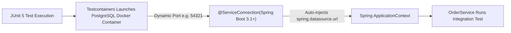

## Question

Explain Testcontainers integration in Spring Boot 3.1+: `@ServiceConnection`, `@Testcontainers`, dynamic properties without manual configuration, container lifecycle reuse (`withReuse(true)`), and mocking external APIs with WireMock.

## Answer

**What is Testcontainers?**
Testcontainers is a Java library that instantiates lightweight, throwaway Docker containers (PostgreSQL, Redis, Kafka, Elasticsearch) during JUnit integration test execution. It eliminates in-memory test mocks (like H2 DB) and tests code against exact production database engines.

**Spring Boot 3.1+ Connection Revolution: `@ServiceConnection`**
Historically, connecting Spring Boot to Testcontainers required boilerplate `@DynamicPropertySource` methods to set database URLs, ports, and credentials. Spring Boot 3.1 introduced `@ServiceConnection` which automatically inspects container types and wires DataSource, Redis, or Kafka properties into the Spring ApplicationContext!



**1. Integration Test with `@ServiceConnection` (Spring Boot 3.1+):**
```java
@SpringBootTest(webEnvironment = SpringBootTest.WebEnvironment.RANDOM_PORT)
@Testcontainers
class OrderIntegrationTest {

    // Launches PostgreSQL container and auto-configures Spring DataSource
    @Container
    @ServiceConnection
    static PostgreSQLContainer<?> postgres = new PostgreSQLContainer<>("postgres:16-alpine");

    // Launches Redis container and auto-configures RedisConnectionFactory
    @Container
    @ServiceConnection
    static GenericContainer<?> redis = new GenericContainer<>("redis:7-alpine")
            .withExposedPorts(6379);

    @Autowired
    private OrderService orderService;

    @Autowired
    private OrderRepository orderRepository;

    @Test
    void createOrder_persistsToRealPostgresAndCachesInRedis() {
        OrderDto created = orderService.createOrder(new CreateOrderRequest("item1", 2));

        assertThat(created.id()).isNotNull();
        assertThat(orderRepository.findById(created.id())).isPresent();
    }
}
```

**2. Local Development with Testcontainers (`@TestConfiguration`):**
In Spring Boot 3.1+, you can run your application locally using Testcontainers instead of installing databases locally or running `docker-compose`:

```java
// src/test/java/com/example/TestApplication.java
public class TestApplication {

    public static void main(String[] args) {
        SpringApplication.from(Application::main)
                .with(TestcontainersConfiguration.class)
                .run(args);
    }
}

@TestConfiguration(proxyBeanMethods = false)
class TestcontainersConfiguration {

    @Bean
    @ServiceConnection
    PostgreSQLContainer<?> postgresContainer() {
        return new PostgreSQLContainer<>("postgres:16-alpine");
    }

    @Bean
    @ServiceConnection
    KafkaContainer kafkaContainer() {
        return new KafkaContainer(DockerImageName.parse("confluentinc/cp-kafka:7.5.0"));
    }
}
```
*Run `TestApplication.main()`:* Launches Postgres & Kafka in Docker automatically and binds to your running local application!

**3. Mocking External HTTP APIs with WireMock:**
```java
@SpringBootTest
@AutoConfigureWireMock(port = 0) // WireMock server on random port
class PaymentGatewayTest {

    @Autowired
    private PaymentClient paymentClient;

    @Test
    void processPayment_handlesSuccessfulWireMockResponse() {
        // Stub external payment API
        stubFor(post(urlEqualTo("/v1/payments"))
            .willReturn(aResponse()
                .withStatus(200)
                .withHeader("Content-Type", "application/json")
                .withBody("""
                    {
                        "status": "APPROVED",
                        "transaction_id": "txn_998877"
                    }
                    """)));

        PaymentResult result = paymentClient.pay(new PaymentRequest(100.00));
        assertThat(result.isSuccess()).isTrue();
    }
}
```

## Follow-ups

- What is `Ryuk` container in Testcontainers and how does it guarantee container cleanup after JVM exit?
- How do you enable container reuse (`withReuse(true)`) in `~/.testcontainers.properties` for instant test runs?
- How do you test database migrations (Flyway/Liquibase) with Testcontainers?
