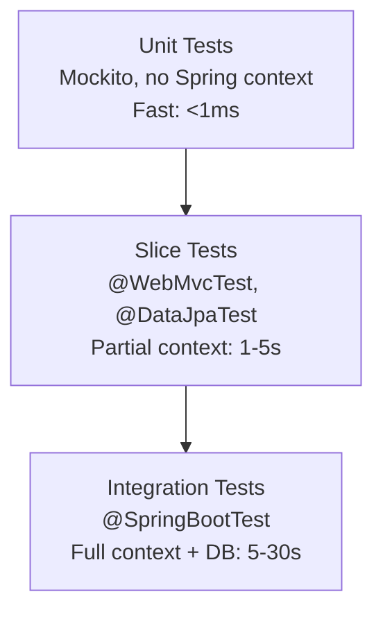

## Question

Walk through the Spring Boot testing pyramid: unit tests with Mockito, slice tests (`@WebMvcTest`, `@DataJpaTest`), full integration tests with `@SpringBootTest`, and how Testcontainers enables realistic database testing.

## Answer

**Testing pyramid for Spring Boot:**



**Unit test (no Spring context):**
```java
@ExtendWith(MockitoExtension.class)
class OrderServiceTest {
    @Mock
    private OrderRepository orderRepo;
    
    @Mock
    private PaymentService paymentService;
    
    @InjectMocks
    private OrderService orderService;
    
    @Test
    void placeOrder_chargesPaymentAndSavesOrder() {
        when(paymentService.charge(any())).thenReturn(PaymentResult.success("txn123"));
        
        orderService.placeOrder(new OrderRequest(...));
        
        verify(paymentService).charge(any());
        verify(orderRepo).save(argThat(o -> o.getStatus() == CONFIRMED));
    }
}
```

**`@WebMvcTest` (controller slice):**
```java
@WebMvcTest(OrderController.class)  // only loads MVC layer
class OrderControllerTest {
    @Autowired MockMvc mockMvc;
    @MockBean OrderService orderService;  // mock service
    
    @Test
    void getOrder_returnsOrderJson() throws Exception {
        when(orderService.findById(1L)).thenReturn(new OrderDTO(1L, "CONFIRMED", ...));
        
        mockMvc.perform(get("/api/orders/1")
                .header("Authorization", "Bearer " + jwt))
            .andExpect(status().isOk())
            .andExpect(jsonPath("$.status").value("CONFIRMED"))
            .andExpect(jsonPath("$.id").value(1));
    }
}
```

**`@DataJpaTest` (repository slice):**
```java
@DataJpaTest    // loads only JPA + H2 in-memory DB
@AutoConfigureTestDatabase(replace = NONE)  // use real DB (with Testcontainers)
class OrderRepositoryTest {
    @Autowired TestEntityManager em;
    @Autowired OrderRepository orderRepo;
    
    @Test
    void findByCustomerId_returnsCustomerOrders() {
        Customer c = em.persist(new Customer("alice@example.com"));
        em.persist(new Order(c, CONFIRMED, BigDecimal.TEN));
        em.flush();
        
        List<Order> orders = orderRepo.findByCustomerId(c.getId());
        assertThat(orders).hasSize(1);
    }
}
```

**Testcontainers (real PostgreSQL in tests):**
```java
@SpringBootTest
@Testcontainers
class OrderIntegrationTest {
    @Container
    static PostgreSQLContainer<?> postgres = new PostgreSQLContainer<>("postgres:15")
        .withDatabaseName("testdb");
    
    @DynamicPropertySource
    static void props(DynamicPropertyRegistry registry) {
        registry.add("spring.datasource.url", postgres::getJdbcUrl);
        registry.add("spring.datasource.username", postgres::getUsername);
        registry.add("spring.datasource.password", postgres::getPassword);
    }
    
    @Autowired OrderService orderService;
    
    @Test
    void fullOrderFlow_persistsAndReturnsOrder() {
        OrderDTO result = orderService.placeOrder(new OrderRequest(...));
        assertThat(result.getStatus()).isEqualTo("CONFIRMED");
    }
}
```

**Key annotations summary:**

| Test type | Annotation | Context loaded |
|---|---|---|
| Unit | none / `@ExtendWith(Mockito)` | None |
| MVC slice | `@WebMvcTest` | MVC + Security |
| JPA slice | `@DataJpaTest` | JPA + DB |
| Full | `@SpringBootTest` | Everything |

## Follow-ups

- What is `@MockBean` vs `@Mock` — when do you use each?
- How does `@Transactional` on a test class help with data isolation between tests?
- How do you test `@Async` methods in Spring Boot?
