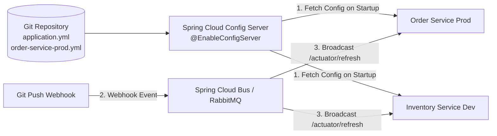

## Question

Explain Spring Cloud Config Server: centralized Git-backed configuration architecture, client property fetching order, `@RefreshScope` dynamic configuration reloading without restarts, and Spring Cloud Bus refresh notifications.

## Answer

**Centralized Configuration Architecture:**
In a microservices architecture with 50+ service instances, updating configuration properties (e.g. database connection timeouts, feature flags) across all instances by redeploying JAR files is inefficient. Spring Cloud Config Server provides a centralized HTTP API for externalized configuration backed by Git, SVN, or Vault.



**1. Config Server Setup:**
```xml
<dependency>
    <groupId>org.springframework.cloud</groupId>
    <artifactId>spring-cloud-config-server</artifactId>
</dependency>
```

```java
@SpringBootApplication
@EnableConfigServer
public class ConfigServerApplication {
    public static void main(String[] args) {
        SpringApplication.run(ConfigServerApplication.class, args);
    }
}
```

```yaml
# application.yml of Config Server
server:
  port: 8888
spring:
  cloud:
    config:
      server:
        git:
          uri: https://github.com/myorg/central-config-repo.git
          default-label: main
          clone-on-start: true
```

**Config Repository Structure:**
```
central-config-repo/
├── application.yml                 # Global default for ALL services
├── order-service.yml               # Default for order-service across all profiles
├── order-service-dev.yml           # Order service 'dev' profile overrides
└── order-service-prod.yml          # Order service 'prod' profile overrides
```

**2. Config Client Configuration (Spring Boot App):**
In Spring Boot 3+, use `spring.config.import`:

```yaml
# application.yml of Order Service
spring:
  application:
    name: order-service
  profiles:
    active: prod
  config:
    import: "configserver:http://localhost:8888" # Fetch config on startup
```

**3. Dynamic Property Reloading with `@RefreshScope`:**
By default, Spring `@Value` and `@ConfigurationProperties` beans are instantiated ONCE at startup. If a Git property changes, calling POST `/actuator/refresh` will NOT update running beans unless annotated with `@RefreshScope`!

```java
@Service
@RefreshScope // Spring recreates this bean on /actuator/refresh to load new property values!
public class DiscountService {

    @Value("${discount.rate:0.10}")
    private double discountRate;

    public BigDecimal applyDiscount(BigDecimal total) {
        return total.multiply(BigDecimal.valueOf(1.0 - discountRate));
    }
}
```

**How `@RefreshScope` Works Under the Hood:**
1. `@RefreshScope` wraps the target bean in a CGLIB proxy.
2. When POST `/actuator/refresh` is invoked, Spring clears the target bean instance from its internal `RefreshScope` cache.
3. The next time a method is called on the proxy, Spring re-instantiates the bean, injecting freshly fetched property values from Config Server!

**4. Automated Cluster Refresh with Spring Cloud Bus:**
Instead of invoking `/actuator/refresh` manually on 50 microservice instances, Spring Cloud Bus connects instances via RabbitMQ or Kafka:
- Git Webhook calls POST `/monitor` on Config Server when a commit is pushed.
- Config Server publishes a `RefreshRemoteApplicationEvent` to RabbitMQ/Kafka.
- All microservice instances listening to the bus automatically refresh their `@RefreshScope` beans simultaneously!

## Follow-ups

- How do you encrypt and decrypt sensitive passwords in Spring Cloud Config Server using asymmetric RSA keys (`{cipher}...`)?
- What happens if the Config Server is offline when a microservice starts up (`fail-fast: true` vs fallback)?
- How does HashiCorp Vault integrate with Spring Cloud Config Server for secret management?
