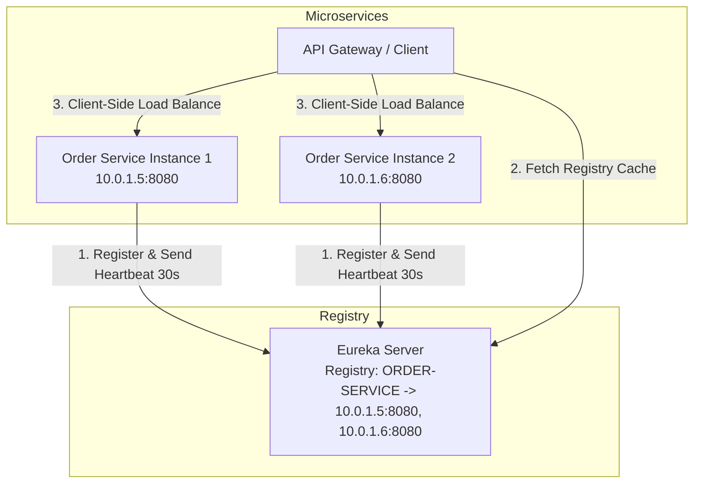

## Question

Explain Spring Cloud Eureka Service Discovery: service registration, heartbeats, self-preservation mode, client-side load balancing (`@LoadBalanced` `RestClient` / `WebClient`), and fault tolerance with Resilience4j.

## Answer

**Service Discovery Architecture:**
In microservice architectures, instances scale up/down dynamically with ephemeral IP addresses. Hardcoding URLs is impossible. Service Discovery acts as a dynamic registry where services register themselves on startup and resolve downstream dependencies by service name (`http://ORDER-SERVICE`).



**1. Eureka Server Setup:**
```java
@SpringBootApplication
@EnableEurekaServer
public class EurekaServerApplication {
    public static void main(String[] args) {
        SpringApplication.run(EurekaServerApplication.class, args);
    }
}
```

**2. Eureka Client Registration (`application.yml`):**
```yaml
spring:
  application:
    name: order-service

eureka:
  client:
    service-url:
      defaultZone: http://localhost:8761/eureka/
  instance:
    prefer-ip-address: true
    lease-renewal-interval-in-seconds: 30 # Heartbeat frequency
    lease-expiration-duration-in-seconds: 90 # Evict if no heartbeat for 90s
```

**3. Client-Side Load Balancing (`@LoadBalanced`):**
Spring Cloud uses Spring LoadBalancer to intercept outgoing requests, look up the service name in the local Eureka cache, and select an instance using Round-Robin or Random algorithms.

```java
@Configuration
public class ClientConfig {

    @Bean
    @LoadBalanced // Intercepts requests to resolve http://ORDER-SERVICE -> http://10.0.1.5:8080
    public RestClient.Builder restClientBuilder() {
        return RestClient.builder();
    }
}

@Service
public class OrderClient {
    private final RestClient restClient;

    public OrderClient(RestClient.Builder restClientBuilder) {
        this.restClient = restClientBuilder.build();
    }

    public OrderDto getOrder(Long id) {
        return restClient.get()
                .uri("http://ORDER-SERVICE/api/v1/orders/{id}", id)
                .retrieve()
                .body(OrderDto.class);
    }
}
```

**4. Eureka Self-Preservation Mode:**
If a network partition occurs between Eureka Server and multiple clients, clients are still healthy, but Eureka stops receiving heartbeats.
- **Normal Mode:** Evicts instances missing heartbeats > 90s.
- **Self-Preservation Mode:** If > 15% of heartbeats drop suddenly across all services, Eureka assumes a network glitch and STOPs evicting instances to protect healthy services from mass deregistration.

```yaml
# Disable in local dev (to allow fast eviction of killed apps):
eureka.server.enable-self-preservation: false
```

**5. Circuit Breaking with Resilience4j:**
Wraps remote service calls to prevent cascading failures when a downstream microservice is slow or failing.

```java
@Service
public class PaymentClient {
    private final RestClient restClient;

    public PaymentClient(RestClient.Builder builder) {
        this.restClient = builder.build();
    }

    @CircuitBreaker(name = "paymentService", fallbackMethod = "fallbackPayment")
    @Retry(name = "paymentService")
    public PaymentResponse processPayment(PaymentRequest req) {
        return restClient.post()
                .uri("http://PAYMENT-SERVICE/api/v1/pay")
                .body(req)
                .retrieve()
                .body(PaymentResponse.class);
    }

    // Fallback executed when Circuit Breaker is OPEN or call fails
    public PaymentResponse fallbackPayment(PaymentRequest req, Throwable t) {
        log.warn("Payment service unavailable. Returning queued status", t);
        return new PaymentResponse("QUEUED", "Payment queued for processing");
    }
}
```

## Follow-ups

- How does Eureka differ from Consul and Kubernetes native Service (Kube-DNS / CoreDNS)?
- What are the states of a Resilience4j CircuitBreaker (CLOSED, OPEN, HALF_OPEN)?
- How do you secure Eureka Server endpoints with Spring Security and basic auth?
