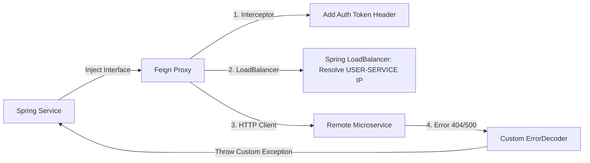

## Question

Explain Spring Cloud OpenFeign: `@FeignClient` declaration, request/response interceptors, custom `ErrorDecoder`, integration with Spring Cloud LoadBalancer, and Resilience4j circuit breaker integration.

## Answer

**What is Spring Cloud OpenFeign?**
OpenFeign is a declarative HTTP client library. Instead of writing HTTP request execution code (`RestTemplate`, `HttpClient`), you define a Java interface with Spring MVC annotations (`@GetMapping`, `@PostMapping`), and Feign dynamically generates the implementation at runtime.



**1. Enabling and Declaring a `@FeignClient`:**
```java
@SpringBootApplication
@EnableFeignClients // Scans interfaces annotated with @FeignClient
public class Application {}

@FeignClient(
    name = "user-service",             // Service name registered in Discovery (or URL)
    path = "/api/v1/users",            // Base path
    configuration = FeignConfig.class  // Custom interceptors & decoders
)
public interface UserClient {

    @GetMapping("/{id}")
    UserDto getUserById(@PathVariable("id") Long id);

    @PostMapping
    UserDto createUser(@RequestBody CreateUserRequest request);

    @GetMapping("/search")
    List<UserDto> searchUsers(@RequestParam("email") String email);
}
```

**2. Adding Custom Request Interceptor (JWT Relay):**
Injects the current user's JWT Authorization token into all outgoing Feign requests:

```java
public class FeignAuthInterceptor implements RequestInterceptor {

    @Override
    public void apply(RequestTemplate template) {
        ServletRequestAttributes attributes = 
            (ServletRequestAttributes) RequestContextHolder.getRequestAttributes();
        
        if (attributes != null) {
            String authToken = attributes.getRequest().getHeader("Authorization");
            if (authToken != null) {
                template.header("Authorization", authToken); // Relay JWT header!
            }
        }
    }
}
```

**3. Custom `ErrorDecoder` (Translating HTTP Errors to Domain Exceptions):**
By default, Feign throws `FeignException` on 4xx/5xx responses. An `ErrorDecoder` maps HTTP status codes to domain exceptions:

```java
public class CustomFeignErrorDecoder implements ErrorDecoder {
    private final ErrorDecoder defaultDecoder = new Default();

    @Override
    public Exception decode(String methodKey, Response response) {
        return switch (response.status()) {
            case 404 -> new ResourceNotFoundException("Remote resource not found: " + response.request().url());
            case 400 -> new BadRequestException("Invalid request payload sent to remote service");
            case 503 -> new ServiceUnavailableException("Remote service unavailable. Please retry later.");
            default -> defaultDecoder.decode(methodKey, response);
        };
    }
}
```

**4. Feign Configuration Class:**
```java
@Configuration
public class FeignConfig {

    @Bean
    public RequestInterceptor authInterceptor() {
        return new FeignAuthInterceptor();
    }

    @Bean
    public ErrorDecoder errorDecoder() {
        return new CustomFeignErrorDecoder();
    }

    @Bean
    public Logger.Level feignLoggerLevel() {
        return Logger.Level.FULL; // Logs headers, body, and metadata for debugging
    }
}
```

**5. Resilience4j Circuit Breaker Fallback:**
```yaml
# application.yml
spring:
  cloud:
    openfeign:
      circuitbreaker:
        enabled: true # Enable Resilience4j integration
```

```java
@FeignClient(name = "user-service", fallback = UserClientFallback.class)
public interface UserClient {
    @GetMapping("/users/{id}")
    UserDto getUserById(@PathVariable("id") Long id);
}

@Component
public class UserClientFallback implements UserClient {
    @Override
    public UserDto getUserById(Long id) {
        // Fallback result when user-service is down or Circuit Breaker is OPEN
        return new UserDto(id, "Anonymous", "fallback@example.com");
    }
}
```

## Follow-ups

- What is the difference between `fallback` vs `fallbackFactory` in `@FeignClient`? (FallbackFactory receives the root `Throwable` cause.)
- How do you configure HTTP connection pooling for Feign using Apache HttpClient or OkHttp?
- How does HTTP GET with `@RequestBody` behave in Feign across different underlying HTTP client implementations?
