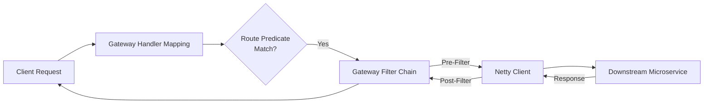

## Question

Explain Spring Cloud Gateway architecture: how Route Predicates and Gateway Filters work on top of Netty and Spring WebFlux, how to create custom filters, and how to implement distributed rate limiting with Redis (`RedisRateLimiter`).

## Answer

**Spring Cloud Gateway Architecture:**
Spring Cloud Gateway is built on Netty, Spring WebFlux, and Project Reactor. It provides an API gateway layer for routing requests to microservices, handling cross-cutting concerns (authentication, rate limiting, logging, circuit breaking).



**Core Concepts:**
1. **Route:** Destination mapping defined by an ID, target URI, collection of predicates, and filters.
2. **Predicate:** Matches HTTP request attributes (path, headers, query params, host, method).
3. **Filter:** Modifies incoming request or outgoing response (Pre / Post).

**Configuration Example (`application.yml`):**
```yaml
spring:
  cloud:
    gateway:
      routes:
        - id: order_service
          uri: lb://ORDER-SERVICE   # Load balanced via Eureka/Consul
          predicates:
            - Path=/api/v1/orders/**
            - Method=GET,POST
          filters:
            - StripPrefix=1
            - AddRequestHeader=X-Gateway-Source, SpringCloudGateway
            - name: RequestRateLimiter
              args:
                redis-rate-limiter.replenishRate: 10   # Tokens added per second
                redis-rate-limiter.burstCapacity: 20   # Token bucket max size
                key-resolver: "#{@userKeyResolver}"
```

**Redis Rate Limiting Setup:**
Uses the Token Bucket algorithm backed by Redis Lua scripts.

```java
@Configuration
public class GatewayConfig {

    @Bean
    public KeyResolver userKeyResolver() {
        // Rate limit by authenticated user ID, fallback to client IP
        return exchange -> {
            String userId = exchange.getRequest().getHeaders().getFirst("X-User-Id");
            if (userId != null) {
                return Mono.just(userId);
            }
            return Mono.just(Objects.requireNonNull(
                    exchange.getRequest().getRemoteAddress()).getAddress().getHostAddress());
        };
    }
}
```

**Writing a Custom GatewayFilter:**
```java
@Component
public class LoggingGlobalFilter implements GlobalFilter, Ordered {
    private static final Logger log = LoggerFactory.getLogger(LoggingGlobalFilter.class);

    @Override
    public Mono<Void> filter(ServerWebExchange exchange, GatewayFilterChain chain) {
        long startTime = System.currentTimeMillis();
        String path = exchange.getRequest().getPath().value();

        // PRE-FILTER logic
        log.info("Incoming request to path: {}", path);

        return chain.filter(exchange).then(Mono.fromRunnable(() -> {
            // POST-FILTER logic
            long duration = System.currentTimeMillis() - startTime;
            log.info("Response for path {} returned status {} in {} ms",
                    path, exchange.getResponse().getStatusCode(), duration);
        }));
    }

    @Override
    public int getOrder() {
        return -1; // High priority (runs early)
    }
}
```

## Follow-ups

- How does Spring Cloud Gateway integrate with Resilience4j for circuit breaking?
- What is the difference between Spring Cloud Gateway and Netflix Zuul (v1 vs v2)?
- How do you handle CORS configuration globally in Spring Cloud Gateway?
