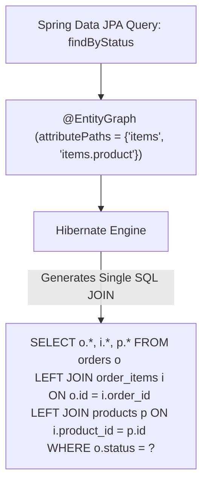

## Question

Explain JPA `@EntityGraph` and Named Entity Graphs: how they solve the N+1 query problem, difference between Fetch Graph (`FETCH`) and Load Graph (`LOAD`), sub-graphs for nested relationships, and comparison with JPQL `JOIN FETCH`.

## Answer

**The N+1 Query Problem Recap:**
When querying a list of entities (e.g. 100 `Order` entities) that have a `@OneToMany` lazy relationship with `OrderItem`, iterating over the orders to access their items triggers 1 initial query + 100 additional queries (N+1 total queries), causing severe database round-trip performance degradation.

**What is `@EntityGraph`?**
Introduced in JPA 2.1 and integrated into Spring Data JPA, `@EntityGraph` allows developers to override default `LAZY` fetching strategy for specific queries, telling Hibernate to fetch specified entity relationships eagerly in a single SQL `LEFT OUTER JOIN` query.



**1. Ad-Hoc `@EntityGraph` in Spring Data Repositories:**
Specify relationship attribute paths directly on repository method declarations:

```java
public interface OrderRepository extends JpaRepository<Order, Long> {

    // Eagerly fetches 'items' and nested 'product' on items in ONE single JOIN query!
    @EntityGraph(attributePaths = {"items", "items.product"})
    List<Order> findByStatus(OrderStatus status);

    // Can also be applied to custom JPQL queries
    @EntityGraph(attributePaths = {"customer"})
    @Query("SELECT o FROM Order o WHERE o.totalAmount > :minAmount")
    List<Order> findLargeOrders(@Param("minAmount") BigDecimal minAmount);
}
```

**2. Named Entity Graphs (`@NamedEntityGraph`):**
Define reusable entity graphs on the JPA Entity class itself:

```java
@Entity
@Table(name = "orders")
@NamedEntityGraph(
    name = "Order.withCustomerAndItems",
    attributeNodes = {
        @NamedAttributeNode("customer"),
        @NamedAttributeNode(value = "items", subgraph = "items-with-product")
    },
    subgraphs = {
        @NamedSubgraph(
            name = "items-with-product",
            attributeNodes = @NamedAttributeNode("product")
        )
    }
)
public class Order {
    @Id private Long id;
    
    @ManyToOne(fetch = FetchType.LAZY)
    private Customer customer;
    
    @OneToMany(mappedBy = "order", fetch = FetchType.LAZY)
    private List<OrderItem> items;
}
```

Reference the named graph in the repository:
```java
public interface OrderRepository extends JpaRepository<Order, Long> {
    @EntityGraph(value = "Order.withCustomerAndItems")
    Optional<Order> findDetailedOrderById(Long id);
}
```

**3. Fetch Graph (`FETCH`) vs Load Graph (`LOAD`):**
The `type` attribute on `@EntityGraph` controls how unlisted attributes are handled:

- **`EntityGraphType.FETCH` (Default):** Attributes specified in the graph are fetched `EAGERLY`. All unlisted attributes are fetched `LAZY` (overriding default EAGER attributes).
- **`EntityGraphType.LOAD`:** Attributes specified in the graph are fetched `EAGERLY`. Unlisted attributes retain their default entity mapping fetch types.

```java
@EntityGraph(attributePaths = {"items"}, type = EntityGraphType.FETCH)
List<Order> findWithFetchGraph();
```

**`@EntityGraph` vs JPQL `JOIN FETCH` Comparison:**

| Feature | `@EntityGraph` | JPQL `JOIN FETCH` |
|---|---|---|
| **Syntax** | Annotation on repository method | Embedded directly in JPQL query string |
| **Dynamic Query Support** | Excellent (can be passed via Specification/EntityManager) | Hardcoded in query string |
| **Join Type** | Generates `LEFT OUTER JOIN` | Generates `INNER JOIN` (unless `LEFT JOIN FETCH`) |
| **Spring Data Method Names** | Works directly on derived query methods (`findByStatus`) | Requires writing explicit `@Query` JPQL |

## Follow-ups

- What is the MultipleBagFetchException in Hibernate when attempting to `@EntityGraph` join two `@OneToMany` `List` collections simultaneously?
- How do you pass a dynamic `EntityGraph` programmatically using JPA `EntityManager` hints?
- Why does `@EntityGraph` generate `LEFT OUTER JOIN` instead of `INNER JOIN`?
