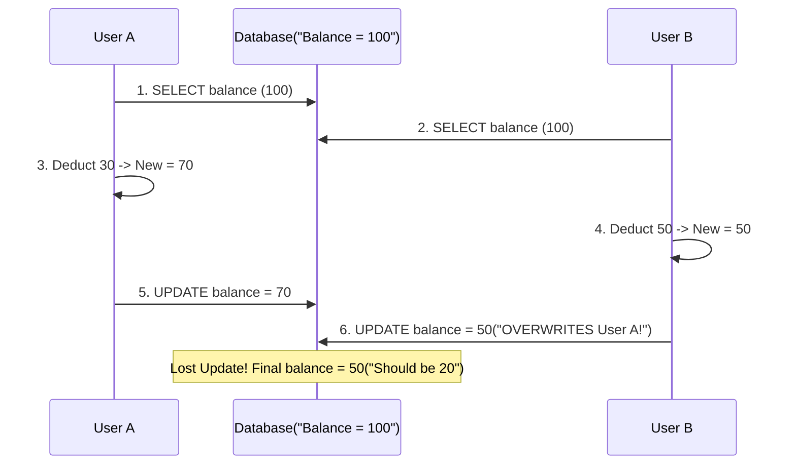

## Question

Explain concurrency control in Spring Data JPA: Optimistic Locking (`@Version`), `ObjectOptimisticLockingFailureException`, Pessimistic Locking (`@Lock`), database row locking (`FOR UPDATE`), lock modes (`PESSIMISTIC_WRITE`, `PESSIMISTIC_READ`), and handling deadlocks.

## Answer

**The Concurrent Update Problem:**
When two users concurrently attempt to update the same database entity (e.g., updating a bank balance or booking the last seat on a flight), without locking, the last update overwrites the first (the **Lost Update** anomaly).



**1. Optimistic Locking (`@Version`):**
Optimistic locking assumes conflicts are **rare**. It does NOT acquire database row locks. Instead, it maintains a version counter column on the table.

```java
@Entity
@Table(name = "accounts")
public class Account {
    @Id
    @GeneratedValue(strategy = GenerationType.IDENTITY)
    private Long id;

    private BigDecimal balance;

    @Version // Automatically managed by JPA / Hibernate!
    private Long version;

    // Getters and setters
}
```

**How `@Version` Executes in SQL:**
When updating an entity with `@Version`:
```sql
-- Read initial state (version = 1)
SELECT id, balance, version FROM accounts WHERE id = 10;

-- Hibernate automatically generates this UPDATE statement:
UPDATE accounts 
SET balance = 70.00, version = version + 1 
WHERE id = 10 AND version = 1;
```
- If User A updates first, `version` becomes `2`.
- When User B tries to update with `WHERE version = 1`, `rows_affected = 0`!
- Hibernate detects `rows_affected = 0` and throws `ObjectOptimisticLockingFailureException` (or `StaleObjectStateException`).

**Handling Optimistic Lock Exceptions:**
Catch the exception and retry the operation or notify the user:

```java
@Service
public class AccountService {
    private final AccountRepository accountRepo;

    @Retryable(
        retryFor = ObjectOptimisticLockingFailureException.class,
        maxAttempts = 3,
        backoff = @Backoff(delay = 100, multiplier = 2)
    )
    @Transactional
    public void deductBalance(Long accountId, BigDecimal amount) {
        Account account = accountRepo.findById(accountId).orElseThrow();
        account.setBalance(account.getBalance().subtract(amount));
        accountRepo.save(account);
    }
}
```

**2. Pessimistic Locking (`@Lock`):**
Pessimistic locking assumes conflicts are **frequent**. It uses underlying database row locks (`SELECT ... FOR UPDATE`), blocking other transactions until the current transaction commits or rolls back.

```java
public interface AccountRepository extends JpaRepository<Account, Long> {

    // Generates: SELECT * FROM accounts WHERE id = ? FOR UPDATE
    @Lock(LockModeType.PESSIMISTIC_WRITE)
    @Query("SELECT a FROM Account a WHERE a.id = :id")
    Optional<Account> findByIdForUpdate(@Param("id") Long id);

    // Generates: SELECT * FROM accounts WHERE id = ? FOR SHARE (Read Lock)
    @Lock(LockModeType.PESSIMISTIC_READ)
    Optional<Account> findByIdForRead(@Param("id") Long id);
}
```

**Pessimistic Lock Modes:**

| LockModeType | SQL Generated | Description |
|---|---|---|
| `PESSIMISTIC_WRITE` | `FOR UPDATE` | Exclusive Lock. Prevents other transactions from reading (`FOR UPDATE`), updating, or deleting. |
| `PESSIMISTIC_READ` | `FOR SHARE` / `LOCK IN SHARE MODE` | Shared Lock. Allows other transactions to read, but blocks them from modifying or taking write locks. |
| `PESSIMISTIC_FORCE_INCREMENT` | `FOR UPDATE` | Takes exclusive lock AND increments the `@Version` field upon transaction completion. |

**Setting Pessimistic Lock Timeout:**
Avoid waiting indefinitely for a locked row by specifying a lock timeout:

```java
@Lock(LockModeType.PESSIMISTIC_WRITE)
@QueryHints({@QueryHint(name = "jakarta.persistence.lock.timeout", value = "3000")}) // 3 second timeout
Optional<Account> findByIdWithTimeout(Long id);
```

**Comparison & Selection Guide:**

| Metric | Optimistic Locking (`@Version`) | Pessimistic Locking (`@Lock`) |
|---|---|---|
| **DB Lock Acquired?** | No (Lock-Free) | Yes (`FOR UPDATE` row lock) |
| **Throughput** | High (No database waiting) | Lower (Threads block waiting for locks) |
| **Conflict Frequency** | Low to Moderate | High (Frequent concurrent contention) |
| **Transaction Duration** | Can span user interactions | MUST be short (active DB transaction required) |
| **Deadlock Risk** | Zero | Moderate to High (Requires consistent ordering) |

## Follow-ups

- What happens if a database transaction holds a `PESSIMISTIC_WRITE` lock for 60 seconds?
- How do database deadlocks occur with Pessimistic Locking when two transactions lock rows in reverse order?
- Can Optimistic Locking (`@Version`) work without an explicit Spring `@Transactional` context?
