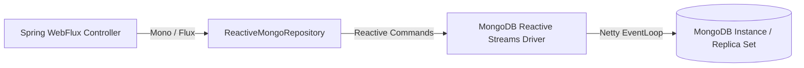

## Question

Explain Spring Data MongoDB Reactive: `ReactiveMongoTemplate`, `ReactiveMongoRepository`, MongoDB Change Streams (`Flux<ChangeStreamEvent>`), reactive aggregation pipelines, and index management with `@Indexed`.

## Answer

**Reactive MongoDB Architecture:**
MongoDB provides an official async Netty-based reactive driver. Spring Data MongoDB Reactive builds on this driver to return Project Reactor types (`Mono<T>` and `Flux<T>`), allowing end-to-end non-blocking database queries in Spring WebFlux applications.



**1. Document Model & Repository:**
```java
@Document(collection = "orders")
@CompoundIndex(name = "user_status_idx", def = "{'userId': 1, 'status': 1}")
public class OrderDocument {
    @Id
    private String id;
    
    @Indexed
    private String userId;
    
    private String status;
    private BigDecimal amount;
    private Instant createdAt;

    // Constructors, getters, setters
}

public interface ReactiveOrderRepository extends ReactiveMongoRepository<OrderDocument, String> {
    // Non-blocking query returning Flux
    Flux<OrderDocument> findByUserIdAndStatus(String userId, String status);

    // Reactive Query with Custom Mongo JSON Filter
    @Query("{ 'amount': { $gt: ?0 }, 'status': 'COMPLETED' }")
    Flux<OrderDocument> findHighValueCompletedOrders(BigDecimal minAmount);
}
```

**2. `ReactiveMongoTemplate` & Aggregations:**
For dynamic queries and complex aggregations, use `ReactiveMongoTemplate`:

```java
@Service
public class OrderAnalyticsService {
    private final ReactiveMongoTemplate mongoTemplate;

    public OrderAnalyticsService(ReactiveMongoTemplate mongoTemplate) {
        this.mongoTemplate = mongoTemplate;
    }

    public Flux<UserSpendSummary> getTopSpendingUsers(BigDecimal minTotalSpend) {
        Aggregation aggregation = Aggregation.newAggregation(
            Aggregation.match(Criteria.where("status").is("COMPLETED")),
            Aggregation.group("userId").sum("amount").as("totalSpend"),
            Aggregation.match(Criteria.where("totalSpend").gte(minTotalSpend)),
            Aggregation.sort(Sort.Direction.DESC, "totalSpend"),
            Aggregation.limit(10)
        );

        return mongoTemplate.aggregate(aggregation, "orders", UserSpendSummary.class);
    }
}
```

**3. Real-Time Streaming with MongoDB Change Streams:**
MongoDB Change Streams allow applications to listen to real-time data modifications (inserts, updates, deletes) in a database or collection without polling. Combined with Server-Sent Events (SSE), it streams database changes directly to web clients.

```java
@RestController
@RequestMapping("/api/v1/live-orders")
public class LiveOrderController {
    private final ReactiveMongoTemplate mongoTemplate;

    public LiveOrderController(ReactiveMongoTemplate mongoTemplate) {
        this.mongoTemplate = mongoTemplate;
    }

    // Stream live orders to browser via Server-Sent Events (SSE)
    @GetMapping(produces = MediaType.TEXT_EVENT_STREAM_VALUE)
    public Flux<OrderDocument> streamNewOrders() {
        return mongoTemplate.changeStream(OrderDocument.class)
                .watchCollection("orders")
                .filter(Criteria.where("operationType").is("insert"))
                .listen()
                .map(ChangeStreamEvent::getBody);
    }
}
```

**4. Reactive Transactions (`TransactionalOperator`):**
MongoDB supports multi-document ACID transactions on replica sets (v4.0+).

```java
@Service
public class OrderService {
    private final ReactiveOrderRepository orderRepo;
    private final TransactionalOperator transactionalOperator;

    public OrderService(ReactiveOrderRepository orderRepo, TransactionalOperator transactionalOperator) {
        this.orderRepo = orderRepo;
        this.transactionalOperator = transactionalOperator;
    }

    public Mono<OrderDocument> createOrder(OrderDocument order) {
        return orderRepo.save(order)
                .flatMap(saved -> updateInventory(saved).thenReturn(saved))
                .as(transactionalOperator::transactional); // Wraps in Reactive MongoDB Transaction!
    }
}
```

## Follow-ups

- How does MongoDB Replica Set Oplog power Change Streams?
- What is the difference between `@Document` vs `@Entity` regarding schema enforcement?
- How do you handle schema migrations in MongoDB using `mongock` or `mongobee`?
