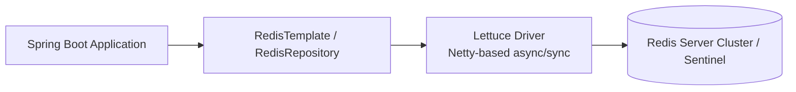

## Question

Explain Spring Data Redis: `RedisTemplate` vs `@RedisHash` repositories, client options (Lettuce vs Jedis), serializer choices (`StringRedisSerializer`, `GenericJackson2JsonRedisSerializer`), and implementing Redis Pub/Sub.

## Answer

**Spring Data Redis Architecture:**
Spring Data Redis provides abstraction layers over low-level Redis drivers (Lettuce or Jedis). Lettuce is the default thread-safe client based on Netty, reusing connections across threads.



**1. `RedisTemplate` Configuration & Serializers:**
By default, `RedisTemplate` uses `JdkSerializationRedisSerializer`, producing unreadable binary data (`\xac\xed\x00\x05...`). In production, configure key as String and value as JSON.

```java
@Configuration
public class RedisConfig {

    @Bean
    public RedisTemplate<String, Object> redisTemplate(RedisConnectionFactory connectionFactory) {
        RedisTemplate<String, Object> template = new RedisTemplate<>();
        template.setConnectionFactory(connectionFactory);

        // Key: String
        StringRedisSerializer stringSerializer = new StringRedisSerializer();
        template.setKeySerializer(stringSerializer);
        template.setHashKeySerializer(stringSerializer);

        // Value: JSON (Jackson)
        GenericJackson2JsonRedisSerializer jsonSerializer = new GenericJackson2JsonRedisSerializer();
        template.setValueSerializer(jsonSerializer);
        template.setHashValueSerializer(jsonSerializer);

        template.afterPropertiesSet();
        return template;
    }
}
```

**2. Operating via `RedisTemplate`:**
```java
@Service
public class TokenService {
    private final RedisTemplate<String, Object> redisTemplate;

    public TokenService(RedisTemplate<String, Object> redisTemplate) {
        this.redisTemplate = redisTemplate;
    }

    public void saveSession(String token, UserSession session, long ttlSeconds) {
        redisTemplate.opsForValue().set("session:" + token, session, Duration.ofSeconds(ttlSeconds));
    }

    public UserSession getSession(String token) {
        return (UserSession) redisTemplate.opsForValue().get("session:" + token);
    }
}
```

**3. Spring Data `@RedisHash` Repositories:**
Maps domain objects to Redis Hashes automatically.

```java
@RedisHash(value = "users", timeToLive = 3600) // TTL 1 hour
public class UserCache {
    @Id
    private String id;
    private String email;
    @Indexed // Creates secondary index set in Redis
    private String username;

    // Constructors, getters, setters
}

public interface UserCacheRepository extends CrudRepository<UserCache, String> {
    Optional<UserCache> findByUsername(String username);
}
```
*Warning on `@Indexed`:* Generates multiple Redis Set operations per entity to support queries, increasing memory usage. Use `RedisTemplate` directly for performance-critical caching.

**4. Redis Pub/Sub with Spring:**
```java
@Configuration
public class RedisPubSubConfig {

    @Bean
    public RedisMessageListenerContainer redisContainer(
            RedisConnectionFactory connectionFactory,
            MessageListenerAdapter listenerAdapter) {
        RedisMessageListenerContainer container = new RedisMessageListenerContainer();
        container.setConnectionFactory(connectionFactory);
        container.addMessageListener(listenerAdapter, new ChannelTopic("orders.events"));
        return container;
    }

    @Bean
    public MessageListenerAdapter listenerAdapter(OrderEventListener receiver) {
        return new MessageListenerAdapter(receiver, "onMessage");
    }
}
```

## Follow-ups

- What is the difference between Lettuce and Jedis regarding thread safety and connection pooling?
- How do you execute atomic Redis operations using Lua scripts with `RedisTemplate` (`execute(RedisScript, ...)` )?
- How do you handle Redis Cluster node failovers smoothly in Spring Data Redis?
