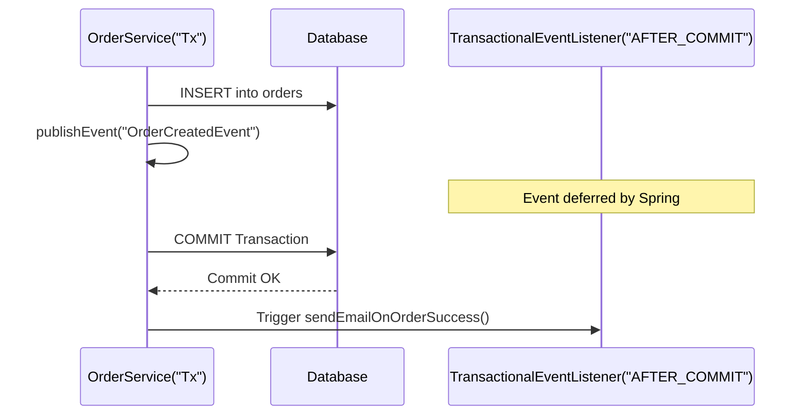

## Question

Explain Spring's internal event-publishing mechanism: `ApplicationEventPublisher`, `@EventListener`, `@TransactionalEventListener`, and `@Async` event processing. What happens if a listener throws an exception during transaction commit?

## Answer

**Decoupling with Spring Application Events:**
Spring provides an in-memory event-driven architecture allowing components to publish and listen to domain events within the same application instance without direct dependency coupling.

**1. Defining and Publishing Events:**
```java
// Record as immutable event (Spring 4.2+ allows un-extended POJOs/records)
public record OrderCreatedEvent(Long orderId, String customerEmail, BigDecimal totalAmount) {}

@Service
public class OrderService {
    private final ApplicationEventPublisher eventPublisher;

    public OrderService(ApplicationEventPublisher eventPublisher) {
        this.eventPublisher = eventPublisher;
    }

    @Transactional
    public void createOrder(OrderRequest request) {
        Order order = saveOrderToDatabase(request);
        
        // Publish event
        eventPublisher.publishEvent(new OrderCreatedEvent(order.getId(), order.getEmail(), order.getTotal()));
    }
}
```

**2. `@EventListener` (Synchronous by Default):**
Runs in the same thread and transaction boundary as the publisher. If the listener throws an exception, the publisher's transaction rolls back.

```java
@Component
public class InventoryListener {

    @EventListener
    public void handleOrderCreated(OrderCreatedEvent event) {
        // Runs inside publisher's thread & transaction
        reserveInventory(event.orderId());
    }
}
```

**3. `@TransactionalEventListener` (Phase-Aware Listening):**
Executes only at specific phases of the publisher's database transaction:
- `AFTER_COMMIT` (default): Runs after the main transaction commits successfully.
- `AFTER_ROLLBACK`: Runs if the main transaction rolled back.
- `AFTER_COMPLETION`: Runs after commit or rollback.
- `BEFORE_COMMIT`: Runs right before transaction commits.

```java
@Component
public class NotificationListener {

    @TransactionalEventListener(phase = TransactionPhase.AFTER_COMMIT)
    public void sendEmailOnOrderSuccess(OrderCreatedEvent event) {
        // Safe to send email — database transaction has officially committed!
        emailService.sendConfirmation(event.customerEmail(), event.orderId());
    }
}
```



**CRITICAL PITFALL: Writing to DB inside `AFTER_COMMIT` Listener:**
Because the transaction has ALREADY committed, any JPA/JDBC save operation inside an `AFTER_COMMIT` listener will be silently ignored or throw an error, because the connection is in read-only / completed state.
- **Fix:** If the listener needs to write to the DB, wrap listener logic in `@Transactional(propagation = Propagation.REQUIRES_NEW)`.

**4. Asynchronous Event Listeners:**
Combine `@Async` with `@EventListener` or `@TransactionalEventListener` to execute listener logic in a worker thread pool:

```java
@Component
public class AnalyticsListener {

    @Async
    @TransactionalEventListener(phase = TransactionPhase.AFTER_COMMIT)
    public void logAnalytics(OrderCreatedEvent event) {
        // Runs asynchronously in background thread pool after commit
        analyticsClient.trackPurchase(event.orderId(), event.totalAmount());
    }
}
```

## Follow-ups

- What happens if an `@Async` listener throws an exception? How is it handled by `AsyncUncaughtExceptionHandler`?
- How do you guarantee ordered execution of multiple listeners for the same event? (`@Order`)
- When should you use Spring ApplicationEvents vs an external broker like Kafka or RabbitMQ?
