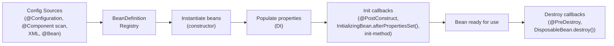

## Question

Explain the Spring IoC (Inversion of Control) container: what a `BeanDefinition` is, the `ApplicationContext` lifecycle, the three DI injection styles, and the difference between `BeanFactory` and `ApplicationContext`.

## Answer

**IoC / Dependency Injection concept:** Instead of objects creating their own dependencies (`new MyService()`), the container creates and injects them. Control of object creation is *inverted* to the framework.

**`BeanDefinition`:** Metadata describing a bean: class, scope (singleton/prototype), init/destroy methods, constructor/property args. Created from `@Component`, `@Bean`, XML, or Java config.

**ApplicationContext lifecycle:**



**Three injection styles:**

**1. Constructor injection (recommended):**
```java
@Service
public class OrderService {
    private final PaymentService paymentService;
    
    public OrderService(PaymentService paymentService) {  // Spring injects
        this.paymentService = paymentService;
    }
}
```
Promotes immutability (final field), makes dependencies explicit, facilitates testing.

**2. Setter injection:**
```java
@Autowired
public void setPaymentService(PaymentService ps) { this.paymentService = ps; }
```
For optional dependencies; allows re-injection (flexible but mutable).

**3. Field injection (avoid in production):**
```java
@Autowired
private PaymentService paymentService;  // Cannot mock easily; hides dependencies
```

**`BeanFactory` vs `ApplicationContext`:**

| | `BeanFactory` | `ApplicationContext` |
|---|---|---|
| Lazy init | Default | Eager (all singletons at startup) |
| i18n | ✗ | ✓ (MessageSource) |
| Events | ✗ | ✓ (ApplicationEventPublisher) |
| AOP integration | Manual | Auto |
| Production use | Rarely | Always |

**Singleton (default) vs Prototype:**
- Singleton: one instance per container — shared. Stateless services.
- Prototype: new instance every `getBean()` call. Stateful objects (careful: injecting prototype into singleton = only one prototype created).

**Circular dependency:** Constructor injection detects circular deps at startup (exception). Setter injection resolves them lazily. Best fix: redesign to break the cycle.

## Follow-ups

- What is `@Lazy` and when would you use it to break a circular dependency?
- How does `@Qualifier` resolve ambiguity when multiple beans of the same type exist?
- What is the difference between `@Component`, `@Service`, `@Repository`, and `@Controller`?
